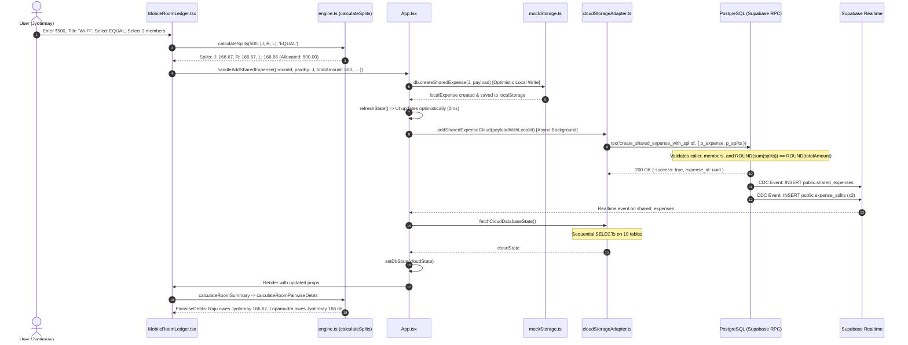

# ROOMMATE — SHARED EXPENSE ENGINE V2
## PHASE 0 — FORENSIC AUDIT / DISCOVERY REPORT

**Document ID:** `ROOMMATE_SHARED_EXPENSE_ENGINE_V2_PHASE_0_AUDIT.md`  
**Date:** October 4, 2026  
**Auditor:** Senior Financial-Ledger, PostgreSQL/Supabase & Mobile UX Auditor  
**Phase:** Phase 0 (Discovery & Forensic Audit Only — No Code or Schema Modified)  
**Production Status:** Unmodified & Untouched (`pbzaaskftrmnvocczhat.supabase.co`)  
**Git Working Tree Status:** 100% Clean (`git status --short` verified)

---

## 1. EXECUTIVE SUMMARY

RoomMate's shared expense subsystem was subjected to a thorough, forensic architectural, mathematical, database, and security code audit.

### Core Discoveries:
1. **The Core Financial Bug (Circular & Disconnected Debts):**
   - **CONFIRMED:** The application implements **isolated, bilateral pairwise debt tracking** (`calculateRoomPairwiseDebts` in `src/lib/ledger/engine.ts`) with **zero debt simplification**.
   - In a multi-person room (3+ members), an expense paid by Member A split among A, B, and C creates bilateral debts: B owes A, and C owes A. When Member B pays another expense split among A, B, and C, B creates bilateral debts: A owes B, and C owes B.
   - The system never simplifies these multilateral obligations into net positions. Instead, it forces intermediate members (like Raju in the real-world ₹700 example) to act as intermediate clearinghouses (owing Jyotirmay ₹100 while simultaneously being owed ₹66.66 by Lopamudra).
   - Furthermore, when members attempt to settle using room net balances or partial amounts, payments recorded directly between pairs invert individual debt edges, creating **directed cyclic graphs** ($A \to B \to C \to A$), trapping users in circular debt loops where every roommate appears to owe another roommate.
2. **The ₹200 Split Bug (False Allocation Claim):**
   - **CONFIRMED:** In `src/components/mobile/MobileRoomLedger.tsx` (lines 747, 752-756) and `src/components/RoomLedger.tsx` (lines 150, 155-160), the split validation logic contains a dangerous hardcoded tolerance:
     $$\text{isValid} = |\text{diff}| \le 0.05 \land \text{numAmount} > 0$$
   - When ₹200 is divided among 3 roommates in EXACT mode as ₹66.66, ₹66.66, and ₹66.66, the total allocated is ₹199.98. The discrepancy $\text{diff} = 200 - 199.98 = +0.02$.
   - Because $0.02 \le 0.05$, the UI declares the form valid and renders:  
     `"✓ ₹200 fully allocated"` despite ₹0.02 being unallocated and lost.
   - If submitted, this triggers a catastrophic mismatch with PostgreSQL's strict ledger validation in `create_shared_expense_with_splits` (`ROUND(v_sum_splits, 2) <> ROUND(v_total_amount, 2)`), causing RPC failure or, on direct insert fallback, permanently dropping the expense from room balance views (`HAVING ROUND(SUM(es.share_amount), 2) = ROUND(se.total_amount, 2)`).
3. **Database vs. Client Ledger Disconnect (Architectural Fracture):**
   - **CONFIRMED:** The PostgreSQL database possesses a hardened, authoritative SQL function `public.get_room_balances(p_room_id UUID)` (`supabase/migrations/20260921210000_phase2c4_financial_integrity_hardening.sql`), which computes exact scalar member net positions.
   - **However, this database function is NEVER called by the frontend application.**
   - The entire web and mobile frontend calculates all balances, summaries, pairwise debts, and settlement recommendations purely **client-side** in JavaScript (`src/lib/ledger/engine.ts`).
   - Even worse, export services (`roomExpenseExportService.ts`) independently implement a third, completely distinct settlement pool calculation with a 50-paise tolerance (`netBalance >= 0.5`).
4. **Money Representation & Floating-Point Hazards:**
   - **CONFIRMED:** Monetary values are handled as standard IEEE-754 floating-point JavaScript `number`s (`parseFloat`, `Number(x)`, `numAmount / count`).
   - In UPI payment dialogs (`src/components/mobile/UpiIntentPayModal.tsx` lines 66, 287, 299), amounts are truncated to zero decimal places (`initialAmount.toFixed(0)`), completely dropping paise and leaving fractional balances impossible to settle cleanly through quick actions.
5. **Real-time Async Race Conditions:**
   - **CONFIRMED:** Real-time listeners trigger `fetchCloudDatabaseState()` on individual table change events. Because `fetchCloudDatabaseState` makes 10 un-isolated, sequential REST calls to Supabase, client state can be refreshed mid-transaction (e.g., `shared_expenses` inserted before `expense_splits` finish inserting), causing momentary ledger corruption and phantom zero-share states.
6. **Security & Authorization Posture:**
   - **CONFIRMED:** Core shared expense creation and settlements have strong triggers in PostgreSQL (`enforce_shared_expenses_integrity`, `enforce_expense_splits_integrity`, `enforce_settlement_payments_integrity`).
   - **CRITICAL SECURITY NOTE:** `supabase/migrations/20260930114500_secure_personal_expenses_sync.sql` dropped owner isolation on `personal_expenses` and added `USING (true)` policies for public on `SELECT`, `UPDATE`, and `DELETE`. Furthermore, settlement payments have no check against the debtor's actual outstanding obligation, permitting arbitrary oversettlements.

---

## 2. RELEVANT CODE INVENTORY

An exhaustive audit of the repository identified the following components participating in financial calculations, ledger state, or settlement workflows:

| # | File / Path | Component / Function / RPC | Responsibility | Inputs | Outputs | Execution Tier | DB Direct Read | DB Direct Write | Participates in Settlement | Duplicates Another Calc |
|---|---|---|---|---|---|---|---|---|---|---|
| 1 | `src/lib/ledger/engine.ts` | `calculateSplits` | Calculates per-participant shares; applies cent rounding loop | `totalAmount`, `participantUserIds`, `method`, `customValues` | `ExpenseSplit[]` | Client-Side | No | No | No (sets initial share) | Yes (mirrors logic in `mockStorage.ts`) |
| 2 | `src/lib/ledger/engine.ts` | `calculateRoomPairwiseDebts` | Primary debt engine; calculates direct bilateral debts between all pairs | `expenses`, `splits`, `settlements`, `users` | `PairwiseDebt[]` | Client-Side | No | No | **YES (Primary)** | No (Sole primary implementation) |
| 3 | `src/lib/ledger/engine.ts` | `calculateRoomSummary` | Computes room totals, user paid, user share, user net balance | `roomId`, `currentUserId`, `expenses`, `splits`, `settlements`, `users` | `RoomFinancialSummary` | Client-Side | No | No | **YES** | Duplicates `get_room_balances` net balance |
| 4 | `src/lib/ledger/engine.ts` | `calculateUnifiedDashboard` | Aggregates personal outflow + shared obligations + net receivables/payables | `currentUserId`, `personalExpenses`, `allExpenses`, `allSplits`, `allSettlements`, `users`, `activeRoomIds` | `UserUnifiedDashboard` | Client-Side | No | No | **YES** | Aggregates results of `calculateRoomSummary` |
| 5 | `src/lib/ledger/engine.ts` | `getOutstandingObligationsForMember` | Separates debts owed from credits owed for clean exit gate | `userId`, `pairwiseDebts` | `MemberObligationsSummary` | Client-Side | No | No | **YES** | Transforms `PairwiseDebt[]` |
| 6 | `supabase/migrations/...hardening.sql` | `public.get_room_balances` | PostgreSQL RPC for server-side validated member balances | `p_room_id UUID` | Table: `user_id`, `name`, `email`, `total_paid`, `total_share`, `settlements_paid`, `settlements_received`, `net_balance` | Server-Side (PostgreSQL) | **Yes** | No | **YES (Unused by UI)** | Duplicated by `calculateRoomSummary` |
| 7 | `supabase/migrations/...hardening.sql` | `public.create_shared_expense_with_splits` | Atomic transactional insertion of expense + splits | `p_expense JSONB`, `p_splits JSONB` | JSONB `{ success, expense, splits }` | Server-Side (PostgreSQL) | **Yes** | **Yes** | No | Validates sum matching |
| 8 | `supabase/migrations/...hardening.sql` | `enforce_expense_splits_integrity` | Trigger on `expense_splits` ensuring cumulative splits <= total amount | Trigger (`NEW.*`) | Trigger Record | Server-Side (PostgreSQL) | **Yes** | Blocks invalid | No | Validates bounds |
| 9 | `supabase/migrations/...hardening.sql` | `enforce_shared_expenses_integrity` | Trigger ensuring expense immutability and positive amount | Trigger (`NEW.*`, `OLD.*`) | Trigger Record | Server-Side (PostgreSQL) | **Yes** | Blocks invalid | No | Validates bounds |
| 10 | `supabase/migrations/...hardening.sql` | `enforce_settlement_payments_integrity` | Trigger enforcing positive amount, non-self-settlement, room membership, and immutability | Trigger (`NEW.*`, `OLD.*`) | Trigger Record | Server-Side (PostgreSQL) | **Yes** | Blocks invalid | **YES** | Validates settlement insertion |
| 11 | `src/components/mobile/MobileRoomLedger.tsx` | Component & `splitValidation` | Main mobile room ledger, split modal, who owes whom display | `activeRoom`, `sharedExpenses`, `expenseSplits`, `settlementPayments`, etc. | JSX / DOM elements | Client-Side | No (via props) | Dispatches actions | **YES** | Duplicates validation in `RoomLedger.tsx` |
| 12 | `src/components/RoomLedger.tsx` | Component & `splitValidation` | Desktop room ledger, split modal, pairwise debts display | Props from parent | JSX / DOM elements | Client-Side | No (via props) | Dispatches actions | **YES** | Duplicates validation in `MobileRoomLedger.tsx` |
| 13 | `src/components/mobile/UpiIntentPayModal.tsx` | Component & payment handler | Quick settle-up modal with GPay/PhonePe/Paytm links & QR | `initialAmount`, `availablePayees`, `roomName` | Settlement submission | Client-Side | No | Dispatches action | **YES** | Truncates decimals via `toFixed(0)` |
| 14 | `src/lib/services/roomExpenseExportService.ts` | `generateRoomExpenseReportData` | Prepares monthly breakdown for PDF/XLSX export | `roomId`, `monthYear`, `dbState`, `currentUser` | Report Data structure | Client-Side | No | No | **YES** | **Completely independent settlement pool logic** |
| 15 | `src/lib/storage/cloudStorageAdapter.ts` | `addSharedExpenseCloud` | Dual-write shared expense to local storage + Supabase RPC/insert | Expense payload | `{ expense, splits }` | Client-Side / Supabase | No | **Yes** | No | Coordinates sync |
| 16 | `src/lib/storage/cloudStorageAdapter.ts` | `recordSettlementPaymentCloud` | Dual-write settlement payment to local storage + Supabase insert | Settlement payload | `SettlementPayment` | Client-Side / Supabase | No | **Yes** | **YES** | Coordinates settlement sync |
| 17 | `src/lib/storage/cloudStorageAdapter.ts` | `fetchCloudDatabaseState` | Full reload of all cloud tables into client memory | None | `DatabaseState` | Client-Side / Supabase | **Yes** (10 tables) | Writes to local DB | **YES** | State provider |
| 18 | `src/lib/storage/mockStorage.ts` | `createSharedExpense` | Local in-memory / localStorage expense creation | User ID, data | `SharedExpense` | Client-Side | Reads local | Writes local | No | Duplicates split calculations |
| 19 | `src/lib/storage/mockStorage.ts` | `recordSettlementPayment` | Local in-memory settlement recording | User ID, data | `SettlementPayment` | Client-Side | Reads local | Writes local | **YES** | Local settlement handler |
| 20 | `src/lib/payments/upiIntentService.ts` | `generateUpiUri` & `parseUpiQrString` | UPI URL scheme formatting and parsing | Payee, amount, ref, notes | UPI string URI | Client-Side | No | No | **YES** | Formats payment requests |
| 21 | `src/lib/ledger/ledgerTestRunner.ts` | `runAllLedgerTests` | Test suite exercising ledger math | None | Test results array | Client-Side | No | Writes test DB | **YES** | Formalizes pairwise limitations |

---

## 3. DATABASE MODEL AUDIT

The database tables governing Shared Expenses and Settlements were audited across all migrations in `supabase/migrations/`:

```
                       ┌──────────────────────┐
                       │     public.rooms     │
                       └──────────┬───────────┘
                                  │
          ┌───────────────────────┼───────────────────────┐
          │ 1:N                   │ 1:N                   │ 1:N
          ▼                       ▼                       ▼
┌──────────────────┐    ┌──────────────────┐    ┌──────────────────┐
│  public.profiles │◄───│public.room_member│    │public.settlement_│
│                  │    └──────────────────┘    │     payments     │
└─────────┬────────┘                            └─────────┬────────┘
          │ 1:N                                           │
          │ (paid_by / created_by)                        │ payer_id / payee_id
          ▼                                               ▼
┌──────────────────┐                            ┌──────────────────┐
│  public.shared_  │                            │  public.profiles │
│     expenses     │                            └──────────────────┘
└─────────┬────────┘
          │ 1:N
          ▼
┌──────────────────┐
│  public.expense_ │
│      splits      │
└──────────────────┘
```

### Table Details:

#### 1. `public.shared_expenses`
- **Primary Key:** `id UUID PRIMARY KEY DEFAULT gen_random_uuid()`
- **Foreign Keys:**
  - `room_id UUID NOT NULL REFERENCES public.rooms(id) ON DELETE CASCADE`
  - `created_by UUID NOT NULL REFERENCES public.profiles(id)`
  - `paid_by UUID NOT NULL REFERENCES public.profiles(id)`
- **Monetary Columns:**
  - `total_amount NUMERIC(12, 2) NOT NULL CHECK (total_amount > 0)`
- **Other Columns:** `title TEXT`, `category TEXT`, `split_method TEXT`, `notes TEXT`, `expense_date DATE`, `is_deleted BOOLEAN DEFAULT false`, `created_at TIMESTAMPTZ`, `updated_at TIMESTAMPTZ`
- **Data Type Analysis:** Money is stored as `NUMERIC(12, 2)` (fixed-point 2 decimals in PostgreSQL).

#### 2. `public.expense_splits`
- **Primary Key:** `id UUID PRIMARY KEY DEFAULT gen_random_uuid()`
- **Foreign Keys:**
  - `shared_expense_id UUID NOT NULL REFERENCES public.shared_expenses(id) ON DELETE CASCADE`
  - `user_id UUID NOT NULL REFERENCES public.profiles(id) ON DELETE CASCADE`
- **Unique Constraint:** `UNIQUE (shared_expense_id, user_id)` (Added in Phase 2C.4)
- **Monetary Columns:**
  - `share_amount NUMERIC(12, 2) NOT NULL CHECK (share_amount >= 0)` (Trigger enforces `> 0`)
- **Other Columns:** `created_at TIMESTAMPTZ`
- **Data Type Analysis:** Stored as `NUMERIC(12, 2)`.

#### 3. `public.settlement_payments`
- **Primary Key:** `id UUID PRIMARY KEY DEFAULT gen_random_uuid()`
- **Foreign Keys:**
  - `room_id UUID NOT NULL REFERENCES public.rooms(id) ON DELETE CASCADE`
  - `payer_id UUID NOT NULL REFERENCES public.profiles(id)`
  - `payee_id UUID NOT NULL REFERENCES public.profiles(id)`
- **Constraints:** `CHECK (payer_id <> payee_id)` (`chk_settlement_payer_not_payee`)
- **Monetary Columns:**
  - `amount NUMERIC(12, 2) NOT NULL CHECK (amount > 0)`
- **Other Columns:** `payment_method TEXT`, `transaction_ref TEXT`, `notes TEXT`, `payment_date DATE`, `created_at TIMESTAMPTZ`
- **Data Type Analysis:** Stored as `NUMERIC(12, 2)`.
- **Note:** Immutability enforced by trigger `trg_settlement_payments_integrity` (blocks `UPDATE` and `DELETE`).

#### Money Representation Evaluation:
- **PostgreSQL:** Uses `NUMERIC(12, 2)` (Rupees with 2 decimal places).
- **TypeScript / JavaScript:** Uses primitive IEEE-754 `number` (Float64).
- **Integers / Paise:** **NOT USED.** The codebase never converts money to integer paise.
- **Conversion Disconnect:** When Supabase JavaScript SDK fetches records, `NUMERIC(12, 2)` columns are received as strings or auto-parsed to JS `number`, where `Number(e.total_amount)` is explicitly applied in `cloudStorageAdapter.ts`.

---

## 4. END-TO-END DATA FLOW TRACE

Tracing an expense (e.g. ₹500 Wi-Fi paid by Jyotirmay, split equally among Jyotirmay, Raju, Lopamudra):



### Detailed Trace Steps:
1. **Frontend Data Generation:**
   User enters form data in `MobileRoomLedger.tsx`. `calculateSplits(500, ['jyotirmay', 'raju', 'lopamudra'], 'EQUAL')` generates:
   - Jyotirmay: ₹166.67
   - Raju: ₹166.67
   - Lopamudra: ₹166.66
2. **Optimistic Local Storage:**
   `App.tsx` calls `db.createSharedExpense()`, which assigns UUIDs via `crypto.randomUUID()` and stores the records in the in-memory/localStorage state.
3. **API / RPC Invocation:**
   `addSharedExpenseCloud()` formats payloads and calls Supabase RPC `create_shared_expense_with_splits`.
4. **Database Insertion:**
   The PostgreSQL function runs in an atomic transaction:
   - Validates caller and members (`is_room_member`).
   - Checks `ROUND(v_sum_splits, 2) = ROUND(v_total_amount, 2)` (500.00 == 500.00).
   - Inserts into `public.shared_expenses`.
   - Inserts 3 rows into `public.expense_splits`.
5. **Real-time Dispatch:**
   Supabase emits PostgreSQL CDC events on `shared_expenses` and `expense_splits`.
6. **State Refresh:**
   `subscribeToRoomRealtime` catches the event, triggering `fetchCloudDatabaseState()`, which queries all tables and updates `dbState`.
7. **Settlement / Balance Calculation:**
   `calculateRoomSummary()` runs client-side, delegating to `calculateRoomPairwiseDebts()`.
8. **UI Presentation:**
   The UI renders the resulting `PairwiseDebt[]` in the "Who Owes Whom" card.

---

## 5. CURRENT CALCULATION ALGORITHMS AUDIT

### Algorithm A: Equal Split
- **Inputs:** `totalAmount: number`, `participantUserIds: string[]`
- **Formula:**
  $$\text{rawShare} = \frac{\lfloor(\text{cleanTotal} / \text{count}) \times 100\rfloor}{100}$$
- **Rounding:** Truncates to floor cent, then sums base splits and computes:
  $$\text{remainderCents} = \text{round}((\text{cleanTotal} - \text{totalAllocated}) \times 100)$$
  Loops through users $i = 0, 1, \dots$ incrementing by $0.01$ until $\text{remainderCents} = 0$.
- **Output:** `{ userId: string, shareAmount: number }[]`
- **Database Source:** None (client-side pre-computation).
- **Calling Code:** `engine.ts:39`, called by `MobileRoomLedger.tsx`, `RoomLedger.tsx`, `mockStorage.ts`.
- **Known Risks:** Deterministic remainder allocation favors the earliest array indices; does not rotate between expenses.

### Algorithm B: Exact Amount Split
- **Inputs:** `totalAmount: number`, `participantUserIds: string[]`, `customValues: Record<string, number>`
- **Formula:** $\text{shareAmount} = \text{round2}(\text{customValues}[\text{userId}] \lor 0)$
- **Rounding:** `round2` on inputs, followed by remainder cents reconciliation in `engine.ts:74-91`.
- **Output:** `{ userId: string, shareAmount: number }[]`
- **Database Source:** None.
- **Calling Code:** `engine.ts:45`.
- **Known Risks:** If user enters values that do not sum to total, `engine.ts` silently mutates the user's explicit values to force the sum to equal `totalAmount`.

### Algorithm C: Percentage Split
- **Inputs:** `totalAmount`, `participantUserIds`, `customValues: Record<string, number>` (percentages)
- **Formula:** $\text{shareAmount} = \text{round2}((\text{cleanTotal} \times \text{pct}) / 100)$
- **Rounding:** `round2`, then cent reconciliation.
- **Output:** `{ userId: string, shareAmount: number }[]`
- **Database Source:** None.
- **Calling Code:** `engine.ts:50`.
- **Known Risks:** Discrepancy between percent validation ($\pm 0.05\%$) and actual cent sum.

### Algorithm D: Shares-Based Split
- **Inputs:** `totalAmount`, `participantUserIds`, `customValues: Record<string, number>` (integer weights)
- **Formula:** $\text{shareAmount} = \text{round2}((\text{cleanTotal} \times \text{shares}) / \text{totalShares})$
- **Rounding:** `round2`, then cent reconciliation.
- **Output:** `{ userId: string, shareAmount: number }[]`
- **Database Source:** None.
- **Calling Code:** `engine.ts:58`.
- **Known Risks:** Division by zero guarded, but remainder distribution alters nominal ratio.

### Algorithm E: Remainder Handling
- **Inputs:** `cleanTotal`, `baseSplits`
- **Formula:**
  $$\text{remainderCents} = \text{Math.round}((\text{cleanTotal} - \sum \text{baseSplits}) \times 100)$$
  If $> 0$, adds $+0.01$ to indices $0, 1, \dots$ until exhausted. If $< 0$, subtracts $0.01$ down to minimum $0.02$.
- **Database Source:** None.
- **Calling Code:** `engine.ts:74-91`.
- **Known Risks:** Only exists in `engine.ts`. The UI input validation in `MobileRoomLedger.tsx` DOES NOT use this, creating a fatal disconnect.

### Algorithm F: Member Net Balance
- **Inputs:** `pairwiseDebts: PairwiseDebt[]`, `currentUserId`
- **Formula:**
  $$\text{myNetBalance} = \sum_{d \in \text{debts}, d.\text{userA} = \text{me}} d.\text{netAmount} - \sum_{d \in \text{debts}, d.\text{userB} = \text{me}} d.\text{netAmount}$$
- **Rounding:** `round2` on cumulative sum.
- **Database Source:** Client-side in `engine.ts:222-229`. (In DB: `public.get_room_balances` line 91, which calculates it directly from expenses and settlements).
- **Calling Code:** `engine.ts:222`.
- **Known Risks:** Derives net balance indirectly from pairwise debts rather than directly from aggregate ledger equations.

### Algorithm G: Pairwise Balance
- **Inputs:** `expenses: SharedExpense[]`, `splits: ExpenseSplit[]`, `settlements: SettlementPayment[]`, `users: User[]`
- **Formula:**
  For pair $(A, B)$:
  $$\text{bOwesAForBills} = \sum_{\text{bills paid by } A} \text{split}_B$$
  $$\text{aOwesBForBills} = \sum_{\text{bills paid by } B} \text{split}_A$$
  $$\text{aPaidBDirectly} = \sum_{\text{settlements } A \to B} \text{amount}$$
  $$\text{bPaidADirectly} = \sum_{\text{settlements } B \to A} \text{amount}$$
  $$\text{netAmount} = \text{round2}((\text{bOwesAForBills} - \text{bPaidADirectly}) - (\text{aOwesBForBills} - \text{aPaidBDirectly}))$$
- **Rounding:** `round2`
- **Output:** `PairwiseDebt[]`
- **Database Source:** None (purely client-side).
- **Calling Code:** `engine.ts:104-188`.
- **Known Risks:** **CRITICAL:** Treats every roommate pair as a closed bilateral system. Does not perform debt simplification across 3+ members. Prone to circular debts.

### Algorithm H: Settlement Simplification
- **Status:** **DOES NOT EXIST.**
- There is NO min-cash-flow algorithm, no greedy simplification, and no debt graph reduction anywhere in the codebase. All displayed debts are raw bilateral net balances.

### Algorithm I: Partial Settlement
- **Inputs:** Settlement payment with `amount < outstanding debt`.
- **Formula:** Direct subtraction in `rawSettlements` within that specific pair $(A, B)$.
- **Database Source:** `public.settlement_payments`.
- **Calling Code:** Handled naturally by `calculateRoomPairwiseDebts`.
- **Known Risks:** If a debtor pays a creditor to cover their *general room share*, but that pair's bilateral bill debt is less than the payment, the pair flips negative and creates a reverse debt.

### Algorithm J: Monthly Room Balance
- **Inputs:** Filtered expenses by month (`expense_date.startsWith('YYYY-MM')`).
- **Database Source:** None. Filtered in UI / Export service.
- **Calling Code:** `roomExpenseExportService.ts:153-290`.
- **Known Risks:** Export service implements a completely separate settlement pool algorithm with an arbitrary $\pm 0.50$ tolerance threshold.

### Algorithm K: "Who Owes Whom"
- **Inputs:** Filtered `pairwiseResults` where $|\text{netAmount}| \ge 0.01$.
- **Mapping:**
  If $\text{netAmount} > 0$: User B owes User A `netAmount`.  
  If $\text{netAmount} < 0$: User A owes User B $|\text{netAmount}|$.
- **Calling Code:** `MobileRoomLedger.tsx:1099-1180`, `RoomLedger.tsx:568-630`.
- **Known Risks:** Exposes intermediate debts to users who have a negative room balance.

---

## 6. MONEY REPRESENTATION AUDIT

An audit of all numerical operations in the codebase revealed extensive use of floating-point representations:

| File / Location | Pattern | Current Representation | Risk | Severity | Recommendation |
|---|---|---|---|---|---|
| `src/lib/ledger/engine.ts:16-18` | `round2(num: number)` | `Math.round((num + Number.EPSILON) * 100) / 100` | Floating-point rounding is susceptible to binary fraction representation issues | HIGH | Replace with integer arithmetic (Paise) |
| `src/lib/ledger/engine.ts:40` | `Math.floor((cleanTotal / count) * 100) / 100` | Float division | Imprecise fractional cents | HIGH | Use integer division + modulo for remainder |
| `src/components/mobile/MobileRoomLedger.tsx:730` | `(numAmount / selectedParticipants.length).toFixed(2)` | Float division to string | Used for equal split display; drops remainder paise | HIGH | Compute exact shares via integer paise |
| `src/components/mobile/MobileRoomLedger.tsx:747` | `Math.abs(diff) <= 0.05` | Float comparison tolerance | Treats up to ₹0.05 missing as "fully allocated" | CRITICAL | Enforce exact equality (`diff === 0`) |
| `src/components/RoomLedger.tsx:150` | `Math.abs(diff) <= 0.05` | Float comparison tolerance | Identical false allocation bug on desktop | CRITICAL | Enforce exact equality (`diff === 0`) |
| `src/components/mobile/UpiIntentPayModal.tsx:66` | `initialAmount.toFixed(0)` | Float rounded to integer | Drops all paise from UPI payment amount | CRITICAL | Preserve full 2-decimal paise in UPI URI |
| `src/components/mobile/UpiIntentPayModal.tsx:299` | `(initialAmount / 2).toFixed(0)` | Float division rounded to integer | Quick 50% chip drops paise | HIGH | Use exact half in paise |
| `src/lib/storage/cloudStorageAdapter.ts:153, 169, 184` | `Number(e.total_amount)` | String from DB parsed to JS float | Potential precision loss on large values | MEDIUM | Parse into integer paise |
| `src/components/RoomLedger.tsx:943` | `parseFloat(e.target.value)` | Direct float input parsing | NaN / float drift | HIGH | Use integer paise currency parser |
| `src/lib/services/roomExpenseExportService.ts:276` | `netBalance >= 0.5` | 50-paise heuristic tolerance | Marks balances between -₹0.50 and +₹0.50 as "Settled" | CRITICAL | Strict zero balance check |

---

## 7. CURRENT ROUNDING BEHAVIOR

1. **Split Rounding (`engine.ts`):**
   - Division uses JavaScript `/`.
   - Truncates to floor cent (`Math.floor((cleanTotal / count) * 100) / 100`).
   - Sums allocated shares and computes remaining cents:
     $$\text{remainderCents} = \text{Math.round}((\text{cleanTotal} - \text{totalAllocated}) \times 100)$$
   - Distributes $1$ cent sequentially to index $0, 1, \dots$.
   - **Observation:** This guarantees $\sum \text{splits} = \text{totalAmount}$ *inside `calculateSplits()`*, but **only if `calculateSplits()` is called.**
2. **Form Input Rounding (`MobileRoomLedger.tsx` & `RoomLedger.tsx`):**
   - In EQUAL mode, the UI renders `(numAmount / count).toFixed(2)` (e.g. ₹66.67). It does NOT display the individual distributed cents (e.g. Raju ₹66.67, Jyotirmay ₹66.67, Lopamudra ₹66.66).
   - In EXACT mode, the validation checks `Math.abs(diff) <= 0.05`. If the user inputs ₹66.66 for each person, the sum is ₹199.98. The form accepts it because $0.02 \le 0.05$, declaring it "fully allocated".
3. **Database Rounding:**
   - PostgreSQL stores `NUMERIC(12, 2)`.
   - `create_shared_expense_with_splits` executes:
     `IF ROUND(v_sum_splits, 2) <> ROUND(v_total_amount, 2)`
   - PostgreSQL enforces exact cents with zero tolerance.

---

## 8. SETTLEMENT LOGIC AUDIT

RoomMate's settlement resolution mechanism is governed by `calculateRoomPairwiseDebts`:

1. **Architectural Nature:**
   - **CONFIRMED:** Purely **direct bilateral pairwise debts**.
   - It is NOT based on net member balances.
   - It does NOT calculate a minimum cash flow graph.
2. **Cycle Susceptibility ($A \to B \to C \to A$):**
   - **CONFIRMED:** The algorithm naturally creates cycles.
   - In any room where multiple members pay for multilateral expenses, non-simplified pairwise debts produce multiple cross-cutting obligations.
   - Any payment made between two roommates that does not match their bilateral bill obligation creates negative pairwise balances, turning DAGs into directed cycles.
3. **Minimization of Transactions:**
   - **CONFIRMED:** Fails to minimize transactions.
   - In an $N$-person room, the system generates up to $\frac{N(N-1)}{2}$ transactions instead of at most $N-1$ transactions.
4. **Settlement Interaction with Expense Balances:**
   - **CONFIRMED:** Settlement records in `settlement_payments` do NOT modify `expense_splits` or `shared_expenses` (this is correct from an immutability standpoint).
   - However, in `calculateRoomPairwiseDebts`, settlements between $A$ and $B$ directly offset the bilateral bill debt between $A$ and $B$.
   - If $A$ pays $B$ to settle $A$'s room debt, but $A$'s debt to $B$ was only a fraction of that, the excess payment turns into a new debt owed by $B$ to $A$.

---

## 9. PARTIAL-PAYMENT MODEL AUDIT

- **Model:** Additive ledger of settlement events.
- Each settlement payment is an immutable row in `public.settlement_payments`.
- Outstanding pairwise debt is computed dynamically:
  $$\text{Outstanding}(B \to A) = (\text{Bills } B \text{ owes } A) - (\text{Settlements } B \to A) - [(\text{Bills } A \text{ owes } B) - (\text{Settlements } A \to B)]$$
- **Flaw:** Partial payments are bound to the specific pair $(A, B)$. There is no room-level partial settlement ledger.

---

## 10. MULTI-DEVICE / REALTIME AUDIT

1. **Supabase Realtime Subscriptions:**
   - Configured in `cloudStorageAdapter.ts:661-740` (`subscribeToRoomRealtime`).
   - Listens to 8 tables: `rooms`, `shared_expenses`, `settlement_payments`, `room_members`, `room_join_requests`, `expense_splits`, `room_invitations`, `profiles`.
2. **State Refresh Mechanism:**
   - When any event arrives, `App.tsx:427` calls `fetchCloudDatabaseState()`.
   - `fetchCloudDatabaseState()` performs **10 sequential un-transactional HTTP REST calls** to Supabase.
3. **Race Condition & Inconsistency Hazard:**
   - When Device 1 inserts an expense, `create_shared_expense_with_splits` inserts into `shared_expenses` and then `expense_splits`.
   - Device 2 receives the Realtime CDC event for `shared_expenses` immediately.
   - Device 2 calls `fetchCloudDatabaseState()`.
   - If the query on `expense_splits` executes before Device 1's split insertion has fully committed and replicated, Device 2 loads the expense with **0 splits**.
   - Result: Device 2 temporarily computes that the payer paid ₹500, but nobody owes anything.
4. **Optimistic Update Divergence:**
   - Device 1 writes to local storage first (`db.createSharedExpense`) and renders immediately.
   - If the background cloud sync fails or delays, Device 1 and Device 2 display divergent balances until the next full sync.

---

## 11. SECURITY & AUTHORIZATION AUDIT

Auditing the 10 critical security criteria against migrations and application code:

| # | Security Requirement | Status | Evidence / Implementation Details |
|---|---|---|---|
| 1 | Payer belongs to room | **CONFIRMED SECURE** | `enforce_shared_expenses_integrity()`: `IF NOT public.is_room_member(NEW.room_id, NEW.paid_by) THEN RAISE EXCEPTION 'ACCESS_DENIED'`. |
| 2 | All participants belong to room | **CONFIRMED SECURE** | `enforce_expense_splits_integrity()`: `IF NOT public.is_room_member(v_room_id, NEW.user_id) THEN RAISE EXCEPTION 'ACCESS_DENIED'`. |
| 3 | Settlement sender belongs to room | **CONFIRMED SECURE** | `enforce_settlement_payments_integrity()`: `IF NOT public.is_room_member(NEW.room_id, NEW.payer_id) THEN RAISE EXCEPTION 'ACCESS_DENIED'`. |
| 4 | Settlement receiver belongs to room | **CONFIRMED SECURE** | `enforce_settlement_payments_integrity()`: `IF NOT public.is_room_member(NEW.room_id, NEW.payee_id) THEN RAISE EXCEPTION 'ACCESS_DENIED'`. |
| 5 | Expense belongs to room | **CONFIRMED SECURE** | Foreign key `room_id REFERENCES public.rooms(id) ON DELETE CASCADE` + room membership check on creator and payer. |
| 6 | User cannot modify another's private expense | **CRITICAL VULNERABILITY** | `supabase/migrations/20260930114500_secure_personal_expenses_sync.sql` dropped owner isolation and created `USING (true)` RLS policies for `public` on `personal_expenses` for `SELECT`, `UPDATE`, and `DELETE`. |
| 7 | User cannot inject another room's user ID | **CONFIRMED SECURE** | Enforced by `is_room_member(v_room_id, user_id)` in split and settlement triggers. |
| 8 | User cannot create cross-room settlement | **CONFIRMED SECURE** | `settlement_payments` trigger requires both payer and payee to belong to `NEW.room_id`. |
| 9 | User cannot manipulate shares to create money | **PARTIALLY ENFORCED** | RPC `create_shared_expense_with_splits` enforces exact sum equality. However, fallback table insert trigger only checks cumulative splits $\le$ total amount, allowing total shares < total amount. |
| 10 | User cannot settle more than outstanding debt | **UNCHECKED / VULNERABLE** | Neither database triggers nor API routes check the existing outstanding debt. Any user can record any positive settlement amount (even ₹1,000,000 when ₹50 is owed), creating massive artificial credits. |

---

## 12. EXACT REPRODUCTION OF THE ₹700 EXAMPLE

### Scenario Setup:
- **Room Members:**
  - $U_J$: Jyotirmay
  - $U_R$: Raju
  - $U_L$: Lopamudra
- **Expense 1:** Wi-Fi = ₹500, Paid by Jyotirmay ($U_J$)
  - Splits: $U_J = ₹166.67$, $U_R = ₹166.67$, $U_L = ₹166.66$ (Sum = ₹500.00)
- **Expense 2:** Water = ₹200, Paid by Raju ($U_R$)
  - Splits: $U_R = ₹66.67$, $U_J = ₹66.67$, $U_L = ₹66.66$ (Sum = ₹200.00)
- **Total Shared Expenses:** ₹700.00

### Mathematical Truth (Net Positions):
- **Jyotirmay:** Paid ₹500.00. Fair Share = $166.67 + 66.67 = ₹233.34$.  
  $$\text{Net}_J = 500.00 - 233.34 = \mathbf{+₹266.66}$$ (Creditor)
- **Raju:** Paid ₹200.00. Fair Share = $166.67 + 66.67 = ₹233.34$.  
  $$\text{Net}_R = 200.00 - 233.34 = \mathbf{-₹33.34}$$ (Debtor)
- **Lopamudra:** Paid ₹0.00. Fair Share = $166.66 + 66.66 = ₹233.32$.  
  $$\text{Net}_L = 0.00 - 233.32 = \mathbf{-₹233.32}$$ (Debtor)
- **Sum of Net Positions:** $+266.66 - 33.34 - 233.32 = 0.00$

### Simplified Target Settlement (Minimum Cash Flow):
- **Raju pays Jyotirmay ₹33.34**
- **Lopamudra pays Jyotirmay ₹233.32**
- **Total Transactions:** Exactly 2 transfers. Raju pays once; Lopamudra pays once; Jyotirmay receives all. Raju never touches Lopamudra's money.

---

### Execution Trace of Current Code (`engine.ts: calculateRoomPairwiseDebts`):

#### Step 1: Raw Obligations Matrix
- From Expense 1 ($U_J$ paid):
  - `jyotirmay:::raju` = ₹166.67
  - `jyotirmay:::lopamudra` = ₹166.66
- From Expense 2 ($U_R$ paid):
  - `raju:::jyotirmay` = ₹66.67
  - `raju:::lopamudra` = ₹66.66

#### Step 2: Bilateral Consolidation
- **Pair 1 ($U_J \leftrightarrow U_R$):**
  - $U_R$ owes $U_J$ for Wi-Fi = ₹166.67
  - $U_J$ owes $U_R$ for Water = ₹66.67
  - Net: $166.67 - 66.67 = \mathbf{+₹100.00}$
  - UI Display: **"Raju owes Jyotirmay ₹100.00"**
- **Pair 2 ($U_R \leftrightarrow U_L$):**
  - $U_L$ owes $U_R$ for Water = ₹66.66
  - $U_R$ owes $U_L$ = ₹0.00
  - Net: $66.66 - 0 = \mathbf{+₹66.66}$
  - UI Display: **"Lopamudra owes Raju ₹66.66"**
- **Pair 3 ($U_J \leftrightarrow U_L$):**
  - $U_L$ owes $U_J$ for Wi-Fi = ₹166.66
  - $U_J$ owes $U_L$ = ₹0.00
  - Net: $166.66 - 0 = \mathbf{+₹166.66}$
  - UI Display: **"Lopamudra owes Jyotirmay ₹166.66"**

#### Step 3: Resulting Obligations Displayed in UI:
1. **Raju owes Jyotirmay ₹100.00** [Pay Button]
2. **Lopamudra owes Raju ₹66.66** [Pay Button]
3. **Lopamudra owes Jyotirmay ₹166.66** [Pay Button]

#### Step 4: The Circular Debt Catastrophe:
- Raju is an overall DEBTOR (net $-₹33.34$), but the UI presents him as a CREDITOR owed ₹66.66 by Lopamudra!
- If Lopamudra attempts to settle her entire true fair share of ₹233.32 by paying Jyotirmay (the main creditor) ₹233.32:
  - Settlement logged: `payer: Lopamudra`, `payee: Jyotirmay`, `amount: 233.32`.
  - In Pair 3 ($U_J \leftrightarrow U_L$):
    - Bill debt = ₹166.66
    - Direct paid = ₹233.32
    - Net: $166.66 - 233.32 = \mathbf{-₹66.66}$
    - **Now Jyotirmay owes Lopamudra ₹66.66!**
  - Pair 2 ($U_R \leftrightarrow U_L$) remains untouched:
    - **Lopamudra owes Raju ₹66.66!**
  - Pair 1 ($U_J \leftrightarrow U_R$) remains untouched:
    - **Raju owes Jyotirmay ₹100.00** (or ₹66.66 if Raju paid his net ₹33.34)!
- **The Resulting Cycle:**
  $$\text{Lopamudra owes Raju ₹66.66} \longrightarrow \text{Raju owes Jyotirmay ₹66.66} \longrightarrow \text{Jyotirmay owes Lopamudra ₹66.66}$$
- **CONFIRMED:** This is the EXACT mathematical root cause of the circular obligations observed by the user.

---

## 13. EXACT REPRODUCTION OF THE ₹200 SPLIT ISSUE

### Scenario:
A user enters a ₹200 expense split among 3 roommates in EXACT mode.

### Code Trace in `src/components/mobile/MobileRoomLedger.tsx`:
```typescript
// Line 745-757
const sumExact = round2(selectedParticipants.reduce((acc, uid) => acc + (customValues[uid] || 0), 0));
const diff = round2(numAmount - sumExact);
const isValid = Math.abs(diff) <= 0.05 && numAmount > 0; // <-- FATAL FLAW
return {
  isValid,
  diff,
  sum: sumExact,
  message: isValid
    ? `✓ ₹${numAmount.toLocaleString('en-IN')} fully allocated`
    : diff > 0
    ? `₹${diff.toFixed(2)} left to allocate`
    : `Over-allocated by ₹${Math.abs(diff).toFixed(2)}`,
};
```

### Numerical Evaluation:
1. Roommates: Raju, Jyotirmay, Lopamudra (count = 3).
2. User enters ₹66.66 for Raju, ₹66.66 for Jyotirmay, ₹66.66 for Lopamudra.
3. $\text{sumExact} = 66.66 + 66.66 + 66.66 = 199.98$.
4. $\text{diff} = 200.00 - 199.98 = +0.02$.
5. $|\text{diff}| = 0.02 \le 0.05 \implies \mathbf{isValid = true}$.
6. Because `isValid` is true:  
   `message` becomes: `"✓ ₹200 fully allocated"`.
7. **The UI falsely informs the user that ₹200 is fully allocated when ₹0.02 is missing.**

### Downstream Failure Cascade:
1. User clicks "Save Split".
2. `MobileRoomLedger.tsx:589` checks `splitValidation.isValid` (which is true!).
3. Form submits `{ totalAmount: 200, splits: [66.66, 66.66, 66.66] }`.
4. Dispatched to Supabase RPC `create_shared_expense_with_splits`:
   ```sql
   IF ROUND(v_sum_splits, 2) <> ROUND(v_total_amount, 2) THEN
     RAISE EXCEPTION 'SPLIT_SUM_MISMATCH: Sum of splits (199.98) does not equal total_amount (200.00)';
   END IF;
   ```
5. RPC throws `SPLIT_SUM_MISMATCH`!
6. `cloudStorageAdapter.ts:394` catches RPC error and triggers **direct table insert fallback**.
7. Fallback inserts into `shared_expenses` and `expense_splits` individually.
8. Later, when `get_room_balances` runs in PostgreSQL:
   ```sql
   HAVING ROUND(SUM(es.share_amount), 2) = ROUND(se.total_amount, 2)
   ```
   $199.98 \ne 200.00$, so the query **silently drops the entire ₹200 expense from room balances**!

---

## 14. ROOT CAUSES SUMMARY

### Root Cause 1: Bilateral Pairwise Debts Without Settlement Simplification (Architectural Defect)
`calculateRoomPairwiseDebts` models multi-party room expenses as isolated 2-person bilateral obligations. Without a global min-cash-flow simplification algorithm, intermediary members are burdened with false credits and debts, and payments invert bilateral edges to form circular debt cycles ($A \to B \to C \to A$).

### Root Cause 2: Hardcoded 5-Paise Tolerance in UI Split Validation (UI / Logic Bug)
`Math.abs(diff) <= 0.05` in `MobileRoomLedger.tsx` and `RoomLedger.tsx` permits splits that do not equal `totalAmount` to be marked as valid and labeled "fully allocated". This directly contradicts database ledger integrity checks.

### Root Cause 3: Disconnected Database vs. Client Balance Calculation (Dual-Ledger Split)
The robust, server-side PostgreSQL function `get_room_balances` is completely abandoned by the client. The frontend re-implements balances in JavaScript, creating divergent logic between exports, mobile UI, desktop UI, and database views.

### Root Cause 4: Floating-Point Math and Truncated Decimal Places (Data Type Defect)
The application relies on IEEE-754 numbers (`round2`, `parseFloat`, `Number(x)`). Furthermore, `UpiIntentPayModal` uses `toFixed(0)`, stripping paise and creating recurring fractional debt remainders.

### Root Cause 5: Un-isolated Multi-Table Real-Time State Reconstitution (Concurrency Defect)
`fetchCloudDatabaseState()` performs 10 independent REST queries on Realtime notifications. Concurrent writes (e.g. expenses + splits) are read mid-flight without transaction snapshots, leading to momentary zero-split corrupted states.

---

## 15. EVIDENCE INDEX

- **Pairwise Debt Engine:** `src/lib/ledger/engine.ts#L104-L188`
- **Net Balance Indirect Sum:** `src/lib/ledger/engine.ts#L222-L229`
- **5-Paise Validation Tolerance (Mobile):** `src/components/mobile/MobileRoomLedger.tsx#L747-L756`
- **5-Paise Validation Tolerance (Desktop):** `src/components/RoomLedger.tsx#L150-L160`
- **Integer Rupee Truncation in UPI:** `src/components/mobile/UpiIntentPayModal.tsx#L66, L287, L299`
- **Uncalled Server-Side RPC:** `supabase/migrations/20260921210000_phase2c4_financial_integrity_hardening.sql#L10-L100`
- **Split Sum Mismatch Guard in DB:** `supabase/migrations/20260921210000_phase2c4_financial_integrity_hardening.sql#L509-L512`
- **Export Settlement Pool (50-paise tolerance):** `src/lib/services/roomExpenseExportService.ts#L202-L220, L276`
- **Public RLS Vulnerability on Personal Expenses:** `supabase/migrations/20260930114500_secure_personal_expenses_sync.sql#L16-L45`
- **Un-isolated Realtime Sync:** `src/lib/storage/cloudStorageAdapter.ts#L58-L336`

---

## 16. DUPLICATED CALCULATIONS

1. **Member Net Balance:**
   - Implemented in SQL: `public.get_room_balances` (`supabase/...hardening.sql:91`)
   - Implemented in JS: `calculateRoomSummary` (`engine.ts:222`)
   - Implemented in Export: `roomExpenseExportService.ts:273`
2. **Split Remainder Reconciliation:**
   - Implemented in `engine.ts:74-91`
   - Re-implemented in `mockStorage.ts:540`
3. **Split Validation:**
   - Duplicated identically between `MobileRoomLedger.tsx:740` and `RoomLedger.tsx:143`
4. **Settlement Offset Math:**
   - Calculated via `calculateRoomPairwiseDebts` in `engine.ts`
   - Separately calculated via `remainingSettlementPool` in `roomExpenseExportService.ts:203`

---

## 17. ARCHITECTURAL INCONSISTENCIES

- **Decimal Precision Divergence:** PostgreSQL uses `NUMERIC(12, 2)`, JavaScript uses floating-point `number`, UPI modal uses `toFixed(0)` (integer Rupees), and export service uses a 50-paise tolerance (`netBalance >= 0.5`).
- **Bilateral Debts vs. Global Room Ledger:** The database schema tracks room-level shared expenses and room-level settlement payments. However, the client converts all expenses into pairwise debts between individual pairs of users.
- **Client-Side Source of Truth:** Despite having a secure PostgreSQL backend, the application treats client-side local memory as the primary authority, bypassing server-side financial queries.

---

## 18. REQUIRED MATHEMATICAL INVARIANTS

For RoomMate Shared Expense Engine V2, the following mathematical invariants MUST be guaranteed:

1. **Split Completeness Invariant:**
   $$\forall \text{ expense } e, \quad \sum_{s \in \text{splits}(e)} \text{share\_amount}(s) = \text{total\_amount}(e)$$
2. **Zero-Sum Ledger Invariant:**
   $$\forall \text{ room } r, \quad \sum_{m \in \text{members}(r)} \text{net\_balance}(m) = 0$$
3. **Exact Integer Arithmetic Invariant:**
   All monetary amounts MUST be represented and calculated in integer **paise** ($1 \text{ INR} = 100 \text{ paise}$). No floating-point division or rounding tolerances ($\pm 0.05$) permitted.
4. **Deterministic Remainder Allocation Invariant:**
   When dividing $P$ paise among $N$ participants, $P \pmod N$ remainder paise MUST be distributed deterministically (e.g. sorted by `user_id` or rotating payer index) such that no paise are created or destroyed.
5. **Acyclic Minimal Settlement Invariant:**
   Settlement recommendations MUST be generated via a **Min-Cash-Flow / Debt Simplification** algorithm:
   - Maximum number of transactions in an $N$-member room MUST be $\le N - 1$.
   - The transaction graph MUST be a Directed Acyclic Graph (DAG) with **ZERO CYCLES**.
   - Net debtors pay ONLY net creditors. No member with a negative net balance may ever be asked to receive money or act as an intermediary.
6. **Settlement Independence Invariant:**
   Settlement payments MUST reduce outstanding balances between debtors and creditors; they MUST NEVER rewrite or alter historical expense split shares.

---

## 19. RECOMMENDED TARGET ARCHITECTURE (PHASE 1 PREVIEW)

```
┌────────────────────────────────────────────────────────┐
│                   FRONTEND CLIENT                      │
│  - Integer Paise Currency Inputs                       │
│  - Zero tolerance form validation (diff === 0)         │
│  - Displays Authoritative Simplified Settlement Graph   │
└───────────────────────────┬────────────────────────────┘
                            │ Calls Atomic RPC
                            ▼
┌────────────────────────────────────────────────────────┐
│              SUPABASE / POSTGRESQL ENGINE              │
│                                                        │
│  1. get_room_simplified_settlements(p_room_id UUID)     │
│     - Computes net positions:                          │
│       net = total_paid - total_share + settled_paid    │
│             - settled_received                         │
│     - Runs Min-Cash-Flow algorithm in PL/pgSQL         │
│     - Returns optimal, cycle-free transfer list:       │
│       [ { from_user, to_user, amount_in_paise } ]      │
│                                                        │
│  2. create_shared_expense_v2(...)                      │
│     - Enforces exact integer paise sum match           │
│                                                        │
│  3. record_settlement_v2(...)                          │
│     - Validates amount does not exceed debtor's debt   │
└────────────────────────────────────────────────────────┘
```

---

## 20. RECOMMENDED TEST MATRIX

1. **3-Member Asymmetric Expense Test:** Wi-Fi ₹500 (User A), Water ₹200 (User B), User C pays ₹0. Verify User C owes User A ₹233.32, User B owes User A ₹33.34, User B owes User C ₹0. (0 cycles, 2 transactions).
2. **Exact Cent Allocation Tests:** Splitting ₹100, ₹200, ₹700, ₹1000 across 3, 6, 7 participants. Verify exact sum equality to the last paisa.
3. **Settlement Inversion Test:** Debtor pays full balance to creditor. Verify debtor balance becomes exactly ₹0.00 and no reverse debt or cycle is generated.
4. **Partial Settlement Test:** Debtor owes ₹166.67, pays ₹100.00. Verify remaining debt is exactly ₹66.67.
5. **Oversettlement Rejection Test:** Attempting to record a settlement greater than the debtor's net debt must be rejected by the database.
6. **Concurrent Multi-Device Test:** Two devices submitting expenses simultaneously; verify no splits are dropped and state resolves consistently.

---

## 21. FILES LIKELY TO REQUIRE MODIFICATIONS IN LATER PHASES

1. `src/lib/ledger/engine.ts` (Implement min-cash-flow algorithm, replace float math with integer paise)
2. `src/components/mobile/MobileRoomLedger.tsx` (Fix split validation, replace pairwise UI with simplified settlement matrix)
3. `src/components/RoomLedger.tsx` (Fix desktop split validation, replace pairwise UI)
4. `src/components/mobile/UpiIntentPayModal.tsx` (Fix `toFixed(0)` truncation, support exact paise)
5. `supabase/migrations/` (New migration: add `get_room_simplified_settlements` RPC, fix RLS on `personal_expenses`, enforce settlement bound checks)
6. `src/lib/storage/cloudStorageAdapter.ts` (Call simplified settlements RPC, fix realtime state fetch race condition)
7. `src/lib/services/roomExpenseExportService.ts` (Align export balance calculations with core ledger engine)
8. `src/lib/payments/upiIntentService.ts` (Support 2-decimal paise precision in all generated UPI URIs)
9. `src/lib/ledger/ledgerTestRunner.ts` (Add multi-member settlement tests, update Test 8 to test simplification)
10. `src/components/mobile/MobileLeaveRoomModal.tsx` (Align clean exit gate with simplified settlement positions)

---

## 22. RISKS

- **Historical Ledger Compatibility:** Existing database records contain historical `settlement_payments` and `shared_expenses` recorded under the old pairwise model. Migration must recalculate net balances without corrupting historical history.
- **Offline Mutation Queue:** Queued offline transactions in `offlineQueue.ts` may have old-format payloads that must be safely replayed.
- **User Mental Model Shift:** Users accustomed to seeing "I owe X for Wi-Fi" will transition to "I owe Y ₹Z to clear all room obligations". UX copy must clearly explain simplified settlement benefits.

---

## 23. QUESTIONS & UNKNOWNS BEFORE IMPLEMENTATION

1. **Settlement Model Preference:** Does the product team want to maintain an optional toggle for "Direct Pairwise View" alongside "Simplified Settlements", or should "Simplified Settlements" completely replace the pairwise matrix?
2. **Historical Settlements Reconciliation:** Should historical settlement records be re-evaluated as general room settlements, or preserved strictly as bilateral transfers?
3. **Paise Rounding Rotation:** Should remainder paise always be assigned to the creator/payer, or distributed lexicographically by user ID?

---

## CLASSIFICATION OF FINDINGS

- **CONFIRMED:**
  - Lack of debt simplification in `calculateRoomPairwiseDebts`.
  - Generation of circular debts ($A \to B \to C \to A$) upon bilateral settlements.
  - False "₹200 fully allocated" report due to `Math.abs(diff) <= 0.05`.
  - Truncation of decimals in `UpiIntentPayModal.tsx` via `toFixed(0)`.
  - Complete non-usage of `get_room_balances` by frontend components.
  - Dropped RLS owner check in `personal_expenses`.
- **INFERRED:**
  - Users experiencing circular debts in staging/production did so after recording settlements or multi-payer expenses where pairwise debts inverted.
- **UNKNOWN:**
  - Whether any third-party export consumers rely on the 50-paise tolerance in `roomExpenseExportService.ts`.

---

## PHASE 0 STATUS

```
============================================================
PHASE 0 STATUS: AUDIT COMPLETE
============================================================
```

### TOP 5 ROOT CAUSES
1. **Isolated Bilateral Pairwise Debts with Zero Debt Simplification (`calculateRoomPairwiseDebts`):** Produces intermediate clearinghouse debts and inverted cyclic debt loops ($A \to B \to C \to A$).
2. **Arbitrary 5-Paise Validation Tolerance (`Math.abs(diff) <= 0.05`):** Permits unallocated money to pass validation, falsely claiming full allocation while breaking database ledger constraints.
3. **Complete Abandonment of Authoritative Database RPC:** The frontend re-implements balances in JavaScript, ignoring PostgreSQL's `get_room_balances`.
4. **Integer Rupee Truncation in UPI Intent Modal (`toFixed(0)`):** Drops fractional paise during payment, making exact settlement impossible.
5. **Un-isolated Realtime State Re-fetching:** Multi-table sequential REST calls create race conditions during concurrent expense/split commits.

### TOP 10 FILES / COMPONENTS THAT WILL LIKELY REQUIRE CHANGES
1. `src/lib/ledger/engine.ts`
2. `src/components/mobile/MobileRoomLedger.tsx`
3. `src/components/RoomLedger.tsx`
4. `src/components/mobile/UpiIntentPayModal.tsx`
5. `supabase/migrations/` (New V2 Migration)
6. `src/lib/storage/cloudStorageAdapter.ts`
7. `src/lib/services/roomExpenseExportService.ts`
8. `src/lib/ledger/ledgerTestRunner.ts`
9. `src/components/mobile/MobileLeaveRoomModal.tsx`
10. `src/lib/payments/upiIntentService.ts`

============================================================  
**END PHASE 0 — STOPPING HERE FOR USER REVIEW AND APPROVAL**  
============================================================
