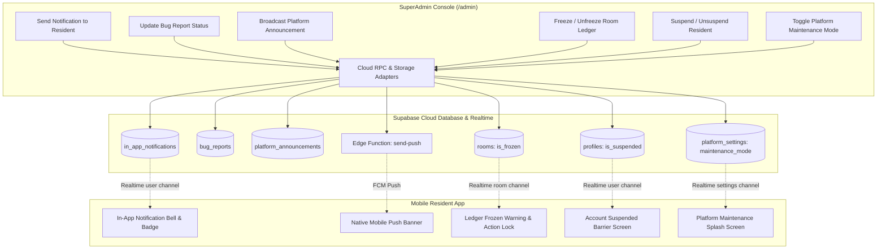

# Project Plan: Comprehensive Mobile & SuperAdmin Feature Connection & Bug Elimination

**File:** `docs/PLAN-app-superadmin-audit.md`  
**Task Slug:** `app-superadmin-audit`  
**Target:** Eliminate all disconnected features, silent failures, and synchronization gaps between the Mobile Resident App and the SuperAdmin Console.

---

## 1. Executive Summary & Root Cause Analysis

While the earlier phase established **Mobile -> SuperAdmin** ingestion (mobile room creation and expenses streaming into the admin console), the **SuperAdmin -> Mobile** control plane and several critical inter-system bridges remained disconnected:

```
+----------------------------------------------------------------------------------------------------+
|                                    DISCONNECTION & BUG INVENTORY                                   |
+----------------------------------------------------------------------------------------------------+
| 1. NOTIFICATIONS DISCONNECTED:                                                                     |
|    - `handleSendNotification` in `AdminRouter.tsx` only called `db.createNotification(...)`        |
|      in local mockStorage. Never saved to Supabase `in_app_notifications` and never triggered      |
|      FCM push. The target resident never received anything.                                        |
|    - `mockStorage.createNotification` generated IDs prefixed with `'notif-'` rather than UUIDs,    |
|      which would fail Supabase UUID validation even if invoked.                                    |
|                                                                                                    |
| 2. ANNOUNCEMENTS DISCONNECTED FROM RESIDENT INBOXES:                                              |
|    - `createPlatformAnnouncementCloud` inserted a row into `platform_announcements`, but never     |
|      created `in_app_notifications` rows for target users and never dispatched push notifications. |
|                                                                                                    |
| 3. BUG REPORT STATUS UPDATES UNNOTIFIED:                                                           |
|    - When SuperAdmin marked a bug ticket as `RESOLVED` or added admin investigation notes,         |
|      the resident who filed the report was never notified of the resolution.                       |
|                                                                                                    |
| 4. ROOM FREEZE UNENFORCED ON MOBILE:                                                               |
|    - In `cloudStorageAdapter.ts`, `fetchCloudDatabaseState()` failed to map `is_frozen` to `Room`. |
|    - `subscribeToRoomRealtime()` did not listen to the `rooms` table.                              |
|    - `MobileRoomLedger.tsx` had no freeze banner and allowed adding expenses in frozen rooms.      |
|    - SuperAdmin freeze/archive RPC calls omitted `deviceId`, causing backend verification errors.  |
|                                                                                                    |
| 5. USER SUSPENSION UNENFORCED ON MOBILE:                                                           |
|    - If a user account was suspended (`is_suspended = true`), `App.tsx` had no barrier or guard.  |
|    - The resident could continue using the app uninterrupted.                                      |
|                                                                                                    |
| 6. USER-LEVEL REALTIME SUBSCRIBER MISSING:                                                         |
|    - Mobile only listened to `room-${roomId}` on shared expenses and settlements.                  |
|    - Mobile had zero subscription for user-specific events (`in_app_notifications`, `profiles`).  |
|                                                                                                    |
| 7. MAINTENANCE MODE DISCONNECTED:                                                                 |
|    - SuperAdmin panel toggle for "Platform Maintenance Mode" had zero listener or guard in        |
|      `App.tsx`. Mobile residents were never held at the maintenance splash screen.                 |
+----------------------------------------------------------------------------------------------------+
```

---

## 2. Architecture & Bidirectional Flow



---

## 3. Implementation Plan & Detailed Phases

### Phase 1: Core UUID & Mock Storage Alignment
- **Files:** `src/lib/storage/mockStorage.ts`
- **Actions:**
  1. Fix `createNotification`: generate standard UUID for `id` using `crypto.randomUUID()` fallback.
  2. Ensure `isUuid(localNotif.id)` evaluates to true for clean Supabase synchronization.

### Phase 2: SuperAdmin Notification & Announcement Dispatch
- **Files:**
  - `src/components/admin/AdminRouter.tsx`
  - `src/lib/storage/cloudStorageAdapter.ts`
- **Actions:**
  1. In `AdminRouter.tsx` `handleSendNotification`:
     - Call `createInAppNotificationCloud(...)`.
     - Call `sendPushNotificationToMembers(...)` with `recipientUserIds: [userId]`.
  2. In `AdminRouter.tsx` `handleCreateAnnouncement` & `cloudStorageAdapter.ts`:
     - When announcement is dispatched with `'IN_APP'`, create notifications for recipients.
     - When announcement includes `'PUSH'`, invoke `sendPushNotificationToMembers`.
  3. In `AdminRouter.tsx` `handleUpdateBugStatus`:
     - When bug report is updated, find reporter `userId` and dispatch notification: `Bug Ticket #${bugId.slice(-6)}: ${status}`.

### Phase 3: Room Freeze Full-Stack Enforcement
- **Files:**
  - `src/lib/storage/cloudStorageAdapter.ts`
  - `src/components/admin/AdminRouter.tsx`
  - `src/components/mobile/MobileRoomLedger.tsx`
- **Actions:**
  1. In `AdminRouter.tsx`, supply `getOrCreateDeviceId()` to `superAdminToggleRoomFreezeCloud`, `superAdminToggleUserSuspensionCloud`, `superAdminArchiveRoomCloud`, and `superAdminResetRoomCodeCloud`.
  2. In `cloudStorageAdapter.ts`:
     - Map `isFrozen: r.is_frozen ?? false` in `fetchCloudDatabaseState`.
     - In `subscribeToRoomRealtime`, add subscription to `rooms` table with filter `id=eq.${roomId}`.
  3. In `MobileRoomLedger.tsx`:
     - Detect `activeRoom?.isFrozen`.
     - Render a sleek, non-intrusive warning card: `Room Ledger Frozen by Admin`.
     - Disable `+ Split Expense` and `Settle Up` buttons with tooltip/toast explaining the freeze.

### Phase 4: User-Level Realtime Subscriptions & Suspension Guard
- **Files:**
  - `src/lib/storage/cloudStorageAdapter.ts`
  - `src/App.tsx`
- **Actions:**
  1. Implement `subscribeToUserRealtime(userId, onRemoteChange)` in `cloudStorageAdapter.ts` on `in_app_notifications` and `profiles`.
  2. In `App.tsx`, mount `subscribeToUserRealtime` for `currentUser.id`.
  3. In `App.tsx`, add suspension guard: If `currentUser.isSuspended`, present immediate Account Suspended barrier with Logout button.

### Phase 5: Platform Maintenance Mode Synchronization
- **Files:**
  - `src/App.tsx`
  - `src/lib/storage/cloudStorageAdapter.ts`
- **Actions:**
  1. In `App.tsx`, fetch `platformSettings` on load and subscribe to `platform_settings` table changes.
  2. If `platformSettings.maintenanceMode` and `currentUser.role !== 'SUPER_ADMIN'`, render the Maintenance Splash screen with refresh button. SuperAdmins remain unrestricted.

### Phase 6: Code Quality, Terminology Clean-Up & Full Test Suite
- **Files:**
  - `src/components/mobile/settings/tabs/HelpSupportTab.tsx`
  - All modified files
- **Actions:**
  1. Replace remaining "Student" text in `HelpSupportTab.tsx` with "Resident".
  2. Run `npm test` across all vitest suites.
  3. Run `npm run build` to ensure 0 TypeScript compilation or bundling errors.

---

## 4. Verification Matrix

| Feature | Pre-Fix Behavior | Post-Fix Verified Behavior |
| :--- | :--- | :--- |
| **Admin Send Notification** | Stored only in admin localStorage; mobile resident saw nothing. | Writes to Supabase `in_app_notifications`, emits realtime event, and sends FCM push notification. |
| **Admin Announcement** | Row inserted into `platform_announcements`, never delivered to resident bell icon. | Populates resident `in_app_notifications` and dispatches push. |
| **Bug Ticket Status Update** | Reporter was not notified when admin triaged or resolved their ticket. | Reporter receives notification with admin notes and ticket status update. |
| **Room Ledger Freeze** | Mobile ignored freeze, `isFrozen` not mapped, expenses could still be recorded. | Realtime freeze notification, amber/rose warning banner, action buttons locked. |
| **User Account Suspension** | Suspended resident had full unrestricted app access. | Realtime session lock presents Account Suspended screen and prompts logout. |
| **Maintenance Mode** | Mobile ignored maintenance mode completely. | Non-admin mobile devices show Maintenance Splash Screen; SuperAdmin maintains console access. |
