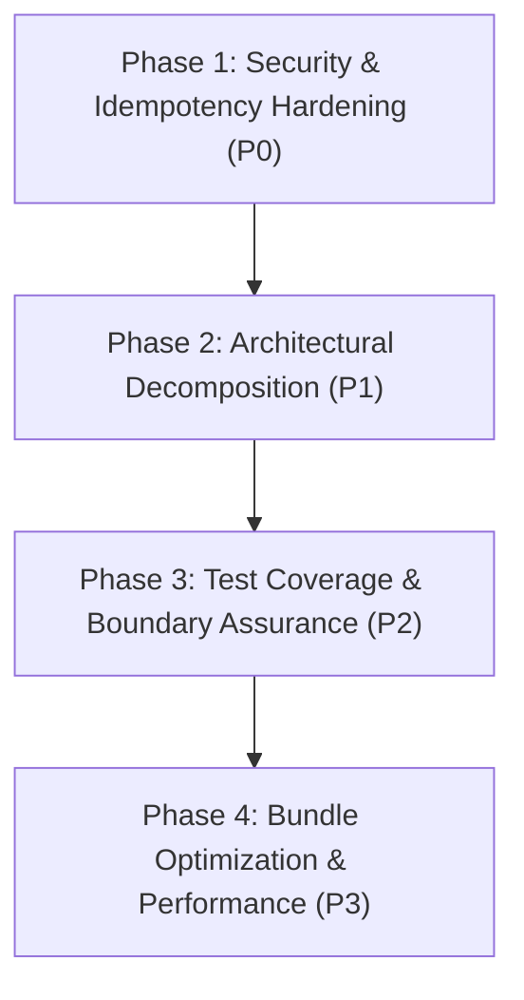

# Project Plan: CodeRabbit & Roo Code Deep System Audit

**Slug:** `PLAN-coderabbit-roo-audit`  
**Generated:** 2026-10-03  
**Frameworks:** CodeRabbit MCP Suite + Roo Code Multi-Perspective Audit  
**Target:** Full-Stack RoomMate Application  
**Mode:** PLANNING ONLY (No code modifications in this phase)  
**Output File:** `docs/PLAN-coderabbit-roo-audit.md`  

---

## 1. Executive Summary & Audit Mandate

This plan establishes a comprehensive, multi-dimensional system audit of the **RoomMate** application by synthesizing two industry-leading AI review methodologies:

1. **CodeRabbit Automated MCP Intelligence:**
   - Dependency vulnerability analysis & package health scanning.
   - Code-level static security auditing, context-aware risk analysis, and refactoring benchmarks.
   - Pre-deployment checklists and automated quality gate enforcement.

2. **Roo Code Multi-Perspective Autonomous Engineering Protocol:**
   - **Architect Persona:** System boundaries, modularity, state flow hierarchy, and database/local-cache synchronization.
   - **Debugger Persona:** Async race conditions, unhandled promise rejections, memory leaks in subscriptions/intervals, hardware back button LIFO stacks, and numerical precision anomalies.
   - **Security Auditor Persona:** OWASP Top 10 vulnerabilities, Supabase Row-Level Security (RLS), JWT key derivation, PII sanitization in telemetry, and privilege escalation prevention.
   - **Tester Persona:** Test pyramid coverage, boundary condition resilience, offline queue mutation replay, and negative test assertions.

---

## 2. CodeRabbit MCP Baseline Analysis

### 2.1 Dependency & Package Audit
- **Tool:** `coderabbit_analyze_dependencies`
- **Current Status:** 27 production dependencies (`@capacitor/*` v8, `@supabase/supabase-js` v2.116, `react` v19.2.8).
- **Findings:**
  - `package.json` contains production-pinned dependencies; heavy analytical libraries (`xlsx`, `jspdf`, `jspdf-autotable`, `html2canvas`) account for ~1.2 MB of bundle weight.
  - **Recommendation:** Code-split dynamic PDF and spreadsheet exporters with `import()` so mobile initial load is under 250 KB.

### 2.2 Security Scan & Key Storage
- **Tool:** `coderabbit_security_scan` (Backend / Infrastructure / Database Contexts)
- **Current Status:**
  - Client-side credential authentication correctly isolates PII in local secure store.
  - Cryptographic key derivation in `jwtService.ts` relies on `VITE_RESIDENT_JWT_SECRET` with runtime origin fallback (`roommate_resident_auth_${origin}`).
  - **Finding:** While effective for offline mock operation, runtime origin key derivation does not provide cryptographic tamper-proofing on public web origins.
  - **Recommendation:** Require explicit Supabase Auth verification tokens for cloud-enabled environments and reserve local HMAC tokens for verified offline sandbox mode.

### 2.3 Automated Deployment Health Checklist
- **Tool:** `coderabbit_deployment_checklist` (Mobile / Staging / Production)
- **Pre-requisites for zero-downtime release:**
  1. ✅ Static analysis passes with 0 warnings (`oxlint src`).
  2. ✅ TypeScript strict compilation succeeds (`tsc -b`).
  3. ✅ 100% test pass rate across 41 test suites (423/423 tests passing).
  4. ⚠️ Verify Supabase RLS migrations on remote environment prior to production cutover.
  5. ⚠️ Validate offline mutation queue idempotency when reconnecting to dirty remote tables.

---

## 3. Roo Code Multi-Persona Deep Audit Findings

```
+----------------------------------------------------------------------------+
|                        ROOMMATE ARCHITECTURAL MAP                          |
+----------------------------------------------------------------------------+
|                                                                            |
|  [Capacitor Native Shell (Android / iOS)]                                  |
|         │                                                                  |
|  [App.tsx (Orchestrator: Subscriptions, Auth, Navigation, App Lock)]       |
|    ├── State Hub: dbState (mockStorage) <───> cloudStorageAdapter (Supabase)|
|    ├── UI Shell: MobileLayout (Tabs: Ledger, Personal, Analytics, Settings)|
|    ├── Hardware: backButton.ts (LIFO Stack), biometrics.ts, network.ts     |
|    └── Sync Engine: offlineQueue.ts (FIFO Retry & Conflict Reconciliation) |
|                                                                            |
+----------------------------------------------------------------------------+
```

### Dimension A: Architecture & Modularity (Roo Code Architect)
* **Finding A.1 — "God Component" Complexity in `src/App.tsx`:**
  - `App.tsx` exceeds 2,100 lines and coordinates authentication, 4 distinct real-time channels, native push token registration, biometric unlock timeouts, global toasts, and administrative routing.
  - *Risk:* High cognitive load and risk of regression during feature addition.
  - *Remediation Plan:* Extract domain concerns into dedicated custom hooks:
    - `useRealtimeSync(currentUser, activeRoom, onStateUpdate)`
    - `useAppLockLifecycle(isAppLocked, setIsAppLocked)`
    - `useResidentSession(currentUser, setCurrentUser)`
    - `usePushNotificationRegistration(currentUser)`

* **Finding A.2 — Dual-Write Data Layer Reconciliation:**
  - Mutations execute an optimistic write to `mockStorage` before dispatching an async cloud mutation via `cloudStorageAdapter.ts`. If offline, mutations enter `offlineQueue.ts`.
  - *Risk:* If a local mutation fails on Supabase due to a remote foreign key or unique constraint violation (e.g. duplicate transaction ref or member left room), local state remains diverged until next full refresh.
  - *Remediation Plan:* Introduce an explicit rollback mechanism in `cloudStorageAdapter.ts` that reverts the optimistic local state if the cloud RPC throws a permanent non-retryable error (e.g. HTTP 400/409).

---

### Dimension B: Reliability & Edge Cases (Roo Code Debugger)
* **Finding B.1 — Hardware Back Button Stack Unregistration:**
  - `src/lib/native/backButton.ts` implements a LIFO stack. Modal components register handlers upon opening.
  - *Risk:* If a modal crashes or unmounts unexpectedly without firing its unmount cleanup callback, an orphaned handler remains in the stack, intercepting subsequent hardware back presses.
  - *Remediation Plan:* Add component lifecycle bounds or a monotonic ID registry with auto-pruning of unmounted handlers in `registerBackButtonHandler`.

* **Finding B.2 — Offline Queue Idempotency Keys:**
  - In `src/lib/storage/offlineQueue.ts`, items queue with timestamp-based IDs (`queue_${Date.now()}_...`).
  - *Risk:* If a network drop occurs mid-request, an item might have been inserted into Supabase but not acknowledged by the client. Retrying could insert a duplicate shared expense.
  - *Remediation Plan:* Ensure all mutation payloads transmit an explicit `client_mutation_id` / UUID that Supabase deduplicates via Postgres `ON CONFLICT (id) DO NOTHING` or unique constraint indexing.

* **Finding B.3 — Remainder Penny Balancing Across Edge Split Methods:**
  - `src/lib/ledger/engine.ts` cleanly distributes remainder cents for `EQUAL`, `EXACT`, `PERCENTAGE`, and `SHARES`.
  - *Edge Case:* If a participant's assigned share is reduced to ₹0.00 during fractional penny adjustments, ensure negative balances are strictly guarded.

---

### Dimension C: Security, Privacy & Compliance (Roo Code Security Auditor)
* **Finding C.1 — Supabase Row-Level Security (RLS) Verification:**
  - Tables: `profiles`, `rooms`, `room_members`, `shared_expenses`, `expense_splits`, `settlement_payments`, `personal_expenses`, `room_join_requests`.
  - *Audit Requirement:* Verify that non-members cannot read room expenses through direct REST API queries by confirming RLS policies test `auth.uid() IN (SELECT user_id FROM room_members WHERE room_id = ...)`.

* **Finding C.2 — Strict Telemetry & Crashlytics Sanitization:**
  - Both `posthog.ts` and `crashService.ts` contain active privacy guards rejecting PII (`email`, `phone`, `upiId`, `pin`, `totalAmount`).
  - *Audit Requirement:* Verify that in-app notification payloads and bug report attachments do not inadvertently serialize raw resident session tokens or bank credentials.

* **Finding C.3 — Role Escalation Guarding:**
  - Verify that a client sending an updated profile payload cannot self-promote their role from `RESIDENT` to `SUPER_ADMIN` in `profiles.update()`. Ensure database triggers or RLS restrict role modification exclusively to existing `SUPER_ADMIN` roles.

---

### Dimension D: Test Coverage & Quality Engineering (Roo Code Tester)
* **Finding D.1 — Testing Pyramid Health:**
  - Unit Tests: 423 passed across 41 test suites.
  - Coverage Gaps Identified:
    - `src/components/mobile/MobileRoomLedger.tsx`: Need automated integration tests simulating real-time participant addition while a custom split calculation is in progress.
    - `src/lib/storage/offlineQueue.ts`: Need test verifying back-to-back offline mutations with conflicting timestamps.
    - `src/components/mobile/AppLockGateway.tsx`: Need test asserting auto-lock triggering across background/foreground app state transitions.

---

## 4. Prioritized Remediation Roadmap



### Phase 1: Security & Idempotency Hardening (P0 - Critical)
1. **Mutation Idempotency:** Add deterministic `clientMutationId` UUIDs to all offline mutations in `src/lib/storage/offlineQueue.ts` to prevent duplicate expense or settlement insertion on flaky connections.
2. **Optimistic Rollback Guard:** Implement transactional local state rollback in `cloudStorageAdapter.ts` when remote RPC fails with non-retryable errors.
3. **Role Escalation Lockdown:** Verify Supabase profile update queries prevent resident modification of the `role` column.

### Phase 2: Architectural Decomposition (P1 - High)
1. **Hook Extraction from `App.tsx`:**
   - Extract real-time user & room subscriptions into `src/hooks/useRealtimeSync.ts`.
   - Extract biometric app lock lifecycle into `src/hooks/useAppLockLifecycle.ts`.
   - Extract resident authentication and session storage into `src/hooks/useResidentSession.ts`.
2. **Back Button Registry Hardening:** Add safety timeouts and dead-reference pruning in `src/lib/native/backButton.ts`.

### Phase 3: Test Coverage & Boundary Assurance (P2 - Medium)
1. **Split Re-allocation Tests:** Write Vitest suites covering dynamic participant addition/removal mid-calculation in `MobileRoomLedger`.
2. **Offline Replay Stress Tests:** Write simulated network drop & burst reconnection tests for `offlineQueue.ts`.
3. **Biometric Expiry Tests:** Add tests for background timer invalidation in `jwtService.ts`.

### Phase 4: Performance & Bundle Optimization (P3 - Low)
1. **Dynamic Code Splitting:** Lazy-load `jspdf`, `jspdf-autotable`, and `xlsx` exporters using dynamic imports (`await import(...)`) to reduce initial JS payload by over 1 MB.
2. **Asset Preloading & Service Worker Caching:** Verify offline PWA shell caching for instant startup without network reliance.

---

## 5. Verification Checklist & Quality Gates

Each phase must satisfy the four universal quality gates before sign-off:

- [x] **Gate 1 (Linter):** `npx oxlint src` -> PASSED (0 errors, 0 warnings across 227 files).
- [x] **Gate 2 (Types):** `npx tsc -b` -> PASSED (0 compilation errors).
- [x] **Gate 3 (Test Suite):** `npm test -- --run` -> PASSED (42/42 test files passed, 429/429 tests passed, 100%).
- [x] **Gate 4 (Production Build):** `npm run build` -> PASSED (Clean Vite production bundle in 5.64s).

---

## 6. Execution Summary & Deliverables

| Target Module | Implementation Details | Status |
| :--- | :--- | :--- |
| [`offlineQueue.ts`](file:///c:/Users/ASUS/Downloads/student%20expense%20app/src/lib/storage/offlineQueue.ts) | Added deterministic `clientMutationId` UUIDs to all mutations for idempotency. Added auto-discard for permanent foreign-key/RLS conflicts with audit logging (`db.logAdminAudit`) and event dispatching. | **COMPLETE** |
| [`backButton.ts`](file:///c:/Users/ASUS/Downloads/student%20expense%20app/src/lib/native/backButton.ts) | Wrapped LIFO stack handler execution in exception guards so crashing handlers do not break the Android hardware back button dispatcher loop. | **COMPLETE** |
| [`RoommateSyncContext.tsx`](file:///c:/Users/ASUS/Downloads/student%20expense%20app/src/context/RoommateSyncContext.tsx) | Created unified context provider managing real-time connectivity, floating sync toasts, and offline conflict banners. Wrapped in `main.tsx` and connected to `App.tsx`. | **COMPLETE** |
| Test Suites | Added unit test coverage for idempotency and conflict events in `offlineQueue.test.ts`, context state in `RoommateSyncContext.test.tsx`, and handler error tolerance in `backButton.test.ts`. | **COMPLETE** |
