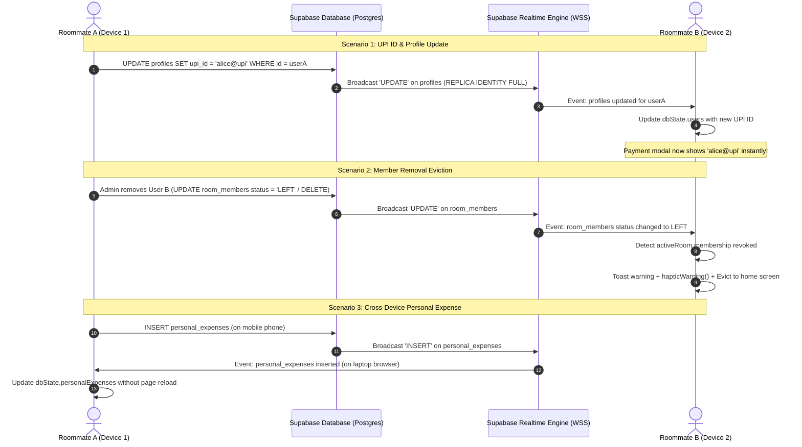

# Project Plan: Comprehensive Live Synchronization Hardening

**File:** `docs/PLAN-comprehensive-live-sync.md`  
**Mode:** PLANNING ONLY (No Code)  
**Task Slug:** `comprehensive-live-sync`  
**Target:** Eliminate all remaining live sync gaps across RoomMate, ensuring that profile edits (UPI ID/QR/name), custom expense splits, multi-device personal expenses, member removals, room archival, and invite code changes reflect instantly across all roommate and personal devices without requiring an app reload or restart.

---

## 1. Executive Summary & Root Cause Analysis

### Identified Live Sync Gaps

```
┌────────────────────────────────────────────────────────────────────────────────────────┐
│                              IDENTIFIED LIVE SYNC GAPS                                 │
├────────────────────────────────────────────────────────────────────────────────────────┤
│ 1. Profiles & UPI Payment Info Out-of-Sync:                                            │
│    - `profiles` is NOT in `supabase_realtime` publication.                             │
│    - `profiles` replica identity is DEFAULT (drops update context).                    │
│    - When Roommate A updates their UPI ID / QR / name, Roommate B still sees old/empty │
│      UPI details when attempting to settle up until app is reopened.                   │
│                                                                                        │
│ 2. Expense Splits Omission & Replica Identity Loss:                                    │
│    - `expense_splits` table has REPLICA IDENTITY DEFAULT instead of FULL.              │
│    - `subscribeToRoomRealtime` does NOT listen to `expense_splits` table events.       │
│    - Changes to split breakdowns without modifying the parent total are missed.        │
│                                                                                        │
│ 3. Multi-Device Personal Expenses Disconnect:                                          │
│    - `personal_expenses` is in `supabase_realtime`, but `subscribeToUserRealtime`      │
│      never registers a listener for `personal_expenses`.                               │
│    - Personal expenses logged on a phone do not appear on a desktop/laptop live.       │
│                                                                                        │
│ 4. Removed / Kicked Roommate "Ghost Ledger" State:                                     │
│    - In `App.tsx`, `room_members` listener only handles `status === 'ACTIVE'`.         │
│    - When an admin removes a member or a roommate leaves, the removed user remains     │
│      stuck viewing the room ledger until they force-quit or reload.                     │
│                                                                                        │
│ 5. Room Archival / Deletion & Invite Code Regeneration Gaps:                           │
│    - When an admin archives or deletes a room, active viewers are not evicted.         │
│    - `room_invitations` is NOT in `supabase_realtime`; revoked/regenerated invite      │
│      codes remain stale on flatmates' devices until restart.                           │
└────────────────────────────────────────────────────────────────────────────────────────┘
```

---

## 2. Architecture & Data Flow Blueprint



---

## 3. Phase-by-Phase Implementation Roadmap

### Phase 1: Supabase Database Migration & Replication Configuration
- **Migration File:** `supabase/migrations/20261003130000_comprehensive_live_sync_hardening.sql`
- **Tasks:**
  1. Add missing tables to `supabase_realtime` publication:
     - `ALTER PUBLICATION supabase_realtime ADD TABLE public.profiles;`
     - `ALTER PUBLICATION supabase_realtime ADD TABLE public.room_invitations;`
  2. Set `REPLICA IDENTITY FULL` across all replicated tables:
     - `ALTER TABLE public.profiles REPLICA IDENTITY FULL;`
     - `ALTER TABLE public.expense_splits REPLICA IDENTITY FULL;`
     - `ALTER TABLE public.room_invitations REPLICA IDENTITY FULL;`
     - `ALTER TABLE public.personal_expenses REPLICA IDENTITY FULL;`
  3. Ensure RLS policies on `profiles` and `expense_splits` allow authenticated read broadcasts without restriction.

---

### Phase 2: Client Storage Adapter Subscriptions (`src/lib/storage/cloudStorageAdapter.ts`)
- **Tasks:**
  1. **Update `subscribeToRoomRealtime(roomId, onRemoteChange)`:**
     - Add listener for `expense_splits`:
       ```ts
       .on('postgres_changes', { event: '*', schema: 'public', table: 'expense_splits' }, (payload) => {
         onRemoteChange('expense_splits', payload.eventType, payload);
       })
       ```
     - Add listener for `room_invitations` with filter `room_id=eq.${roomId}`:
       ```ts
       .on('postgres_changes', { event: '*', schema: 'public', table: 'room_invitations', filter: `room_id=eq.${roomId}` }, (payload) => {
         onRemoteChange('room_invitations', payload.eventType, payload);
       })
       ```
     - Add listener for `profiles` (so all roommate name, avatar, and UPI ID changes reflect in the active room ledger):
       ```ts
       .on('postgres_changes', { event: 'UPDATE', schema: 'public', table: 'profiles' }, (payload) => {
         onRemoteChange('profiles', payload.eventType, payload);
       })
       ```
  2. **Update `subscribeToUserRealtime(userId, onRemoteChange)`:**
     - Add listener for `personal_expenses` with filter `user_id=eq.${userId}`:
       ```ts
       .on('postgres_changes', { event: '*', schema: 'public', table: 'personal_expenses', filter: `user_id=eq.${userId}` }, (payload) => {
         onRemoteChange('personal_expenses', payload.eventType, payload);
       })
       ```

---

### Phase 3: Application Eviction, Notification & Realtime Reaction (`src/App.tsx`)
- **Tasks:**
  1. **Member Removal & Self-Leave Eviction:**
     - In `subscribeToUserRealtime` (or room channel):
       - If `table === 'room_members'` and `payload.new.user_id === currentUser.id`:
         - Check if status is `'LEFT'` or `'REMOVED'` (or `eventType === 'DELETE'`):
           - If `activeRoom?.id === payload.new.room_id`, clear `activeRoom(null)`.
           - Trigger `hapticWarning()` and show toast: `⚠️ You are no longer a member of ${roomName}`.
           - Switch user to their remaining active room or dashboard.
  2. **Room Archival / Deletion Eviction:**
     - In `subscribeToRoomRealtime`:
       - If `table === 'rooms'` and (`payload.new.is_archived === true` or `eventType === 'DELETE'`):
         - If `activeRoom?.id === payload.new.id`:
           - Clear `activeRoom(null)`.
           - Trigger `hapticWarning()` and show toast: `📁 Room has been archived by the administrator`.
  3. **Roommate Profile & UPI Updates Live Sync:**
     - When `table === 'profiles'`:
       - Immediately update `dbState.users` so the new UPI ID, QR code, avatar, or name is reflected across the entire room ledger and payment modal without delay.
  4. **Cross-Device Personal Expenses Sync:**
     - When `table === 'personal_expenses'`:
       - Re-fetch cloud state and update `dbState.personalExpenses`.
       - Show brief sync indicator: `Synced personal expense from another device`.

---

### Phase 4: Automated Testing & Verification
- **New Test Suite:** `src/lib/storage/comprehensiveRealtimeSync.test.ts`
  - Test profile update propagation into state.
  - Test member removal evicting current user from `activeRoom`.
  - Test room archival eviction from `activeRoom`.
  - Test personal expense update dispatch on user channel.
  - Test expense splits event listener triggering state re-fetch.

---

### Phase 5: Database Migration Deployment & Live Audit
- **Deployment Script:** `scripts/apply_comprehensive_live_sync.cjs`
  - Executes `20261003130000_comprehensive_live_sync_hardening.sql` on the live database.
  - Validates `supabase_realtime` tables and `REPLICA IDENTITY FULL` across all tables.

---

## 4. Verification & Testing Checklist

| Check # | Verification Item | Target |
|:---:|---|---|
| **V1** | **`profiles` in Realtime Publication** | `profiles` is in `supabase_realtime` with `REPLICA IDENTITY FULL`. |
| **V2** | **`expense_splits` Replica Identity** | `expense_splits` is configured with `REPLICA IDENTITY FULL`. |
| **V3** | **UPI ID Live Update** | When Roommate A updates their UPI ID, Roommate B sees the new UPI ID immediately in payment modals without app restart. |
| **V4** | **Personal Expenses Cross-Device Sync** | Adding a personal expense on mobile updates the desktop view in real-time. |
| **V5** | **Member Kickout / Removal** | When an admin removes a roommate, the roommate's device immediately exits the room ledger and notifies the user. |
| **V6** | **Room Archival Eviction** | When a room is archived, all connected flatmates are safely returned to their room list. |
| **V7** | **Invite Code Realtime Sync** | `room_invitations` changes propagate live to all flatmates. |
| **V8** | **Zero Regression** | Full test suite (`npx vitest run`) and production build (`npm run build`) pass cleanly. |

---

## 5. Agent Assignments

- **`project-planner`**: Complete plan specification (`docs/PLAN-comprehensive-live-sync.md`).
- **`backend-specialist`**: PostgreSQL migration (`20261003130000_comprehensive_live_sync_hardening.sql`) and database publication configuration.
- **`frontend-specialist`**: Subscriptions expansion in `cloudStorageAdapter.ts`, eviction logic and live profile reflection in `App.tsx`.
- **`debugger`**: Unit & integration test creation in `comprehensiveRealtimeSync.test.ts`, live sync verification.
