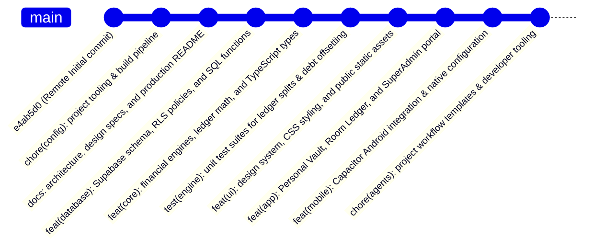

# PLAN: Professional Structured Git Commit & Remote Repository Setup

**Task Slug**: `git-commit-repo`  
**Target Repository**: `https://github.com/rajdeepbhattacharyya25-pixel/RoomMate.git`  
**Date**: September 11, 2026  
**Status**: Ready for Review / Pending Approval  

---

## 1. Executive Summary & Context

The workspace contains the full-stack source code for **RoomMate** (a student expense management SaaS platform with Personal Vault, Room Ledger, UPI Intent proof verification, SuperAdmin portal, Supabase live sync, and Capacitor Android support). 

Currently:
- The local workspace is **not initialized** as a Git repository.
- The remote repository `https://github.com/rajdeepbhattacharyya25-pixel/RoomMate.git` has an initial commit with a basic README (`e4ab5d0`).
- The workspace contains development artifacts and scripts in `scratch/` containing sensitive Supabase Personal Access Tokens (`sbp_...`) and `.env` credentials that **must never be leaked** to GitHub.
- Rather than performing a single monolithic commit (`git add . && git commit -m "initial commit"`), we will structure the repository into a clean, professional series of atomic Conventional Commits (`feat:`, `fix:`, `chore:`, `docs:`, `test:`) on top of the remote `main` branch, ensuring zero secret leaks, impeccable git hygiene, and clear change tracking.

---

## 2. Security & Repository Hygiene Audit

| Item | Local Status | Action Required |
|------|--------------|-----------------|
| `scratch/` | Contains `.mjs` scripts with `sbp_...` tokens | **MUST be ignored** in `.gitignore` |
| `.agents/scratch/` | Temporary agent files | **MUST be ignored** in `.gitignore` |
| `.env` | Active Supabase project config & credentials | Already in `.gitignore` |
| `.env.example` | Clean placeholder template | **Tracked** in git for public reference |
| `node_modules/` | Dependencies | Already in `.gitignore` |
| `dist/` | Vite build output | Already in `.gitignore` |
| `android/.gradle/` | Gradle daemon caches | Already in `android/.gitignore` |
| `android/app/build/` | Native Android build outputs | Already in `android/.gitignore` |
| `android/local.properties` | Local Android SDK path | Ignored in `android/.gitignore` |
| `README.md` | Template Vite README | **Upgrade** to comprehensive RoomMate production documentation |

---

## 3. Structured Commit Architecture (Conventional Commits)

We will sequence the history into **9 logical, reviewable atomic commits**:

### Commit Breakdown & File Allocation

#### Commit 1: `chore(config): configure project tooling, dependencies, and build pipeline`
- `.gitignore` (hardened to strictly exclude `scratch/`, `.agents/scratch/`, `.env`, build caches)
- `.oxlintrc.json` (configured to exclude `.agents` from linter warnings)
- `package.json` & `package-lock.json`
- `tsconfig.json`, `tsconfig.app.json`, `tsconfig.node.json`
- `vite.config.ts`
- `vercel.json`
- `.env.example`

#### Commit 2: `docs: add comprehensive architecture, design specs, and production README`
- `README.md` (high-impact production README detailing RoomMate, problem statement, key features, architecture, setup guide, and tech stack)
- `DESIGN.md` (UI/UX design system specifications)
- `stitch.json` (design system tokens)
- `docs/` (all feature specs and architectural plans)

#### Commit 3: `feat(database): define Supabase schema, RLS policies, and database migrations`
- `supabase/migrations/20260909_init_student_expense_schema.sql` (profiles, rooms, room_members, shared_expenses, expense_splits, settlement_payments, personal_expenses, settlement_proofs)
- `supabase/migrations/20260909_room_debt_functions.sql` (stored procedures for pairwise debt recalculation)
- `supabase/migrations/20260910_superadmin_rls.sql` (SuperAdmin role policies and audit logs)

#### Commit 4: `feat(core): implement financial calculation engines, ledger math, and types`
- `src/types/index.ts` & `src/types/supabase.ts`
- `src/lib/ledger/engine.ts` (penny-exact splits, pairwise offsetting, point-in-time isolation, overpayment handling)
- `src/lib/storage/mockData.ts` & `src/lib/storage/localStorage.ts`
- `src/lib/storage/supabaseSync.ts` (hybrid offline-first sync engine)
- `src/lib/supabase/client.ts`
- `src/lib/auth/demoAuth.ts`
- `src/lib/platform/device.ts`
- `src/lib/payments/upi.ts` (deep-linking UPI intent URL generator & QR codes)
- `src/lib/native/biometrics.ts` (native biometric auth fallback)

#### Commit 5: `test(engine): add unit test suites for ledger splits, offsetting, and isolation`
- `src/lib/ledger/engine.test.ts` (automated assertion suite validating penny rounding, 2-way mutual offsetting, partial payments, overpayments, late joiner isolation, and dashboard aggregation)

#### Commit 6: `feat(ui): design system, styles, and public static assets`
- `index.html`
- `src/index.css` & `src/App.css`
- `public/favicon.svg` & `public/icons.svg`
- `src/assets/hero.png`, `src/assets/react.svg`, `src/assets/vite.svg`

#### Commit 7: `feat(app): responsive views, Personal Vault, Room Ledger, and SuperAdmin portal`
- `src/App.tsx` & `src/main.tsx`
- `src/components/Navbar.tsx`
- `src/components/PersonalVault.tsx` (private personal finance tracker)
- `src/components/RoomLedger.tsx` (shared household expense ledger)
- `src/components/UnifiedDashboard.tsx` (cross-cutting balance breakdown)
- `src/components/SuperAdminPortal.tsx` (platform-wide telemetry and room oversight)
- `src/components/UserSubscription.tsx`
- `src/components/SecurityTestModal.tsx` & `src/components/SupabaseSyncModal.tsx`
- `src/components/mobile/` & `src/components/desktop/`

#### Commit 8: `feat(mobile): Capacitor Android integration and native bridge config`
- `capacitor.config.ts`
- `android/` (source code, gradle configurations, AndroidManifest.xml, excluding `.gradle/` and build outputs)

#### Commit 9: `chore(agents): add project workflow templates, skills, and developer tooling`
- `.agents/workflows/`
- `.agents/skills/`
- `skills-lock.json`
- `.mcp.json`

---

## 4. Execution Step-by-Step

1. **Hardening `.gitignore` & Documentation**:
   - Add `scratch/` and `.agents/scratch/` to `.gitignore`.
   - Update `README.md` with production-quality markdown documentation.
2. **Git Repository Initialization**:
   - Run `git init -b main`.
   - Run `git remote add origin https://github.com/rajdeepbhattacharyya25-pixel/RoomMate.git`.
   - Run `git fetch origin`.
   - Reset soft/mixed to `origin/main` so `e4ab5d0 Initial commit` is the base parent.
3. **Sequential Staging & Committing**:
   - For each of the 9 commits, selectively stage the exact file list via `git add <files>`.
   - Commit with detailed, descriptive Conventional Commit messages.
4. **Validation & Push**:
   - Run `git log --graph --oneline` to review commit tree.
   - Run `git status` to ensure zero untracked unwanted files.
   - Run `npm run build` to confirm code integrity.
   - Push cleanly to remote: `git push -u origin main`.

---

## 5. Verification Checklist (Phase X)

- [ ] Repository has `main` branch tracking `origin/main`.
- [ ] No personal tokens or sensitive `.env` files staged or committed.
- [ ] Exactly 9 structured, informative commits matching Conventional Commits standard.
- [ ] `npm run build` completes successfully.
- [ ] Remote `origin/main` updated and synchronized on GitHub.
