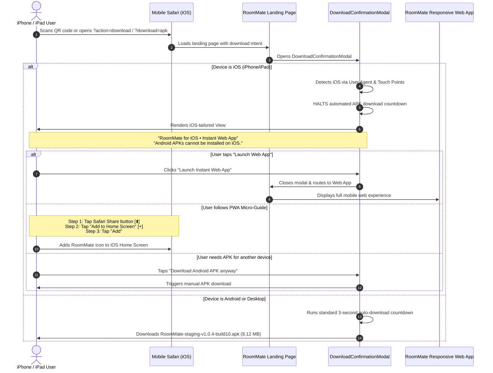

# Implementation Plan: Intelligent Device-Aware Download Modal & iOS PWA Guidance

Empower iOS (iPhone & iPad) users who scan the RoomMate QR code with an intelligent, device-aware experience. Instead of initiating an unopenable `.apk` download that results in a frozen white screen in Safari, the modal detects iOS, halts the APK download, explains why APKs are Android-specific, provides an instant **"Launch Web App"** button, and illustrates a 2-step **"Add to Home Screen" (PWA)** micro-guide so iPhone users can use RoomMate with full-screen native feel and an app icon.

---

## 🎯 Architecture & User Flow Diagram



---

## 🧩 User Experience & Component Specifications

### 1. Device Detection Utility (`src/lib/utils/deviceDetector.ts`)
* **Objective:** Clean, bulletproof client-side device classification.
* **Logic:**
  ```typescript
  export interface DeviceInfo {
    isIOS: boolean;
    isAndroid: boolean;
    isMobile: boolean;
    isDesktop: boolean;
  }
  ```
  - `isIOS`: Checks `/iPhone|iPad|iPod/i.test(navigator.userAgent)` or desktop-mode iPad Safari `(navigator.platform === 'MacIntel' && navigator.maxTouchPoints > 1)`.
  - `isAndroid`: Checks `/Android/i.test(navigator.userAgent)`.
  - SSR / undefined window safety check.

---

### 2. iOS-Tailored Modal View (`DownloadConfirmationModal.tsx`)

#### Header & Visuals
* **Icon:** Apple emblem / Safari compass icon alongside the RoomMate brand icon.
* **Title:** **RoomMate for iOS**
* **Subtitle:** *Instant Web App & Progressive Web App (PWA)*

#### Explanatory Badge
* Distinct, user-friendly notice box (Amber/Brand Teal):
  > **Why can't I install the APK?**
  > APK files are built specifically for Android devices. Because you are on an iPhone/iPad, Apple's iOS cannot open `.apk` packages.
  > The great news: RoomMate is fully responsive and runs immediately in your browser without any App Store installation!

#### Primary Action
* **Button:** **"Launch RoomMate Web App Now"**
  - Instant transition into the responsive mobile web application.
  - Emerald/Teal brand gradient button with arrow icon (`ArrowRight` or `ExternalLink`).

#### Interactive PWA "Add to Home Screen" Micro-Guide
A collapsible or elegant 3-step visual walkthrough:
1. **Step 1:** Tap the Safari Share button (**⬆️**) in the bottom navigation bar.
2. **Step 2:** Scroll down and select **"Add to Home Screen"** (**⊞**).
3. **Step 3:** Tap **"Add"** in the top right corner.
* *Result highlight:* "RoomMate will appear right on your home screen with a dedicated app icon and full-screen display just like an App Store app!"

#### Fallback / Secondary Actions
* **Secondary Link:** *"Downloading for an Android friend or another device? Download Android APK (8.12 MB)"*
* **Dismiss Button:** *"Close & Browse Features"*

---

### 3. Android Flow Preservation
* Android users continue to receive the existing verified experience:
  - 3-second auto-countdown.
  - Direct download of `RoomMate-staging-v1.0.4-build10.apk`.
  - Sideload installation guide link (`SideloadGuideModal`).

---

## 📋 Task Breakdown & File Changes

| File | Change Description |
| :--- | :--- |
| `src/lib/utils/deviceDetector.ts` | **NEW**: Robust OS and device detector with iOS, iPadOS, Android, and touch detection. |
| `src/components/landing/DownloadConfirmationModal.tsx` | **MODIFY**: Add device detection check. Prevent auto-download on iOS. Implement iOS-specific view with PWA home screen guide. |
| `src/components/desktop/DesktopLandingPage.tsx` | **MODIFY**: Connect `onOpenWebApp` callback to `DownloadConfirmationModal` so iOS users transition into mobile app. |
| `src/components/landing/downloadConfirmation.test.ts` | **MODIFY**: Add unit tests for iOS user agent detection, prevention of auto-download, and PWA guide rendering. |

---

## 🧪 Verification & Testing Checklist

- [x] **iOS User Agent Test:** Emulate iPhone Safari user agent; verify modal renders iOS view without triggering any APK download or blank tab.
- [x] **Countdown Inhibition:** Confirm `countdown` effect does not fire `onDownload()` when `isIOS` is true.
- [x] **"Launch Web App" Button:** Verify clicking the primary button closes the modal and opens the responsive mobile app view.
- [x] **PWA Guide Visibility:** Verify the 3-step Safari instructions (Share ⬆️ -> Add to Home Screen -> Add) render cleanly and responsively on small screens.
- [x] **Android Regression Test:** Emulate Android user agent; verify 3-second auto-download countdown runs and downloads APK as expected.
- [x] **Manual Download Fallback:** Verify the "Download Android APK anyway" link triggers the APK download even when on iOS.
- [x] **Automated Test Suite:** Run `npm test` and ensure all 371 tests pass with 0 failures.
