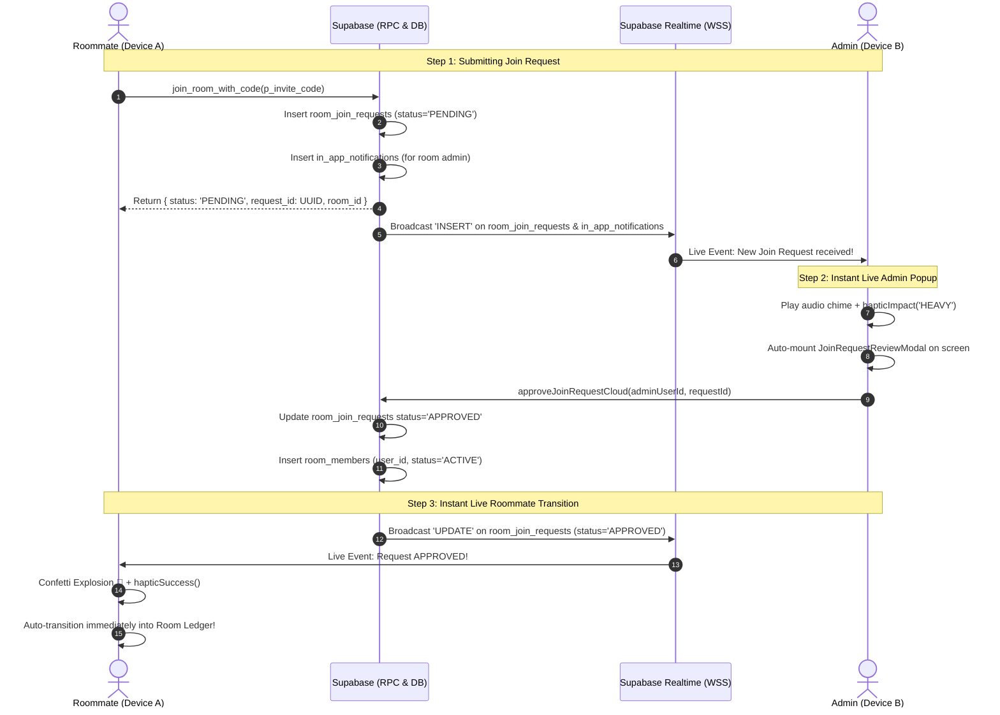

# Project Plan: Realtime Join Request Sync, Live Admin Popup & Multi-Device Synchronization

**File:** `docs/PLAN-live-sync-join-requests.md`  
**Mode:** PLANNING ONLY (No Code)  
**Task Slug:** `live-sync-join-requests`  
**Target:** Eliminate the app reopen requirement by delivering instant, two-way live synchronization for room join requests, automated admin review popups with audio-haptics, instant roommate auto-entry upon approval with celebratory confetti, and comprehensive multi-device realtime synchronization across expenses, settlements, and member lists.

---

## 1. Executive Summary & Root Cause Analysis

### User Problem Statement
> When a roommate scans a QR code or enters a room code, the admin only receives the prompt after completely reopening the app. Furthermore, after the admin accepts, the roommate's device only shows they have joined after reopening the app instead of syncing live. The user requested live popups on both devices and a comprehensive fix for any related live-sync gaps.

### Deep-Dive Root Cause Discovery
Through inspection of the Supabase migrations, storage adapters, and UI components, six concrete technical flaws were identified:

```
┌────────────────────────────────────────────────────────────────────────────────────────┐
│                               ROOT CAUSE ARCHITECTURE MAP                              │
├────────────────────────────────────────────────────────────────────────────────────────┤
│ 1. Supabase Publication Gap:                                                           │
│    `public.room_join_requests` was never added to the `supabase_realtime` publication  │
│    in Postgres (`ALTER PUBLICATION supabase_realtime ADD TABLE room_join_requests;`). │
│    Postgres changes were dropped at the Supabase Realtime replication engine.          │
│                                                                                        │
│ 2. RPC Return Value & Admin In-App Notification Omission:                              │
│    The `join_room_with_code` Postgres function created `room_join_requests` with a    │
│    UUID `id`, but the returned JSON only contained `{status, room_id, room_name}`.     │
│    It did NOT return `request_id`, nor did it insert a notification row into           │
│    `in_app_notifications` for the room admin.                                         │
│                                                                                        │
│ 3. Client-Side Fake ID Fallback:                                                       │
│    Because `requestJoinRoomCloud` received no `requestId`, `MobileLogin.tsx` fell      │
│    back to `reqId = 'req-' + Date.now().toString(36)`. It polled Supabase using this   │
│    fake string ID, which never matched any real row in Supabase!                       │
│                                                                                        │
│ 4. Admin Review Modal Isolation:                                                       │
│    `JoinRequestReviewModal` only existed inside `MobileRoomLedger.tsx` and only opened │
│    when the admin manually tapped an amber alert banner. If the admin was on any other │
│    tab, dashboard, or screen, no popup could ever render.                              │
│                                                                                        │
│ 5. Why Did It Sync Only On Reopening?                                                  │
│    In `App.tsx`, `listenToAppLifecycle` triggers `fetchCloudDatabaseState()` upon app   │
│    resume/reopen. This cold re-fetch was the ONLY mechanism re-hydrating the state!    │
│                                                                                        │
│ 6. Roommate Waiting Screen Lacked Auto-Enter & Realtime Channel:                       │
│    The waiting wizard did not subscribe to Supabase Realtime for the user's request.   │
│    Even when approved, it required the user to notice a status badge and tap a button. │
└────────────────────────────────────────────────────────────────────────────────────────┘
```

---

## 2. Realtime Synchronization Architecture Blueprint



---

## 3. Phase-by-Phase Implementation Roadmap

### Phase 1: Supabase Database Migration & Realtime Publication Hardening
- **Objective:** Ensure all join requests and real-time events replicate through Supabase Realtime without restriction.
- **Tasks:**
  1. **New Migration File:** `supabase/migrations/20261003120000_realtime_join_requests_and_notifications.sql`
     - Add `public.room_join_requests` to `supabase_realtime` publication:
       ```sql
       ALTER PUBLICATION supabase_realtime ADD TABLE public.room_join_requests;
       ALTER TABLE public.room_join_requests REPLICA IDENTITY FULL;
       ```
     - Add `public.room_members` to `supabase_realtime` publication (if not already enabled) with `REPLICA IDENTITY FULL`.
     - Add `public.rooms` to `supabase_realtime` publication with `REPLICA IDENTITY FULL`.
  2. **Update RPC `join_room_with_code`:**
     - Return the exact inserted or updated `request_id` (UUID) in the return JSON:
       ```sql
       INSERT INTO public.room_join_requests (room_id, user_id, status)
       VALUES (v_room.id, v_caller_id, 'PENDING')
       ON CONFLICT (room_id, user_id)
       DO UPDATE SET status = 'PENDING', updated_at = now()
       RETURNING id INTO v_request_id;

       -- Create in-app notification for room creator / admin
       INSERT INTO public.in_app_notifications (
         user_id, room_id, type, title, message, priority, is_read, action_type, action_target, metadata
       ) VALUES (
         v_room.created_by, v_room.id, 'ROOM_JOIN_REQUEST',
         '🔔 New Join Request',
         v_caller_name || ' requested to join ' || v_room.name,
         'HIGH', false, 'REVIEW_JOIN_REQUEST', v_request_id::TEXT,
         jsonb_build_object('requesterId', v_caller_id, 'requestId', v_request_id, 'roomName', v_room.name)
       );
       ```
  3. **Verification:**
     - Validate RLS policies on `room_join_requests`: ensure room admins can `SELECT` and `UPDATE`, and requesters can `SELECT` their own requests.

---

### Phase 2: Cloud Storage Adapter & Realtime Channel Expansion
- **Objective:** Wire up client-side subscriptions and fix the request ID pipeline.
- **Files to Modify:**
  - `src/lib/storage/cloudStorageAdapter.ts`
- **Tasks:**
  1. **Update `subscribeToRoomRealtime`:**
     - Add listener for table `'room_join_requests'` with filter `room_id=eq.${roomId}`:
       ```ts
       .on('postgres_changes', { event: '*', schema: 'public', table: 'room_join_requests', filter: `room_id=eq.${roomId}` }, (payload) => {
         onRemoteChange('room_join_requests', payload.eventType, payload);
       })
       ```
  2. **Update `subscribeToUserRealtime`:**
     - Add listener for `room_join_requests` where `user_id=eq.${userId}`:
       - Instantly notifies the requesting roommate when their request is updated to `APPROVED` or `DECLINED`.
     - Add listener for `room_members` where `user_id=eq.${userId}`:
       - Instantly updates the user's room list when added or approved into any room.
  3. **Fix `requestJoinRoomCloud`:**
     - Capture `rpcRes.request_id` from the RPC response and return it as `requestId`.
     - If the RPC didn't return an ID (local/offline fallback), query Supabase `room_join_requests` for the active `(room_id, user_id)` to resolve the real UUID.
  4. **Harden `checkJoinRequestStatusCloud`:**
     - Accept optional `roomId` and `userId` parameters as fallback if `requestId` is missing or non-UUID:
       ```ts
       .from('room_join_requests')
       .select('*')
       .or(`id.eq.${requestId},and(room_id.eq.${roomId},user_id.eq.${userId})`)
       ```

---

### Phase 3: Global Admin Live Popup Modal & Audio-Haptic Alert
- **Objective:** Whenever an admin is anywhere in the app, a new join request immediately triggers the review bottom-sheet popup with sound and vibration.
- **Files to Modify:**
  - `src/App.tsx`
  - `src/components/mobile/MobileLayout.tsx`
  - `src/components/mobile/JoinRequestReviewModal.tsx`
- **Tasks:**
  1. **Global Join Request State in `App.tsx`:**
     - Add state: `activeJoinRequestForAdmin: (RoomJoinRequest & { user: User; room?: Room }) | null`.
  2. **Realtime Listener in `App.tsx`:**
     - When `subscribeToRoomRealtime` or `subscribeToUserRealtime` receives an `INSERT` or `UPDATE` on `room_join_requests` or `in_app_notifications`:
       - Fetch fresh state and find the pending join request.
       - Check if the current user is an admin of that room (`room.createdBy === currentUser.id` or admin member).
       - If yes:
         - Trigger `hapticImpact('HEAVY')`.
         - Trigger `playNotificationSound()`.
         - Auto-set `activeJoinRequestForAdmin(request)`.
  3. **Global Review Modal Mount:**
     - Mount `JoinRequestReviewModal` at the root of `App.tsx` (or passed through `MobileLayout.tsx`):
       - If `activeJoinRequestForAdmin` is set, the bottom-sheet automatically slides up over whichever screen the admin is currently viewing!
       - Includes 1-tap "Accept" and "Decline" buttons.
       - On Accept: calls `handleApproveJoinRequest(request.id)`, plays success haptics, dismisses modal, and dispatches approval to Supabase.
       - On Decline: calls `handleDeclineJoinRequest(request.id)`, plays haptics, and dismisses modal.

---

### Phase 4: Roommate Waiting Flow & Instant Auto-Entry Transition
- **Objective:** The moment the admin clicks "Accept", the roommate's device immediately celebrates and enters the room without requiring a tap or app reopen.
- **Files to Modify:**
  - `src/components/mobile/MobileLogin.tsx`
  - `src/components/mobile/JoinRoomModal.tsx`
  - `src/App.tsx`
- **Tasks:**
  1. **Live Realtime Subscription in `MobileLogin.tsx`:**
     - In `MobileLogin.tsx`, when `joinWizardStep === 'waiting'`:
       - Subscribe directly to Supabase Realtime channel `join-request-${activeJoinRequestId}` or user channel:
         ```ts
         supabase.channel(`join-req-${activeJoinRequestId}`)
           .on('postgres_changes', { event: 'UPDATE', schema: 'public', table: 'room_join_requests', filter: `id=eq.${activeJoinRequestId}` }, (payload) => {
             if (payload.new.status === 'APPROVED') {
               handleLiveAutoEnterRoom();
             }
           })
         ```
       - Keep the 2.5s polling loop as an offline fallback safeguard.
  2. **Celebratory Auto-Entry (`handleLiveAutoEnterRoom`):**
     - Trigger confetti animation (`canvas-confetti` or dynamic CSS confetti).
     - Trigger `hapticSuccess()`.
     - Automatically execute `handleEnterApprovedRoom()` after a 600ms celebratory reveal!
     - The roommate does NOT have to press any button or restart the app; they seamlessly transition straight into the Room Ledger!
  3. **Live Sync in `JoinRoomModal.tsx` (For Already Logged-in Users):**
     - When an existing logged-in user enters a code and receives `{ status: 'PENDING' }`:
       - `JoinRoomModal` subscribes to the user's `room_members` or `room_join_requests`.
       - When approved, it fires celebratory confetti, closes the modal, and automatically invokes `onRoomJoined(approvedRoom)`.

---

### Phase 5: Comprehensive Multi-Device Live Sync Audit & Hardening
- **Objective:** Fix any other live-sync issues across expenses, settlements, room policies, and member updates as requested by the user.
- **Files to Modify:**
  - `src/lib/storage/cloudStorageAdapter.ts`
  - `src/App.tsx`
  - `src/components/mobile/MobileRoomLedger.tsx`
- **Tasks:**
  1. **Cross-Room Admin Subscription Pool:**
     - Currently, `subscribeToRoomRealtime` only subscribes to `activeRoom.id`.
     - If an admin owns multiple rooms and is viewing Room A, they would miss join requests for Room B!
     - Solution: Create a user-level subscription for all rooms owned/administered by the user, or subscribe to `room_join_requests` where `room_id in (...)`.
  2. **Expense & Settlement Delete/Update Propagation:**
     - Verify that `DELETE` and `UPDATE` events on `shared_expenses` and `settlement_payments` trigger immediate local state reconciliation across all flatmate devices without ghost balances.
  3. **Member Join / Leave / Removal Sync:**
     - Ensure when an admin removes a member (`handleRemoveMember`), the removed flatmate's device immediately catches the `room_members` change, revokes active room view, and redirects to their remaining rooms or home screen.
  4. **Room Policy & Name Changes:**
     - Ensure edits to room name, currency, or join policy (`APPROVAL_REQUIRED` vs `INSTANT`) propagate live to all active flatmates.

---

### Phase 6: Automated Testing & Verification Matrix
- **Objective:** Ensure rock-solid behavior with unit, integration, and cross-client simulation tests.
- **Test Suites to Create / Update:**
  1. `src/lib/storage/realtimeJoinSync.test.ts` [NEW]:
     - Test `requestJoinRoomCloud` accurately returns `requestId` UUID.
     - Test `checkJoinRequestStatusCloud` resolves status via `requestId` and fallback query.
     - Test `approveJoinRequestCloud` updates both `room_join_requests` and `room_members`.
  2. `src/components/mobile/JoinFlowRealtime.test.tsx` [NEW]:
     - Test admin receives live join request event and triggers `JoinRequestReviewModal`.
     - Test approving request transitions roommate waiting screen automatically with `status === 'approved'`.
  3. **Multi-Device Simulation Test:**
     - Run parallel simulation: Client A submits join code -> Client B verifies live review popup -> Client B accepts -> Client A verifies auto-navigation into Room Ledger.

---

## 4. Verification & Testing Checklist

| Check # | Verification Item | Target |
|:---:|---|---|
| **V1** | **Supabase Realtime Publication** | `room_join_requests` is in `supabase_realtime` publication with `REPLICA IDENTITY FULL`. |
| **V2** | **RPC Return Payload** | `join_room_with_code` returns real `request_id` (UUID) and creates admin in-app notification. |
| **V3** | **Admin Live Popup** | Admin viewing any screen receives audio-haptic alert and instant `JoinRequestReviewModal` bottom sheet without app reopen. |
| **V4** | **Roommate Auto-Transition** | Roommate on waiting screen instantly gets confetti and auto-navigates into Room Ledger upon admin approval without app reopen. |
| **V5** | **Already Logged-In Flow** | Roommates joining via `JoinRoomModal` experience live approval detection and automatic room switch. |
| **V6** | **Multi-Room Admin Support** | Admins owning multiple rooms receive live join request popups regardless of which room is currently active. |
| **V7** | **Multi-Device Expense/Settlement Sync** | Expenses and settlements added/edited/deleted on Device A reflect immediately on Device B. |
| **V8** | **Zero Lint/Build Errors** | `npm run build` and `npx vitest run` pass with zero failures. |

---

## 5. Agent Assignments

- **`project-planner`**: Complete plan specification (`docs/PLAN-live-sync-join-requests.md`).
- **`backend-specialist`**: PostgreSQL migration (`20261003120000_realtime_join_requests_and_notifications.sql`), RPC updates, Supabase Realtime publication setup.
- **`frontend-specialist`**: UI auto-popup modal in `App.tsx`, audio-haptic integration, confetti auto-transition in `MobileLogin.tsx` and `JoinRoomModal.tsx`.
- **`debugger`**: End-to-end multi-device live sync verification, error handling, offline fallback validation.
