# PLAN: Mobile App UI Deep Audit, Polish & Dummy Data Deletion

**Status**: [PLANNING ONLY] - Awaiting User Approval
**Date**: September 2026
**Target Deliverables**:
1. Deep Mobile UI/UX polish across all 5 core screens & bottom sheets.
2. Complete purge of dummy/seed data from Supabase Cloud backend and local application storage.
3. Clean, resilient zero-state / first-run onboarding experience.

---

## 1. Executive Summary & Audit Diagnosis

A comprehensive live visual and architectural audit was performed on the mobile application at `390×844` viewport (standard iPhone / modern Android screen dimension). 

The audit identified critical UI defects, layout overlaps, hardcoded mock values, and dummy records in both the frontend components and the Supabase cloud database.

### Key Issues Uncovered:
| Area | Critical Defect | Impact |
|---|---|---|
| **Auth / Login Screen** | Plaintext `PIN: 1234` displayed; pre-filled with wrong email `rajdeep@campusflow.io`; premature "Verified" checkmark; hardcoded badge `Version 2.4 • Flat 302 Ledger`. | Degrades security posture, causes immediate sign-in failure on first click, confuses real users. |
| **Floating Cloud Status** | Fixed `top-3 right-3` pill has no backdrop blur or safe container; overlaps room switcher pills, cards, and roommate list on scroll. | Severe visual clash and unreadable text during user scrolling. |
| **Bottom Navigation Bar** | Tab 3 label is hardcoded to `Flat 302` instead of dynamic room or `Rooms`. Content behind the bottom nav bar is clipped due to insufficient bottom scroll padding. | Prevents viewing last transactions; breaks room name context when in another room. |
| **Quick Action FAB Sheet** | Bottom sheet drawer height overflows 844px mobile viewport; options like "Scan UPI QR" and "Settle Up" are clipped offscreen without scroll. | Users cannot access primary quick actions on standard mobile screens. |
| **Number & Currency Formatting** | Single decimal rendering (e.g., `₹110.5` instead of `₹110.50`); hardcoded fallback calculations (`totalAmount / 4`, `|| 3`, `|| 4`). | Inaccurate accounting display and broken math when rooms have different member counts. |
| **Hardcoded Form Defaults** | Split form pre-fills `WiFi & Water Bill` and `1200` automatically on opening. | Annoying for users who have to delete pre-filled dummy strings. |
| **Dummy Data Residue** | 5 dummy profiles, 1 dummy room (Flat 402/Flat 302), 4 dummy shared expenses, 8 splits, 1 settlement, and 3 personal expenses exist in Supabase and local storage. | Clutters app with fake data. |

---

## 2. Work Breakdown Structure (WBS)

```mermaid
graph TD
    A[Mobile App Audit & Polish] --> B[Phase 1: Database Backend Purge]
    A --> C[Phase 2: Local Mock Storage & Zero-State Engine]
    A --> D[Phase 3: Screen-by-Screen UI/UX Polish]
    A --> E[Phase 4: Multi-Device Verification & Testing]

    B --> B1[Purge Supabase Tables with FK Order]
    B --> B2[Purge Supabase Auth Dummy Users]

    C --> C1[Empty INITIAL_DATA in mockStorage.ts]
    C --> C2[Clear LocalStorage Stale Caches]
    C --> C3[Graceful Empty States for 0 Rooms / 0 Expenses]

    D --> D1[Polish MobileLogin: Clean Auth, No Pre-filled Fake Data]
    D --> D2[Polish MobileBottomNav: Tab Label & Z-Index / Safe Areas]
    D --> D3[Polish MobileDashboard: Header, Non-colliding Cloud Pill, Currency]
    D --> D4[Polish MobileRoomLedger: Form Inputs, Empty States, Modals]
    D --> D5[Polish MobilePersonalVault: Category Chip Fade, Bottom Padding]
    D --> D6[Polish Quick Action Sheet: Viewport Height & Overflow Handling]

    E --> E1[Browser Subagent Visual Re-Audit]
    E --> E2[Typecheck & Production Build Validation]
```



---

## 3. Phase-by-Phase Implementation Plan

### Phase 1: Supabase Backend Dummy Data Deletion
Target Tables: `public.expense_splits`, `public.settlement_payments`, `public.shared_expenses`, `public.personal_expenses`, `public.room_invitations`, `public.room_members`, `public.rooms`, `public.user_subscriptions`, `public.subscription_events`, `public.audit_logs`, `public.profiles`, and dummy records in `auth.users`.

- **Action 1.1**: Execute ordered SQL purge via Supabase MCP server:
  ```sql
  DELETE FROM public.expense_splits;
  DELETE FROM public.settlement_payments;
  DELETE FROM public.shared_expenses;
  DELETE FROM public.personal_expenses;
  DELETE FROM public.room_invitations;
  DELETE FROM public.room_members;
  DELETE FROM public.rooms;
  DELETE FROM public.subscription_events;
  DELETE FROM public.user_subscriptions;
  DELETE FROM public.audit_logs;
  DELETE FROM public.profiles;
  -- Remove mock demo users from auth
  DELETE FROM auth.users WHERE email IN (
    'rajdeep@campus.edu',
    'sneha@campus.edu',
    'kabir@campus.edu',
    'ananya@campus.edu',
    'admin@campusflow.io'
  );
  ```
- **Action 1.2**: Verify via `SELECT count(*) FROM ...` that all tables report `0` rows and database is pristine.

---

### Phase 2: Local Mock Storage & Zero-State Engine
Files: `src/lib/storage/mockStorage.ts`, `src/lib/storage/cloudStorageAdapter.ts`, `src/App.tsx`

- **Action 2.1**: Update `INITIAL_DATA` in `mockStorage.ts`:
  - Reset `users`, `subscriptions`, `rooms`, `roomMembers`, `roomInvitations`, `personalExpenses`, `sharedExpenses`, `expenseSplits`, `settlementPayments`, `auditLogs` to clean empty arrays `[]`.
- **Action 2.2**: In `App.tsx`:
  - Handle zero-user state gracefully. When no session or user exists, route cleanly to `MobileLogin` without defaulting to hardcoded `'usr-rajdeep-1'`.
  - Provide a one-time migration / cleanup hook to clear legacy `campusflow_saas_db_v2` dummy keys from `localStorage`.

---

### Phase 3: Screen-by-Screen UI/UX Polish

#### 3.1 `src/components/mobile/MobileLogin.tsx`
- **Clean Input Fields**:
  - Remove pre-filled `rajdeep@campusflow.io` and `1234`.
  - Replace with proper placeholder: `e.g. resident@campus.edu` or `+91 98765 43210`.
  - Remove exposed plaintext `PIN: 1234` hint.
  - Remove premature "Verified" badge prior to authentication.
- **Branding & Layout**:
  - Change badge `Version 2.4 • Flat 302 Ledger` to `CampusFlow • Student Ledger`.
  - Replace "Quick Select Demo Resident" section with a clean "New to CampusFlow? Create an Account" sign-up / passcode workflow.
  - Ensure form card fits cleanly inside 844px height without vertical clipping.

#### 3.2 `src/components/mobile/MobileBottomNav.tsx`
- **Tab Label & Navigation**:
  - Change hardcoded `Flat 302` tab label to `Rooms` (or dynamic active room name with max-char truncation).
  - Ensure all tab click targets have minimum 48×48px touch targets and snappy haptic feedback.
  - Fix desktop frame preview positioning so bottom nav stays strictly contained within the phone mock.

#### 3.3 `src/components/mobile/MobileDashboard.tsx`
- **Cloud Status Pill Integration**:
  - Remove unconstrained `fixed top-3 right-3` floating pill that collides with roommate cards on scroll.
  - Integrate cloud status cleanly into the top header bar next to user profile / active room selector.
- **Dynamic Data & Formatting**:
  - Connect real `getUserBudget(currentUser.id)` rather than hardcoded 8000 / 2000.
  - Replace hardcoded room name fallbacks (`Flat 302`) with `activeRoom?.name || 'No Room Selected'`.
  - Fix currency formatting helper to render consistent standard Indian currency with two decimals: `₹110.50`.
  - Replace hardcoded member division `totalAmount / 4` with dynamic participant count.
- **Empty States**:
  - When no rooms exist: Display a modern "Welcome to CampusFlow" empty card with "+ Create Room" and "Join with Code".
  - When no transactions exist: Display clean empty state illustration: "All settled up! No expenses yet. Tap + to add a bill."
- **Safe Area & Padding**:
  - Increase bottom padding from `pb-nav-safe` to `pb-28` to guarantee Recent Activity items are never obscured by bottom nav.

#### 3.4 `src/components/mobile/MobileRoomLedger.tsx`
- **Form State Cleanup**:
  - Remove default initial state `title: 'WiFi & Water Bill'`, `amount: '1200'`.
  - Use clean empty strings with intuitive placeholders.
- **Header & Modals**:
  - Fix room pill collisions with cloud indicator.
  - Add empty states for rooms with 0 members or 0 transactions.

#### 3.5 `src/components/mobile/MobilePersonalVault.tsx`
- **Header & Spacing**:
  - Increase scroll container bottom padding (`pb-28`) so bottom transactions are fully visible above bottom nav.
  - Add horizontal scroll fade mask on category filter chips.
  - Modern empty state card when vault has 0 personal expenses.

#### 3.6 Quick Action Center FAB Sheet (`MobileLayout.tsx`)
- **Height & Overflow**:
  - Constrain bottom sheet with `max-h-[85vh] overflow-y-auto` and compact item padding.
  - Ensure all 4 actions ("Add Private Expense", "Split Room Bill", "Settle Up via UPI", "Scan Any UPI QR Code") are fully visible and comfortable on all phone dimensions.

#### 3.7 `src/components/mobile/MobileProfile.tsx`
- **Account & Security**:
  - Display actual logged-in user profile, real UPI VPA (`username@okaxis`), and subscription status.
  - Remove demo testing persona switcher if dummy data is deleted, or provide a clean real account switcher.

---

## 4. Verification & Testing Checklist

- [ ] **Database Verification**: Run SQL queries via Supabase MCP to confirm all tables (`profiles`, `rooms`, `shared_expenses`, `personal_expenses`, etc.) are empty of dummy data.
- [ ] **Storage Verification**: Confirm local storage is cleared of legacy seed data.
- [ ] **Login Flow**: Test entering a new email/passcode to register, and signing in.
- [ ] **Empty States Verification**: Verify Dashboard, Vault, and Room Ledger all look polished and inviting with 0 records.
- [ ] **Room Creation & Expense Flow**: Create a new real room, add a real expense, and verify balance calculations.
- [ ] **Visual Audit with Browser Subagent**: Re-run automated browser audit at 390×844 to confirm:
  - No clipped bottom content
  - No overlapping status pills
  - Quick action FAB sheet fully visible
  - Bottom nav tab displays "Rooms" instead of "Flat 302"
- [ ] **TypeScript & Lint Verification**: `oxlint` passes with 0 errors; `tsc -b && vite build` succeeds cleanly.
