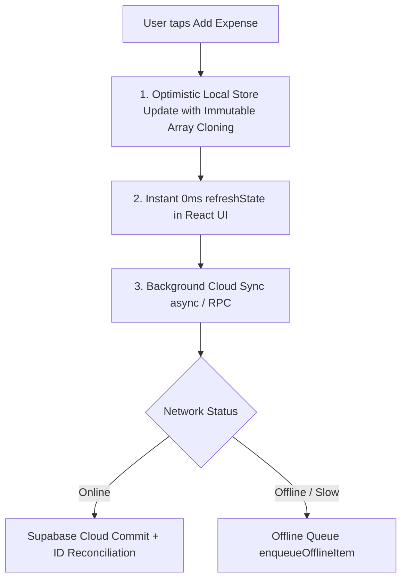

# Project Plan: Mobile App Cold Start Performance & Instant Data Reactivity Fix

**Slug:** `PLAN-mobile-perf-reactivity`  
**Generated:** 2026-09-24  
**Mode:** PLANNING ONLY  
**Target File:** `docs/PLAN-mobile-perf-reactivity.md`  

---

## 1. Executive Summary & Root Cause Analysis

Following on-device testing via USB debugging on physical hardware (Motorola Edge 60 Pro, Android 16), two severe user-facing defects were identified:

1. **Slow App Loading Time:** Cold start takes several seconds to display the UI, leaving the user on a splash screen and loading spinner.
2. **Missing Instant Data Updates (Personal Vault & Shared Room):** When adding a personal expense in the Vault or an expense in the Shared Room, the data does not appear immediately. The newly saved record only appears after killing and reopening the app.

---

### Root Cause 1: In-Place Array Mutation Breaks React `useMemo` & Reactivity
- **File:** `src/lib/storage/mockStorage.ts`
- **Mechanism:**
  - `createPersonalExpense()` mutates the internal array in place: `this.state.personalExpenses.unshift(newExp)`.
  - `createSharedExpense()` mutates in place: `this.state.sharedExpenses.unshift(newExp)` and `this.state.expenseSplits.push(...splits)`.
  - `recordSettlementPayment()` mutates in place: `this.state.settlementPayments.unshift(newPayment)`.
- **Impact in `App.tsx`:**
  - `refreshState()` executes `setDbState({ ...db.getState() })`. A shallow clone of the top-level object is created, but the internal arrays (`personalExpenses`, `sharedExpenses`, `expenseSplits`, etc.) retain the **identical array reference** in memory (`===`).
- **Impact in `MobilePersonalVault.tsx` & `MobileRoomLedger.tsx`:**
  - `userExpenses = useMemo(() => ..., [personalExpenses, currentUser.id, deletedExpenseCache])`.
  - Because `personalExpenses === prevProps.personalExpenses`, React's `useMemo` dependency check evaluates to `true` and **skips recomputing**.
  - All downstream memoized values (`thisWeekExpenses`, `selectedMonthExpenses`, `filteredExpenses`) also skip recomputation.
  - The UI continues rendering the stale, cached list.
- **Why it shows after reopening:** On app restart, `fetchCloudDatabaseState()` fetches from Supabase and calls `.map(...)`, which creates a brand new array reference. Only then does `useMemo` recompute and render the saved item.

---

### Root Cause 2: Asynchronous Cloud Awaiting Before UI Refresh
- **File:** `src/App.tsx`
- **Mechanism:**
  - In `handleAddPersonalExpense`, `await addPersonalExpenseCloud(...)` is executed before calling `refreshState()`.
  - In `handleAddSharedExpense`, it awaits `addSharedExpenseCloud(...)`, and then sequentially awaits `createInAppNotificationCloud(...)` inside a `for...of` loop for every roommate before `refreshState()` is called.
- **Impact:**
  - On cellular networks, high latency delays UI updates by 1.5 to 4 seconds. If a network timeout occurs or cloud sync fails, `refreshState()` is blocked entirely.

---

### Root Cause 3: Non-Atomic Shared Expense Inserts Trigger Realtime Race Condition
- **Files:** `src/lib/storage/cloudStorageAdapter.ts`, `src/App.tsx`
- **Mechanism:**
  - `addSharedExpenseCloud` performs two non-atomic HTTP calls: first `supabase.from('shared_expenses').insert()`, then `supabase.from('expense_splits').insert()`.
  - As soon as `shared_expenses` is inserted, Supabase Realtime notifies the app via `subscribeToRoomRealtime`.
  - The app immediately triggers `fetchCloudDatabaseState()`, which queries Supabase for `expense_splits` **before** the second insert has finished!
  - `fetchCloudDatabaseState()` receives 0 splits for the new expense, calls `db.saveState()`, and overwrites the local storage state—wiping out the splits that were just created locally.

---

### Root Cause 4: 407 KB Client-Side Tailwind JIT Runtime in WebView
- **Files:** `index.html`, `public/tailwind.js`
- **Mechanism:**
  - `index.html` loads ``, a 407 KB browser-side Tailwind JIT compiler.
  - On every launch, the mobile WebView must download/read, parse, and initialize this script. The compiler observes DOM mutations and dynamically calculates styles on the fly, consuming significant CPU cycles and blocking first paint on mobile devices.

---

### Root Cause 5: Blocking Auth Initializer & Splash Screen Delay
- **Files:** `capacitor.config.ts`, `src/App.tsx`
- **Mechanism:**
  - `capacitor.config.ts` sets `launchShowDuration: 1800` (holds native splash for 1.8 seconds minimum).
  - In `src/App.tsx`, `isAuthInitializing` defaults to `isSupabaseConfigured` (`true`), rendering a full-screen loading spinner while waiting for `supabase.auth.getSession()` over the internet.
  - Even when the resident is already logged in with a valid session in `localStorage`, the user is forced to wait for remote network resolution before seeing any UI.

---

### Root Cause 6: Duplicate Startup Cloud Fetches
- **File:** `src/App.tsx`
- **Mechanism:**
  - On mount, both `listenToNetworkStatus` (line 238) and the hydration `useEffect` (line 314) invoke `fetchCloudDatabaseState()` simultaneously without promise deduplication.
  - 22 parallel HTTP REST queries are fired at startup, saturating mobile bandwidth and degrading launch performance.

---

## 2. Solution Strategy: Architecture & Design Decisions

### Core Architecture Pillars:
1. **Immutable State in `mockStorage.ts` & `App.tsx`:**
   - Every mutation creates fresh array references (`[newExp, ...prev]`, `.map()`, `.filter()`).
   - `refreshState` shallow-clones top-level and explicitly clones all entity arrays, guaranteeing React `useMemo` hooks re-evaluate instantly.
2. **Optimistic Instant UI:**
   - Write to local storage and trigger `refreshState()` **immediately** upon form submission (0ms latency).
   - Sync to Supabase in the background asynchronously without blocking modal closure or UI feedback.
3. **Atomic Cloud Sync via Postgres RPC:**
   - Utilize existing `create_shared_expense_with_splits` RPC function to prevent split-wipe race conditions.
4. **Precompiled CSS / Remove Runtime JIT:**
   - Eliminate `public/tailwind.js` runtime overhead from `index.html`.
5. **Instant Cold Start (<150ms):**
   - If `getStoredResidentSession()` exists, render cached local state immediately without blocking on `isAuthInitializing`.
   - Set `launchShowDuration: 0` in `capacitor.config.ts` and dismiss splash via `SplashScreen.hide()` on first render.
   - Deduplicate `fetchCloudDatabaseState()` calls with a single-flight in-memory promise.

---

## 3. Detailed Task Breakdown

### Phase 1: Storage Immutability & Reactivity Fixes (Instant Updates)
- [ ] **`src/lib/storage/mockStorage.ts`**:
  - Update `createPersonalExpense`: use `crypto.randomUUID()` for 36-char UUIDs; return immutable state `{ ...this.state, personalExpenses: [newExp, ...this.state.personalExpenses] }`.
  - Update `deletePersonalExpense`: return immutable filtered array.
  - Update `createSharedExpense`: return immutable arrays for both `sharedExpenses` and `expenseSplits`.
  - Update `recordSettlementPayment`: return immutable array for `settlementPayments`.
  - Update `createRoom`, `addRoomMember`, `leaveRoom`, `removeMember`: ensure immutable array updates.
- [ ] **`src/App.tsx`**:
  - Update `refreshState` to ensure all array references are fresh copies.
  - Update `handleAddPersonalExpense`: call `refreshState()` immediately for 0ms optimistic UI, then execute background cloud sync.
  - Update `handleAddSharedExpense`: call `refreshState()` immediately, fire notification loop asynchronously in background.
  - Update `handleRecordSettlement`: call `refreshState()` immediately before background sync.
- [ ] **`src/components/mobile/MobilePersonalVault.tsx` & `MobileRoomLedger.tsx`**:
  - Verify `useMemo` hooks trigger re-render as soon as props change.

### Phase 2: Supabase Cloud Sync & Realtime Race Condition Remediation
- [ ] **`src/lib/storage/cloudStorageAdapter.ts`**:
  - Update `addSharedExpenseCloud` to use atomic RPC `create_shared_expense_with_splits` or insert splits transactionally.
  - Deduplicate `fetchCloudDatabaseState()` calls: implement an active promise cache so multiple concurrent calls share the same in-flight request.
  - Add `personal_expenses` realtime subscription listener or selective sync to keep multi-device personal data reconciled.
  - Align local ID format (`crypto.randomUUID()`) with Supabase primary key constraints.

### Phase 3: Cold Start Loading Time Optimization (<150ms Launch)
- [ ] **`capacitor.config.ts`**:
  - Set `SplashScreen.launchShowDuration: 0` and `launchAutoHide: false` to allow immediate programmatic dismiss.
- [ ] **`src/App.tsx`**:
  - Refactor `isAuthInitializing`: if `getStoredResidentSession()` returns a stored session and `db.getState().users` is populated, set `isAuthInitializing: false` immediately.
  - Run session verification and cloud hydration silently in the background.
  - Dismiss native splash screen on the very first mount of `AppContent`.
- [ ] **Tailwind Runtime Replacement**:
  - Audit `public/tailwind.js` dependency in `index.html`.
  - Generate precompiled static CSS bundle or integrate build-time Tailwind processing into Vite configuration, removing the 407 KB runtime script from the HTML head.

### Phase 4: Verification & Mobile Smoke Testing
- [ ] Verify Personal Vault:
  - Add private expense -> confirm it renders **immediately** on screen without restarting.
  - Delete expense -> confirm optimistic removal and undo toast.
  - Switch tabs and return -> confirm expense is preserved.
- [ ] Verify Shared Room Ledger:
  - Add shared bill -> confirm it appears in activity feed and balance summary instantly.
  - Record UPI settlement -> confirm pairwise debt updates immediately.
- [ ] Verify Cold Start:
  - Measure cold launch time from app icon tap to interactive dashboard (target: < 500ms).
  - Verify zero blank screens or delayed spinners for returning authenticated users.
- [ ] Run full test suite: `npm test` and `npm run build`.

---

## 4. Deliverables & Next Steps

| Deliverable | File Path | Status |
| :--- | :--- | :--- |
| Project Plan | `docs/PLAN-mobile-perf-reactivity.md` | **CREATED** |
| Implementation Review | Chat UI Brainstorming | **READY** |

---

### Recommended Next Steps:
1. Review the Brainstorm tradeoffs and recommendations below.
2. Confirm the preferred approach (Option B recommended).
3. Proceed with surgical implementation of Phase 1, Phase 2, and Phase 3.
