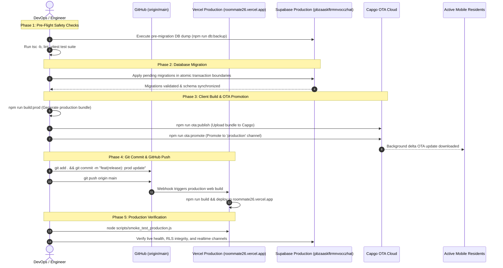

# Project Plan: Production Release Deployment & GitHub Synchronization

**File:** `docs/PLAN-prod-deploy-push.md`  
**Mode:** PLANNING ONLY (No code writing)  
**Task Slug:** `prod-deploy-push`  
**Target:** Controlled production update covering Supabase database migrations, Capgo OTA bundle promotion, Vercel web application deployment, and synchronized GitHub repository push.

---

## 1. User Decisions & Confirmed Architecture (Socratic Gate)

Through the mandatory Socratic Gate, the following decisions were confirmed by the user:

1. **Target Production Scope:**  
   **Full Production Suite**: Update the Web App on Vercel (`roommate26.vercel.app`), apply pending Supabase DB migrations on the production project (`pbzaaskftrmnvocczhat`), and publish/promote the Capgo OTA update to the `production` channel.
2. **Pre-Deployment Safety Gate:**  
   **Strict Safety Gate**: Execute a full logical PostgreSQL backup dump (`npm run db:backup`), run strict TypeScript compilation (`tsc -b`), lint check (`npm run lint`), and execute the Vitest test suite (`npm run test`) prior to mutating the production database or deploying artifacts.
3. **GitHub Push Strategy:**  
   **Direct Main Synchronization**: Stage all pending changes across frontend, mobile assets, database migrations, and documentation, commit cleanly to `main`, and push directly to `origin/main` (which will also trigger Vercel's automated production CD build).

---

## 2. Inventory of Pending Production Changes

### 2.1 Database Migrations (Supabase Production: `pbzaaskftrmnvocczhat`)
The following migrations are present in `supabase/migrations/` and pending execution on production:

| # | Migration File | Scope & Impact |
|---|----------------|----------------|
| **1** | `20260924223000_phase2c_supabase_advisor_remediation.sql` | Index optimization, foreign key indexes, and security advisor remediations |
| **2** | `20260925001500_fix_delete_user_account_unauthenticated_error.sql` | Hardens unauthenticated error handling during account deletion RPC |
| **3** | `20260929210000_fix_profiles_rls_infinite_recursion.sql` | Breaks recursive RLS policy loops on `profiles` and `room_members` |
| **4** | `20260929214500_add_resolve_room_invite_rpc.sql` | Adds secure server-side RPC for room invite code resolution |
| **5** | `20260929225500_superadmin_bug_reports_rpc.sql` | Exposes authenticated RPC for SuperAdmin bug report telemetry |
| **6** | `20260930103000_secure_bug_reporting_and_notifs.sql` | Implements secure client submission of bug reports and notification dispatch |
| **7** | `20260930104500_enable_realtime_read_sync.sql` | Configures Supabase Realtime publication for multi-device sync |
| **8** | `20260930114500_secure_personal_expenses_sync.sql` | Personal vault expenses cloud sync with isolated RLS |

### 2.2 Client Application Updates
- **SuperAdmin Realtime & Live Sync:** Postgres CDC subscription for live resident activity updates without manual refresh.
- **Progressive Feed & Pagination:** Infinite scroll / chunked loading for expenses and notification feeds to reduce memory footprint.
- **Personal Vault Sync:** Isolated, encrypted offline-first personal expense tracking with Supabase sync.
- **Theme & Dark Mode Support:** Theme provider integration with persistent mode preference.
- **Branded QR Generator & Scanner:** Enhanced UPI and room invite QR generation and parsing.
- **Notification Icon Hardening:** Standardized Android notification drawables (`ic_stat_notification.xml`) preventing white square icon glitches.

---

## 3. Deployment Architecture Flow

---

## 4. Detailed Task Breakdown

### Phase 1: Pre-Flight Safety Verification & Disaster Recovery Snapshot
- [ ] **Task 1.1: Code Quality & Type Integrity Check**
  - **Input:** Current workspace code state
  - **Action:** Run `npx oxlint src` and `npx tsc -b`
  - **Verify:** Zero type errors, zero unhandled lint issues
- [ ] **Task 1.2: Unit & Integration Test Suite**
  - **Input:** Test files in `src/**/*.test.ts`
  - **Action:** Run `npm run test`
  - **Verify:** All Vitest suites pass cleanly with exit code 0
- [ ] **Task 1.3: Pre-Deployment Database Logical Backup**
  - **Input:** Production connection credentials from `.env.local`
  - **Action:** Execute `npm run db:backup`
  - **Output:** SQL backup file saved to `backups/supabase_backup_<timestamp>.sql`
  - **Verify:** File exists, file size > 2.5 MB, SHA-256 fingerprint logged

---

### Phase 2: Production Database Migrations Execution (Supabase)
- [ ] **Task 2.1: Pre-Migration Schema Snapshot & Verification**
  - **Action:** Inspect table count and migration history on production DB
  - **Verify:** Database connection healthy, baseline verified
- [ ] **Task 2.2: Sequential Atomic Migration Application**
  - **Action:** Apply migrations 24 through 31 sequentially using atomic single-transaction execution:
    1. `20260924223000_phase2c_supabase_advisor_remediation.sql`
    2. `20260925001500_fix_delete_user_account_unauthenticated_error.sql`
    3. `20260929210000_fix_profiles_rls_infinite_recursion.sql`
    4. `20260929214500_add_resolve_room_invite_rpc.sql`
    5. `20260929225500_superadmin_bug_reports_rpc.sql`
    6. `20260930103000_secure_bug_reporting_and_notifs.sql`
    7. `20260930104500_enable_realtime_read_sync.sql`
    8. `20260930114500_secure_personal_expenses_sync.sql`
  - **Verify:** All 8 migrations succeed with exit code 0; zero SQL syntax errors or constraint violations
- [ ] **Task 2.3: Post-Migration Schema Integrity Audit**
  - **Action:** Verify newly created tables (`personal_expenses`), RPC functions (`resolve_room_invite`, `get_superadmin_bug_reports`), and RLS policies
  - **Verify:** No recursive RLS policies on `profiles`, `supabase_realtime` publication contains required tables

---

### Phase 3: Production Client Bundle & OTA Deployment (Capgo)
- [ ] **Task 3.1: Production Build Generation**
  - **Action:** Execute `npm run build:prod` (invokes `generate-build-info.js --channel production`, `tsc -b`, and `vite build --mode production`)
  - **Output:** Production assets in `dist/` with updated `buildInfo.ts`
  - **Verify:** `dist/index.html` exists, bundle size within budget, zero build errors
- [ ] **Task 3.2: Capgo OTA Bundle Packaging & Publishing**
  - **Action:** Execute `npm run ota:publish`
  - **Output:** Zipped web bundle uploaded to Capgo cloud with version tag
  - **Verify:** Capgo CLI returns upload success with checksum and release ID
- [ ] **Task 3.3: OTA Channel Promotion**
  - **Action:** Execute `npm run ota:promote` targeting `production` channel
  - **Verify:** Release marked active on `production` channel for active mobile app instances

---

### Phase 4: Git Synchronization & Production Push (GitHub & Vercel)
- [ ] **Task 4.1: Workspace Staging & Review**
  - **Action:** Run `git status` to verify all relevant modified and untracked files are staged
  - **Files:** Source code, migrations, Android drawables, documentation plans, test scripts
  - **Verify:** No unintended credentials or temp files staged (`.env.local` must remain ignored)
- [ ] **Task 4.2: Structured Commit Creation**
  - **Action:** Create commit with conventional changelog message:
    `feat(release): production update - vault sync, realtime superadmin, and security hardening`
  - **Verify:** Git commit SHA created on branch `main`
- [ ] **Task 4.3: Remote Push to GitHub**
  - **Action:** Run `git push origin main`
  - **Verify:** GitHub accepts push; remote `origin/main` matches local `main`
- [ ] **Task 4.4: Vercel Production Build Confirmation**
  - **Action:** Monitor Vercel webhook build triggered by push to `main`
  - **Verify:** Vercel deployment completes successfully with status `READY` on `roommate26.vercel.app`

---

### Phase 5: Post-Deployment Smoke Testing & Production Verification
- [ ] **Task 5.1: Production Web Smoke Test**
  - **Action:** Run `node scripts/smoke_test_production.js`
  - **Verify:** HTTP 200 on `https://roommate26.vercel.app/`, `/api/health` returns status OK, CSP and HSTS headers present
- [ ] **Task 5.2: Live API & Database Connectivity Check**
  - **Action:** Check Supabase health and anonymous endpoints
  - **Verify:** Database queries and realtime channels operational
- [ ] **Task 5.3: Production Release Report**
  - **Action:** Generate final deployment verification report with commit SHA, migration checksums, and deployment timestamps
  - **Output:** `docs/ROOMMATE_PRODUCTION_RELEASE_VERIFICATION_REPORT.md`

---

## 5. Verification Checklist & Success Criteria

| Milestone | Gate Criteria | Verification Method |
|---|---|---|
| **Pre-Flight** | 0 lint errors, 0 type errors, 100% test pass | `npm run lint && npx tsc -b && npm run test` |
| **DB Backup** | Uncorrupted logical dump file > 2.5 MB | `npm run db:backup` |
| **Migrations** | 8/8 migrations committed in single transactions | SQL log & schema verification |
| **Client Bundle** | Production Vite build compiles cleanly | `npm run build:prod` |
| **OTA Release** | Deployed to Capgo `production` channel | `npm run ota:publish && npm run ota:promote` |
| **Git Push** | Synced to `origin/main` on GitHub | `git log -1` matches remote |
| **Web Deploy** | Live on `roommate26.vercel.app` with HTTP 200 | `node scripts/smoke_test_production.js` |

---

## 6. Rollback & Disaster Recovery Strategy

1. **Database Rollback:**  
   If any migration fails mid-execution, PostgreSQL's `--single-transaction` rolls back the individual transaction automatically. If data inconsistency occurs post-deployment, restore from the pre-migration snapshot created in Phase 1 (`backups/supabase_backup_<timestamp>.sql`).
2. **OTA Rollback:**  
   If the new web bundle causes client crashes on mobile, run `npm run ota:rollback` to instantly roll back the active release on the Capgo `production` channel to the previous stable release.
3. **Web Application Rollback:**  
   If the Vercel web deployment encounters runtime issues, promote the previous instant deployment in the Vercel dashboard or revert the commit on GitHub (`git revert HEAD && git push origin main`).
