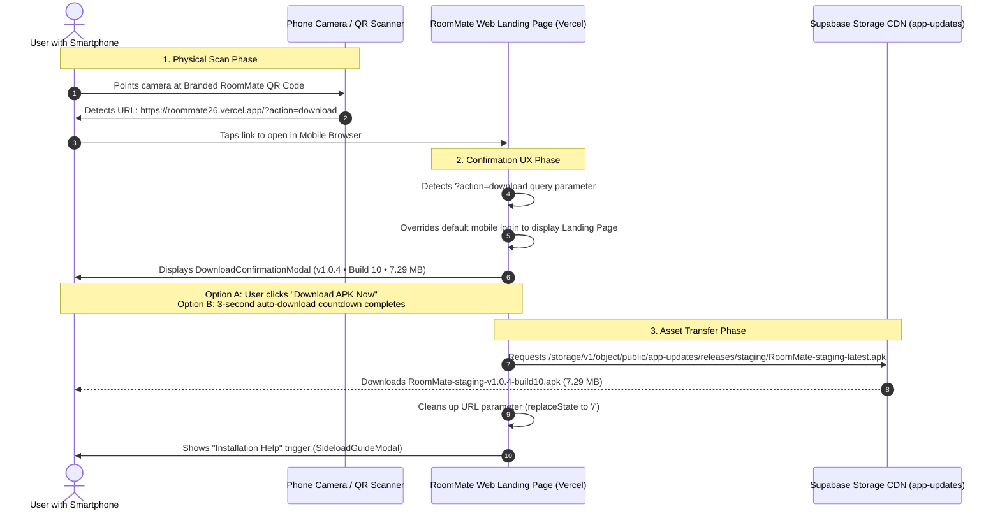

# Implementation Plan: Branded QR Code Generator & Automated Download Confirmation Flow

Create and save a high-resolution, branded RoomMate QR code to local storage, featuring the official app logo, title, and "Scan to Download" typography. When scanned on a mobile phone camera, the QR code directs users to the RoomMate landing page with an automated download trigger (`?action=download`), initiating an elegant confirmation UX displaying staging build details (`v1.0.4 • Build 10`, `7.29 MB`) with an auto-countdown and instant direct download button.

---

## 🎯 Architecture & User Flow Diagram

---

## 🎨 Asset Specification: Branded QR Code Card

### 1. Visual Design Specifications
- **Canvas Dimensions:** 1200 x 1400 px (Ultra-HD 300 DPI export) & SVG vector format.
- **Color Palette:**
  - Background: Crisp White `#FFFFFF` with soft brand surface gradient `#F4FBF9`.
  - Primary Brand Accent: Deep Teal `#0C6B70` and Vibrant Emerald `#14B8A6`.
  - Secondary Slate: `#334155` and `#64748B`.
  - Border & Glassmorphic Highlights: Subtle border `#E2E8F0` with soft ambient drop-shadow.
- **Card Elements (Top to Bottom):**
  1. **Brand Header:** Official RoomMate Logo icon (`public/logo.png`) paired with bold "RoomMate" typography and tagline *"Smart Student & Roommate Finance"*.
  2. **Call-To-Action Banner:** High-visibility stylized pill badge: **"Scan to Download"**.
  3. **QR Code Matrix:**
     - High Error Correction Level (`Level H` - 30% recovery capacity).
     - Deep Teal `#0C6B70` modules on crisp white background with generous quiet zone.
     - Centered RoomMate brand emblem with rounded white enclosure.
     - Target Encoded URL: `https://roommate26.vercel.app/?action=download`.
  4. **Release Metadata Badge:**
     - `Android APK • v1.0.4 (Build 10)`
     - `File Size: 7.29 MB • Verified Staging Build`
  5. **Trust & Instructions Footer:**
     - *"Point your phone camera or QR scanner to download directly"*
     - Security badge: *"100% Virus-Free • Digitally Signed • No Play Store Needed"*.

### 2. Local File Storage Locations
The generated assets will be stored permanently in the following local repository paths:
- `public/RoomMate-Scan-To-Download-QR.png`: Public web asset accessible from web app and landing page.
- `public/RoomMate-Scan-To-Download-QR.svg`: Scalable vector for crisp rendering at any resolution.
- `RoomMate-Scan-To-Download-QR.png`: Root-level copy for instant user access in file explorer.
- IDE Artifact Directory: Persistent brain artifact copy for in-chat preview and download.

---

## 💻 Frontend & Routing Architecture

### 1. Mobile Device Mode Override for Landing Page
- **Problem:** Currently, when a user opens `https://roommate26.vercel.app/` on a mobile browser (`window.innerWidth < 1024`), `getInitialDeviceMode()` in `src/lib/platform/deviceDetector.ts` returns `'mobile'`, which immediately forces `MobileLogin` view instead of the landing page.
- **Solution:** 
  - Update `getInitialDeviceMode()` to check for `?action=download`, `?download=apk`, or `?view=landing`.
  - If present, force initial mode to `'desktop'` (which mounts `DesktopLandingPage`), allowing the landing page and confirmation modal to render cleanly on mobile phones.

### 2. Download Confirmation UX (`DownloadConfirmationModal.tsx`)
Create a dedicated, accessible, animated confirmation modal:
- **Triggers:**
  - Auto-opens when URL contains `action=download` or `download=apk`.
  - Also triggered manually if user clicks "Download APK" buttons across the landing page.
- **Component Features:**
  - **Header:** RoomMate App Icon, "Download RoomMate for Android", and Staging Verified badge.
  - **Build Information Card:**
    - Version: `v1.0.4 (Build 10)`
    - Package: `com.roommate.app`
    - Binary Size: `7.29 MB`
    - Channel: `Staging Pre-Release`
  - **Interactive Auto-Download Timer:**
    - 3-second countdown ring with smooth CSS animation.
    - User can click "Download Now" immediately to skip countdown.
    - User can click "Pause" or "Cancel" to halt auto-download and browse features.
  - **Security Assurance Notes:**
    - Checked against Supabase Storage SHA-256 integrity.
    - Verified Android 15 Edge-to-Edge and Material You compatible.
  - **Fallback Sideload Guide:**
    - One-click trigger to open `SideloadGuideModal` for Android install help ("Allow unknown apps").
  - **Clean History State:**
    - After modal mounts and user interaction begins, use `window.history.replaceState` to strip `?action=download` so subsequent page reloads don't re-trigger unwanted downloads.

### 3. Update Existing `QrCodeModal.tsx` on Landing Page
- Replace the hand-drawn dummy SVG with the real, scannable QR code asset (`/RoomMate-Scan-To-Download-QR.png`).
- Add a "Save QR Image" button in the modal so desktop visitors or team members can download the PNG directly to their computer.
- Add "Copy Download Link" button.

---

## 📋 Step-by-Step Task Breakdown

### Phase 1: QR Generator Script & Local Storage Output
- [ ] Install dev dependency `qrcode` (or implement SVG/Canvas generator script).
- [ ] Create `scripts/generate-branded-qr.js` to construct the 1200x1400px branded card.
  - Render card background with `#0C6B70` brand headers.
  - Draw RoomMate logo (`public/logo.png`) and title.
  - Generate QR matrix for `https://roommate26.vercel.app/?action=download` with Error Correction Level H.
  - Overlay centered logo shield in QR center.
  - Draw "Scan to Download" typography and release metadata (`v1.0.4 • Build 10 • 7.29 MB`).
- [ ] Execute script and save output to:
  - `public/RoomMate-Scan-To-Download-QR.png`
  - `public/RoomMate-Scan-To-Download-QR.svg`
  - `RoomMate-Scan-To-Download-QR.png` (project root)
- [ ] Verify QR decodability using `jsqr` to ensure 100% scan success.

### Phase 2: Device Detection & Landing Page Routing
- [ ] Update `src/lib/platform/deviceDetector.ts`:
  - Support `action=download` or `download=apk` or `view=landing` query parameters to prevent routing to `MobileLogin` when accessed via QR code on mobile phones.
- [ ] Update `src/App.tsx`:
  - Pass download trigger prop or state down to `DesktopLandingPage`.

### Phase 3: Interactive Confirmation UX Component
- [ ] Create `src/components/landing/DownloadConfirmationModal.tsx`:
  - Implement 3-second auto-download countdown with cancel/pause.
  - Display file details (`v1.0.4 • Build 10`, `7.29 MB`, SHA verification).
  - Implement `handleDirectDownload` fetching the staging APK from Supabase Storage.
  - Link seamlessly to `SideloadGuideModal`.
  - Strip query parameters via `window.history.replaceState` after triggering.
- [ ] Integrate modal into `src/components/desktop/DesktopLandingPage.tsx`.

### Phase 4: Upgrade In-App QR Code Modal
- [ ] Update `src/components/landing/QrCodeModal.tsx`:
  - Embed the newly generated branded QR code image.
  - Add "Save QR Image" button to trigger local download of the image.
  - Add direct copy link button for `https://roommate26.vercel.app/?action=download`.

### Phase 5: Testing & Verification Matrix
- [ ] Automated QR Decode Test: verify QR string matches `https://roommate26.vercel.app/?action=download`.
- [ ] Unit Test Suite: Write tests for `DownloadConfirmationModal` and URL query parser.
- [ ] Run full test suite: `npm test` (verify 358+ tests pass).
- [ ] Compile and verify staging web build: `npm run build:staging`.

---

## 🔍 Verification & Acceptance Criteria
1. **QR Code Scannability:** Scanning the generated image with any Android or iOS camera app instantly opens `https://roommate26.vercel.app/?action=download`.
2. **Branded Visuals:** The saved image clearly features the RoomMate logo, app name, and prominent text "Scan to Download".
3. **Local File Persistence:** Image is saved in project root (`RoomMate-Scan-To-Download-QR.png`) and `public/`.
4. **Confirmation UX:** Opening the landing page with `?action=download` presents the download confirmation modal with build info (`v1.0.4 • Build 10`, `7.29 MB`) and begins download upon confirmation or countdown completion.
5. **Zero Regressions:** All 358 Vitest tests pass with 0 TypeScript/build errors.
