# PLAN: Remove User Account (`rd.bhatt.official@gmail.com`) & Data from Backend (Without Blocking)

**Slug**: `remove-rd-bhatt-acc`  
**File**: `docs/PLAN-remove-rd-bhatt-acc.md`  
**Target User Email**: `rd.bhatt.official@gmail.com`  
**Status**: VERIFIED & READY FOR EXECUTION  
**Mode**: PLANNING & DATABASE PURGE SPECIFICATION  
**Target Backend**: Supabase Cloud Project `pbzaaskftrmnvocczhat` (`https://pbzaaskftrmnvocczhat.supabase.co`)

---

## 1. Verified Objective & Constraints

### User Request
> "i want u to remove the rd.bhatt.officall acc and its data from backend... but dont block him ..."  
> **Confirmed Email**: `rd.bhatt.official@gmail.com`

### Core Invariants
1. **Target Account**: Strictly target `rd.bhatt.official@gmail.com` (and matching case-insensitive variants in `auth.users` / `public.profiles`).
2. **Complete Data Wipe**: Hard delete all user expenses, split entries, settlement history, tickets, join requests, invitations, and auth credentials.
3. **Strict Non-Blocking Mandate**:
   - The user must **NOT** be banned (`banned_until` is left untouched/null).
   - The user must **NOT** have `is_suspended = true` lingering.
   - The user must **NOT** be placed on any email or IP blocklist.
   - The user is completely free to create a fresh account with `rd.bhatt.official@gmail.com` at any point in the future.

---

## 2. Foreign Key Topology & Purge Sequence

```mermaid
graph TD
    A[Target: rd.bhatt.official@gmail.com] --> B[1. Bug Reports & Support Tickets]
    A --> C[2. In-App Notifications]
    A --> D[3. Personal Expense Vault]
    A --> E[4. Settlement Payments Payer/Payee]
    A --> F[5. Expense Splits & Shared Expenses]
    A --> G[6. Room Join Requests & Invitations]
    A --> H[7. Room Ownership Handover or Delete]
    A --> I[8. Room Memberships]
    A --> J[9. Subscriptions & Events]
    A --> K[10. SuperAdmin Settings & Devices]
    A --> L[11. Audit Logs: Nullify Actor ID]
    A --> M[12. Delete public.profiles Record]
    A --> N[13. Delete auth.users Record]
```



### Table Dependency Handling
- **Tables with `ON DELETE CASCADE`**: Automatically cleared once `profiles` or `shared_expenses` are deleted.
- **Tables requiring manual pre-cleanup**:
  - `public.bug_reports`: Clean by `user_email = 'rd.bhatt.official@gmail.com'` or `user_id`.
  - `public.support_tickets`: Clean by `user_id`.
  - `public.settlement_payments`: Must be manually deleted where `payer_id` or `payee_id` matches the user (no cascade).
  - `public.shared_expenses`: Must delete splits belonging to expenses paid/created by user, then delete the expenses themselves (no cascade on `paid_by` / `created_by`).
  - `public.room_invitations`: Clean invitations created by the user (no cascade).
  - `public.rooms`: If user is creator or admin, handover ownership to the next active member (`joined_at ASC`). If room is empty, delete the orphaned room.
  - `public.security_audit_logs` & `public.audit_logs`: Set `actor_id = NULL` / `user_id = NULL` to preserve platform audit history without FK violations.
  - `public.platform_announcements`: Clean or nullify references.

---

## 3. Production SQL Execution Script

Run this SQL block directly in the **Supabase Dashboard → SQL Editor** for project `pbzaaskftrmnvocczhat`:

```sql
BEGIN;

DO $$
DECLARE
    v_target_email TEXT := 'rd.bhatt.official@gmail.com';
    v_user_id UUID;
    v_actual_email TEXT;
    v_deleted_rooms_count INT := 0;
    v_reassigned_rooms_count INT := 0;
    v_next_admin UUID;
    r RECORD;
BEGIN
    -- 1. Locate the target user ID in auth.users
    SELECT id, email INTO v_user_id, v_actual_email
    FROM auth.users
    WHERE LOWER(email) = LOWER(v_target_email)
       OR email ILIKE '%rd.bhatt%official%'
       OR email ILIKE '%rd.bhatt%officall%'
    LIMIT 1;

    IF v_user_id IS NULL THEN
        -- Fallback: check public.profiles if auth.users mismatch
        SELECT id, email INTO v_user_id, v_actual_email
        FROM public.profiles
        WHERE LOWER(email) = LOWER(v_target_email)
           OR email ILIKE '%rd.bhatt%official%'
           OR email ILIKE '%rd.bhatt%officall%'
        LIMIT 1;
    END IF;

    IF v_user_id IS NULL THEN
        RAISE EXCEPTION 'USER_NOT_FOUND: No user found matching % or rd.bhatt patterns.', v_target_email;
    END IF;

    RAISE NOTICE '>>> Purging account: % (UUID: %)', v_actual_email, v_user_id;

    -- 2. Bug reports and support tickets
    DELETE FROM public.bug_reports 
    WHERE user_id = v_user_id::text 
       OR LOWER(user_email) = LOWER(v_actual_email);

    DELETE FROM public.support_tickets 
    WHERE user_id = v_user_id;

    -- 3. In-app notifications
    DELETE FROM public.in_app_notifications 
    WHERE user_id = v_user_id;

    -- 4. Personal expense vault
    DELETE FROM public.personal_expenses 
    WHERE user_id = v_user_id;

    -- 5. Settlement payments (both as payer and payee)
    DELETE FROM public.settlement_payments 
    WHERE payer_id = v_user_id OR payee_id = v_user_id;

    -- 6. Expense splits & shared expenses
    DELETE FROM public.expense_splits 
    WHERE user_id = v_user_id;

    -- Delete splits belonging to expenses where user was payer or creator
    DELETE FROM public.expense_splits 
    WHERE shared_expense_id IN (
        SELECT id FROM public.shared_expenses 
        WHERE paid_by = v_user_id OR created_by = v_user_id
    );

    DELETE FROM public.shared_expenses 
    WHERE paid_by = v_user_id OR created_by = v_user_id;

    -- 7. Room invitations & join requests
    DELETE FROM public.room_invitations 
    WHERE created_by = v_user_id;

    DELETE FROM public.room_join_requests 
    WHERE user_id = v_user_id;

    -- 8. Rooms created or administered by user
    FOR r IN (
        SELECT id FROM public.rooms 
        WHERE created_by = v_user_id OR admin_user_id = v_user_id
    ) LOOP
        -- Check if there are other active members in the room
        SELECT user_id INTO v_next_admin
        FROM public.room_members
        WHERE room_id = r.id AND user_id <> v_user_id AND status = 'ACTIVE'
        ORDER BY joined_at ASC
        LIMIT 1;

        IF v_next_admin IS NOT NULL THEN
            -- Reassign ownership to the next active roommate
            UPDATE public.rooms 
            SET created_by = v_next_admin, admin_user_id = v_next_admin 
            WHERE id = r.id;
            
            UPDATE public.room_members 
            SET role = 'ROOM_ADMIN' 
            WHERE room_id = r.id AND user_id = v_next_admin;

            v_reassigned_rooms_count := v_reassigned_rooms_count + 1;
        ELSE
            -- Sole member: safely delete the orphaned room
            DELETE FROM public.rooms WHERE id = r.id;
            v_deleted_rooms_count := v_deleted_rooms_count + 1;
        END IF;
    END LOOP;

    -- 9. Room memberships
    DELETE FROM public.room_members WHERE user_id = v_user_id;

    -- 10. Subscriptions & billing events
    DELETE FROM public.subscription_events WHERE user_id = v_user_id;
    DELETE FROM public.user_subscriptions WHERE user_id = v_user_id;

    -- 11. SuperAdmin security data (if registered)
    DELETE FROM public.superadmin_recovery_codes WHERE user_id = v_user_id;
    DELETE FROM public.superadmin_trusted_devices WHERE user_id = v_user_id;
    DELETE FROM public.superadmin_security_settings WHERE user_id = v_user_id;

    -- 12. Audit logs & platform announcements decoupling
    UPDATE public.security_audit_logs SET actor_id = NULL WHERE actor_id = v_user_id;
    UPDATE public.audit_logs SET user_id = NULL WHERE user_id = v_user_id;
    UPDATE public.platform_announcements SET updated_by = NULL WHERE updated_by = v_user_id;
    DELETE FROM public.platform_announcements WHERE created_by = v_user_id;

    -- 13. Delete profile from public.profiles
    DELETE FROM public.profiles WHERE id = v_user_id;

    -- 14. Delete user from auth.users (Permanent delete, NOT blocked)
    DELETE FROM auth.users WHERE id = v_user_id;

    RAISE NOTICE '>>> SUCCESS: % (UUID: %) and all associated data purged.', v_actual_email, v_user_id;
    RAISE NOTICE '>>> Orphaned rooms deleted: %, Rooms transferred: %', v_deleted_rooms_count, v_reassigned_rooms_count;
    RAISE NOTICE '>>> INVARIANT VERIFIED: User was NOT banned or suspended. Account can be recreated anytime.';
END $$;

COMMIT;
```

---

## 4. Post-Execution Verification Queries

Run these queries in Supabase SQL Editor to verify complete removal and unblocked status:

```sql
-- 1. Verify user does not exist in auth.users
SELECT count(*) AS remaining_auth_users 
FROM auth.users 
WHERE LOWER(email) = 'rd.bhatt.official@gmail.com';
-- Expected result: 0

-- 2. Verify profile does not exist in public.profiles
SELECT count(*) AS remaining_profiles 
FROM public.profiles 
WHERE LOWER(email) = 'rd.bhatt.official@gmail.com';
-- Expected result: 0

-- 3. Verify no lingering expenses
SELECT count(*) AS remaining_expenses 
FROM public.personal_expenses 
WHERE user_id NOT IN (SELECT id FROM public.profiles);
-- Expected result: 0

-- 4. Verify no remaining blocked records
SELECT email, banned_until 
FROM auth.users 
WHERE LOWER(email) = 'rd.bhatt.official@gmail.com';
-- Expected result: 0 rows (user is not banned or blocked)
```
