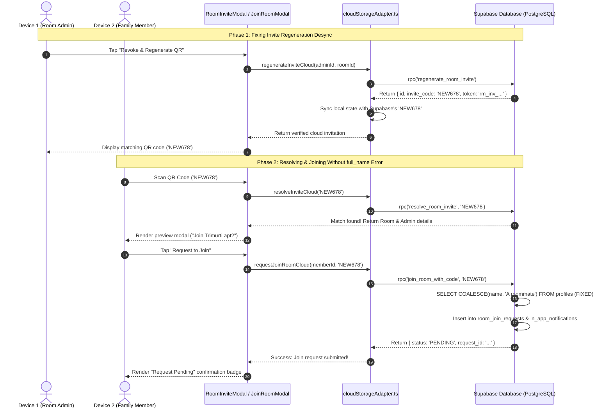

# Project Plan: Fix Room Join & Invite QR Code Synchronization

**Plan Slug:** `PLAN-room-join-fix`  
**Target File:** `docs/PLAN-room-join-fix.md`  
**Date:** 2026-10-03  
**Status:** PROPOSED (Mode: Planning Only)  

---

## 1. Problem Statement & Root Cause Analysis

During multi-device testing with family members, two severe room-joining errors occurred:

### Error 1: `column "full_name" does not exist` (Screenshot 1)
- **Observed Behavior:** When a user scanned a valid room QR code, the modal showed the room details ("Join Trimurti apt? Admin: Raju, 1 members"). Upon tapping **"Request to Join"**, a red banner appeared: `column "full_name" does not exist`.
- **Root Cause Identified:**
  - In `supabase/migrations/20261003120000_realtime_join_requests_and_notifications.sql` (Line 137), the function `public.join_room_with_code` executes:
    ```sql
    SELECT COALESCE(full_name, name, 'A roommate') INTO v_requester_name
    FROM public.profiles
    WHERE id = v_caller_id;
    ```
  - In the database schema, table `public.profiles` has the column `name` (and `email`, `role`, `avatar_url`), but **no column named `full_name`**.
  - PostgreSQL compiles dynamic PL/pgSQL queries at execution time. When `v_caller_id` requests to join, PostgreSQL aborts with `column "full_name" does not exist`, rolling back the join request transaction.

---

### Error 2: `Room invite not found. Please check the code or ask the admin for a new link.` (Screenshot 2)
- **Observed Behavior:** When the admin revoked the old QR code and generated a new QR code, scanning the new QR code on the second device resulted in: `Room invite not found. Please check the code or ask the admin for a new link.`
- **Root Cause Identified:**
  - In `src/lib/storage/cloudStorageAdapter.ts` (`regenerateInviteCloud`), the function was calling:
    ```typescript
    const result = db.regenerateInvite(requesterUserId, roomId, expirationHours);
    ...
    await supabase.rpc('regenerate_room_invite', { ... });
    ...
    return result;
    ```
  - **State Desynchronization:**
    1. Supabase's `regenerate_room_invite` generated a random 6-character code `v_new_code` (e.g. `ABC123`) and token in PostgreSQL.
    2. However, `regenerateInviteCloud` discarded/ignored the RPC's returned `data` and returned `result` from local `mockStorage` (e.g. `XYZ789`).
    3. The admin's phone UI rendered a QR code and link encoding `XYZ789`.
    4. The second phone scanned `XYZ789` and queried Supabase's `resolve_room_invite` RPC.
    5. In Supabase, the active invite was `ABC123`, while `XYZ789` never existed in the database.
    6. Supabase raised `INVITE_UNAVAILABLE: This room invitation is no longer valid or does not exist.`, causing `JoinRoomModal.tsx` to display `Room invite not found`.

---

## 2. Architecture & Remediation Strategy



---

## 3. Work Breakdown Structure

### Phase 1: Database Migration (Fix `full_name` column error)
- **Target File:** `supabase/migrations/20261003140000_fix_room_join_full_name_and_invite_sync.sql`
- **Actions:**
  1. Patch `public.join_room_with_code(p_invite_code TEXT)` to query `COALESCE(name, 'A roommate')` instead of `COALESCE(full_name, name, 'A roommate')`.
  2. Verify that `in_app_notifications` inserts and `room_join_requests` status logic remain strictly intact.
  3. Create runner script `scripts/apply_room_join_fix.cjs` and execute it against Supabase AWS pooler.
- **Assigned Agent:** `backend-specialist`

### Phase 2: Client Cloud Storage Adapter Hardening
- **Target File:** `src/lib/storage/cloudStorageAdapter.ts`
- **Actions:**
  1. Refactor `regenerateInviteCloud`:
     - Capture `const { data, error } = await supabase.rpc('regenerate_room_invite', ...);`
     - If RPC succeeds, unpack `data.invite_code`, `data.token`, `data.id`, and `data.expires_at`.
     - Update `state.roomInvitations` in the local DB so local memory reflects the exact cloud invitation.
     - Return the validated cloud invitation object to ensure UI renders the true server code.
     - Maintain safe local fallback only if network/cloud sync is disabled.
  2. Ensure `resolveInviteCloud` and `requestJoinRoomCloud` trim and clean invite tokens consistently.
- **Assigned Agent:** `frontend-specialist`

### Phase 3: Automated Testing & Verification
- **Target File:** `src/components/mobile/roomJoinInvite.test.ts`
- **Actions:**
  1. Add tests for `regenerateInviteCloud` verifying:
     - Cloud RPC return payload is persisted to local state.
     - Generated invite codes match the cloud response.
  2. Add tests for `requestJoinRoomCloud` mocking Supabase response for approval-required rooms.
  3. Execute `npm run test` or `npx vitest run src/components/mobile/roomJoinInvite.test.ts`.
- **Assigned Agent:** `debugger` / `frontend-specialist`

---

## 4. Verification Checklist & Success Criteria

| Check | Expected Result | Verified By |
|-------|-----------------|-------------|
| 1. PostgreSQL Schema Query | `SELECT COALESCE(name, 'A roommate') FROM public.profiles` succeeds without 42703 error | `scripts/apply_room_join_fix.cjs` |
| 2. QR Code Regeneration | Admin device displays QR code matching Supabase `room_invitations.invite_code` | Unit Test + Cloud Adapter |
| 3. Invite Resolution | Family device scans regenerated QR, resolves room name and admin name | `resolve_room_invite` RPC |
| 4. Request to Join | Family device clicks "Request to Join", receives `status: 'PENDING'` with zero SQL errors | `join_room_with_code` RPC |
| 5. Notification Dispatch | Admin device receives real-time notification: `"🔔 New Join Request: [Name] wants to join Trimurti apt"` | Supabase In-App Notifications |
| 6. Lint & Build | TypeScript compilation passes without errors | `npm run build` |

---

## 5. Next Steps

- This plan is in **PLANNING ONLY** mode. No code modifications have been made.
- Review the plan above.
- To execute this plan, confirm to proceed or run `/create` to implement the fixes step-by-step.
