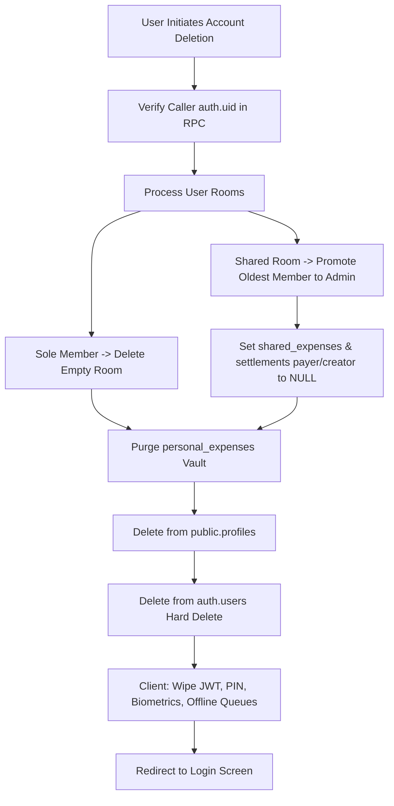

# PLAN: Fully Functional Sign Out (All/Other Devices) & Account Deletion

**Slug**: `signout-delete-account`  
**File**: `docs/PLAN-signout-delete-account.md`  
**Mode**: PLANNING ONLY (no code changes during plan creation)  
**Target Backend**: Supabase Cloud Project `pbzaaskftrmnvocczhat` & Local State Engine  

---

## 1. Objectives

1. **Sign Out Other Devices**:
   - Invalidate all other active device refresh tokens via `supabase.auth.signOut({ scope: 'others' })`.
   - Keep current phone signed in seamlessly with feedback toast.
2. **Sign Out From All Devices**:
   - Invalidate all active sessions globally across all devices via `supabase.auth.signOut({ scope: 'global' })`.
   - Clear local resident JWT session, reset app state, and return phone to Login.
3. **Delete RoomMate Account (Hard Delete)**:
   - Replace fake `setTimeout` with atomic Supabase RPC `public.delete_user_account()` and local storage wiper.
   - Clean up foreign keys with `ON DELETE SET NULL` on expenses and settlements so existing room members don't experience crashes or lose history.
   - Automatically transfer room admin role if the user was an admin with remaining roommates; delete empty rooms if sole member.
   - Hard-delete from `public.profiles` and `auth.users`, purge private vaults, subscriptions, push tokens, and App Lock PINs.
   - Transition user cleanly to logged-out onboarding view.

---

## 2. Table Dependency & Foreign Key Handling

---

## 3. Tasks Breakdown

- [ ] **Phase 1: Database Migration (`20260918_account_deletion_and_session_management.sql`)**
  - Drop strict NOT NULL & update FKs to `ON DELETE SET NULL` for shared expenses, settlements, rooms, and invitations.
  - Implement atomic `public.delete_user_account()` RPC with `SECURITY DEFINER`.
- [ ] **Phase 2: Storage & Service Implementation**
  - Add `deleteUserAccount` in `src/lib/storage/mockStorage.ts`.
  - Add `deleteUserAccountCloud`, `signOutOtherDevicesCloud`, and `signOutAllDevicesCloud` in `src/lib/storage/cloudStorageAdapter.ts`.
- [ ] **Phase 3: UI & Modals Polish**
  - Update `SignOutOthersModal.tsx` to handle both other devices and all devices with real API calls.
  - Wire `DeleteAccountModal.tsx` with true asynchronous deletion, error handling, and loading spinner.
  - Update `SecurityTab.tsx` with both "Sign Out Other Devices" and "Sign Out From All Devices" actions.
  - Update `App.tsx` to ensure `handleLogout` cleans Supabase Auth sessions and add `handleAccountDeleted`.
- [ ] **Phase 4: Verification**
  - Verify build (`npm run build`) and tests (`npm run test`).
  - Verify device sign-out and account deletion behavior.
