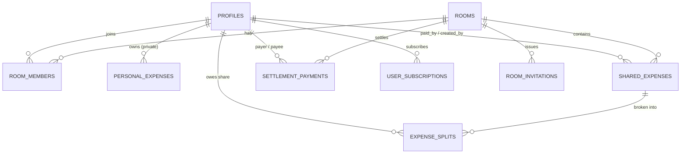

# Project Plan: Supabase Backend Integration for Student Expense App

**File:** `docs/PLAN-supabase-backend.md`  
**Mode:** PLANNING ONLY  
**Task Slug:** `supabase-backend`  
**Target:** Production-grade Supabase database architecture, PostgreSQL schema with Row-Level Security (RLS), Auth triggers, and seamless client integration for the Student Expense App.

---

## 1. Context & Architecture Review

### Domain Model
The Student Expense App currently runs on an in-memory/localStorage mock layer (`src/lib/storage/mockStorage.ts`) with the following core entities:
1. **User / Profile (`profiles`)**: Student metadata, role (`STUDENT` / `SUPER_ADMIN`), university details, suspension status.
2. **Personal Expense Vault (`personal_expenses`)**: 100% private financial tracker per user (Food, Academics, Travel, Shopping, Health, etc.).
3. **Room Ledger (`rooms`, `room_members`, `room_invitations`)**: Shared flatmate environments, invite codes (6-digit alphanumeric), member roles (`ROOM_ADMIN`, `MEMBER`).
4. **Shared Expenses & Splits (`shared_expenses`, `expense_splits`)**: Room bills (Rent, Electricity, Wi-Fi, Groceries) with multi-modal splits (`EQUAL`, `EXACT`, `PERCENTAGE`, `SHARES`).
5. **Settlements (`settlement_payments`)**: Direct peer-to-peer debt resolution (UPI, Cash, Bank Transfer).
6. **SaaS Subscriptions (`user_subscriptions`, `subscription_events`)**: Razorpay/Stripe billing tiers (`FREE`, `PRO ₹49/mo`, `CAMPUS_MAX`).
7. **Audit Logs (`audit_logs`)**: Security, audit trail, and admin activity logging.

### Supabase MCP Server Status & Connectivity Check
- **MCP Server Connection**: Connected and operational via `supabase_mcp_server`.
- **Discovered Organizations**:
  - `mjupvvpdqvphpolcupwt` ("rajdeepbhattacharyya") — Free plan, 2 active projects: `gqwgvhxcssooxbmwgiwt` ("e commerce"), `nbnsfszhjvvygqdcooni` ("DineAR").
  - `xngthxvkdksjjskyuils` ("project 002") — Free plan, 0 active projects.
- **Reference in `.mcp.json`**:
  - Refers to project `pbzaaskftrmnvocczhat`. Currently returns `403 Forbidden` / `Access Denied` under the configured CLI access token (may belong to another organization or require updated token permissions).
- **Strategy**:
  - We design full SQL migrations and DDL scripts compatible with Supabase MCP deployment.
  - User can select whether to create a new project in `project 002`, update the token for `pbzaaskftrmnvocczhat`, or target a specific project.

---

## 2. Dynamic Agent Assignments

| Agent Role | Skill / Focus | Responsibilities |
| :--- | :--- | :--- |
| **Database Architect** | `database-design`, `supabase-postgres-best-practices` | Design relational schema, foreign key indexing, check constraints, composite indexes, and enum types. |
| **Security Specialist** | `security-auditor`, `supabase-postgres-best-practices` (security-rls) | Define Row-Level Security (RLS) policies, security-definer helper functions (`is_room_member`), and auth boundary isolation. |
| **Backend Specialist** | `api-patterns`, `supabase_mcp_server` | Write SQL migration scripts, Auth webhook triggers (`handle_new_user`), and RPC stored procedures for debt simplification. |
| **Frontend Integrator** | `react-patterns`, `typescript-expert` | Integrate `@supabase/supabase-js`, create `SupabaseStorageAdapter`, generate TypeScript definitions, and provide auth state listeners. |
| **Test & QA Engineer** | `testing-patterns`, `clean-code` | Verify RLS isolation between users/rooms, validate data invariants, and run linting/typechecks. |

---

## 3. Database Schema & RLS Architecture

### A. Core Relational Schema



### B. Tables & Indexes
1. **`public.profiles`**:
   - `id uuid PRIMARY KEY REFERENCES auth.users(id) ON DELETE CASCADE`
   - `email text NOT NULL`, `name text NOT NULL`, `phone text`, `avatar_url text`
   - `role text NOT NULL DEFAULT 'STUDENT' CHECK (role IN ('STUDENT', 'SUPER_ADMIN'))`
   - `is_suspended boolean NOT NULL DEFAULT false`
   - `created_at timestamptz DEFAULT now()`, `updated_at timestamptz DEFAULT now()`

2. **`public.rooms`**:
   - `id uuid PRIMARY KEY DEFAULT gen_random_uuid()`
   - `name text NOT NULL`, `description text`
   - `created_by uuid NOT NULL REFERENCES public.profiles(id)`
   - `is_archived boolean NOT NULL DEFAULT false`
   - `created_at timestamptz DEFAULT now()`, `updated_at timestamptz DEFAULT now()`

3. **`public.room_members`**:
   - `id uuid PRIMARY KEY DEFAULT gen_random_uuid()`
   - `room_id uuid NOT NULL REFERENCES public.rooms(id) ON DELETE CASCADE`
   - `user_id uuid NOT NULL REFERENCES public.profiles(id) ON DELETE CASCADE`
   - `role text NOT NULL DEFAULT 'MEMBER' CHECK (role IN ('ROOM_ADMIN', 'MEMBER'))`
   - `status text NOT NULL DEFAULT 'ACTIVE' CHECK (status IN ('ACTIVE', 'LEFT', 'REMOVED'))`
   - `joined_at timestamptz DEFAULT now()`, `left_at timestamptz`
   - `UNIQUE (room_id, user_id)`
   - Index on `(room_id, user_id)` and `(user_id)`

4. **`public.room_invitations`**:
   - `id uuid PRIMARY KEY DEFAULT gen_random_uuid()`
   - `room_id uuid NOT NULL REFERENCES public.rooms(id) ON DELETE CASCADE`
   - `invite_code text NOT NULL UNIQUE` (6-char uppercase alphanumeric)
   - `created_by uuid NOT NULL REFERENCES public.profiles(id)`
   - `expires_at timestamptz NOT NULL`
   - `is_revoked boolean NOT NULL DEFAULT false`
   - `created_at timestamptz DEFAULT now()`

5. **`public.personal_expenses`**:
   - `id uuid PRIMARY KEY DEFAULT gen_random_uuid()`
   - `user_id uuid NOT NULL REFERENCES public.profiles(id) ON DELETE CASCADE`
   - `title text NOT NULL`, `amount numeric(12,2) NOT NULL CHECK (amount > 0)`
   - `category text NOT NULL CHECK (category IN ('Food', 'Shopping', 'Travel', 'Entertainment', 'Academics', 'Health', 'Other'))`
   - `notes text`, `expense_date date NOT NULL DEFAULT CURRENT_DATE`
   - `created_at timestamptz DEFAULT now()`, `updated_at timestamptz DEFAULT now()`
   - Index on `(user_id, expense_date DESC)`

6. **`public.shared_expenses`**:
   - `id uuid PRIMARY KEY DEFAULT gen_random_uuid()`
   - `room_id uuid NOT NULL REFERENCES public.rooms(id) ON DELETE CASCADE`
   - `created_by uuid NOT NULL REFERENCES public.profiles(id)`
   - `paid_by uuid NOT NULL REFERENCES public.profiles(id)`
   - `title text NOT NULL`, `total_amount numeric(12,2) NOT NULL CHECK (total_amount > 0)`
   - `category text NOT NULL`
   - `split_method text NOT NULL CHECK (split_method IN ('EQUAL', 'EXACT', 'PERCENTAGE', 'SHARES'))`
   - `notes text`, `expense_date date NOT NULL DEFAULT CURRENT_DATE`
   - `is_deleted boolean NOT NULL DEFAULT false`
   - `created_at timestamptz DEFAULT now()`, `updated_at timestamptz DEFAULT now()`
   - Index on `(room_id, expense_date DESC)`

7. **`public.expense_splits`**:
   - `id uuid PRIMARY KEY DEFAULT gen_random_uuid()`
   - `shared_expense_id uuid NOT NULL REFERENCES public.shared_expenses(id) ON DELETE CASCADE`
   - `user_id uuid NOT NULL REFERENCES public.profiles(id) ON DELETE CASCADE`
   - `share_amount numeric(12,2) NOT NULL CHECK (share_amount >= 0)`
   - `created_at timestamptz DEFAULT now()`
   - Index on `(shared_expense_id)`, `(user_id)`

8. **`public.settlement_payments`**:
   - `id uuid PRIMARY KEY DEFAULT gen_random_uuid()`
   - `room_id uuid NOT NULL REFERENCES public.rooms(id) ON DELETE CASCADE`
   - `payer_id uuid NOT NULL REFERENCES public.profiles(id)`
   - `payee_id uuid NOT NULL REFERENCES public.profiles(id)`
   - `amount numeric(12,2) NOT NULL CHECK (amount > 0)`
   - `payment_method text NOT NULL CHECK (payment_method IN ('UPI', 'CASH', 'BANK_TRANSFER', 'OTHER'))`
   - `transaction_ref text`, `notes text`, `payment_date date NOT NULL DEFAULT CURRENT_DATE`
   - `created_at timestamptz DEFAULT now()`
   - Index on `(room_id, payment_date DESC)`, `(payer_id)`, `(payee_id)`

9. **`public.user_subscriptions` & `public.subscription_events`**:
   - Subscription lifecycle tracking for monetization.

10. **`public.audit_logs`**:
    - Immutable security audit records.

---

## 4. Row-Level Security (RLS) Policy Design

In accordance with `supabase-postgres-best-practices`:
- Always use `(select auth.uid())` instead of raw `auth.uid()` to prevent per-row function evaluation.
- Prevent recursive queries on `room_members` by using a `SECURITY DEFINER` function with `SET search_path = public`:

```sql
CREATE OR REPLACE FUNCTION public.is_room_member(check_room_id uuid, check_user_id uuid)
RETURNS boolean
LANGUAGE sql
SECURITY DEFINER
STABLE
SET search_path = public
AS $$
  SELECT EXISTS (
    SELECT 1 FROM public.room_members
    WHERE room_id = check_room_id
      AND user_id = check_user_id
      AND status = 'ACTIVE'
  );
$$;
```

### Policy Matrix
| Table | Operation | Policy Rule |
| :--- | :--- | :--- |
| `profiles` | SELECT | Public / Authenticated read (or scoped to room peers) |
| `profiles` | UPDATE | `id = (select auth.uid())` |
| `personal_expenses` | ALL | `user_id = (select auth.uid())` (100% Isolated) |
| `rooms` | SELECT | `is_room_member(id, (select auth.uid()))` OR `created_by = (select auth.uid())` |
| `room_members` | SELECT | `is_room_member(room_id, (select auth.uid()))` |
| `room_members` | INSERT/UPDATE | Room admin check via security definer `is_room_admin(...)` |
| `shared_expenses` | SELECT | `is_room_member(room_id, (select auth.uid()))` |
| `shared_expenses` | INSERT | `is_room_member(room_id, (select auth.uid()))` |
| `expense_splits` | SELECT | Member of parent room |
| `settlement_payments`| SELECT | `is_room_member(room_id, (select auth.uid()))` |

---

## 5. Phase-by-Phase Task List

### Phase 1: Database Migration & Schema Creation
- [ ] Prepare SQL migration file `supabase/migrations/20260909_init_student_expense_schema.sql`.
- [ ] Include all enum checks, tables, foreign keys, and indexes.
- [ ] Add `updated_at` trigger function and apply to mutable tables.
- [ ] Add `handle_new_user()` trigger on `auth.users` to populate `public.profiles`.

### Phase 2: RLS Policies & Security Functions
- [ ] Add `is_room_member` and `is_room_admin` security definer helper functions.
- [ ] Enable RLS on all 10 tables.
- [ ] Write granular SELECT, INSERT, UPDATE, DELETE policies.
- [ ] Execute migration via Supabase MCP tool (`apply_migration` or `execute_sql`).

### Phase 3: Client Integration & Storage Adapter Layer
- [ ] Install `@supabase/supabase-js` package.
- [ ] Create `src/lib/supabase/client.ts` with singleton client and environment variable support.
- [ ] Create `src/lib/storage/supabaseStorage.ts` implementing the storage interface matching `mockStorage.ts`.
- [ ] Add unified storage switcher (`STORAGE_PROVIDER = 'supabase' | 'mock'`) allowing instantaneous fallback for local testing.
- [ ] Create Supabase Auth context/modal for real user login & session persistence.

### Phase 4: TypeScript Schema Generation & Alignment
- [ ] Run `supabase_mcp_server:generate_typescript_types` to produce `src/types/supabase.ts`.
- [ ] Verify complete type safety between Postgres schema and `src/types/index.ts`.

### Phase 5: Verification & End-to-End Validation
- [ ] Run `tsc -b` to guarantee zero compilation issues.
- [ ] Run `npm run lint` / `oxlint`.
- [ ] Test RLS security boundaries (e.g. personal expenses remain invisible across users).
- [ ] Test room expense split recording and real-time settlement sync.

---

## 6. Verification Checklist (Phase X)

- [ ] Supabase project verified and accessible via Supabase MCP.
- [ ] All tables created with proper primary keys, foreign keys, and check constraints.
- [ ] Zero missing indexes on foreign keys (`user_id`, `room_id`, etc.).
- [ ] RLS enabled and validated on all tables.
- [ ] Personal expenses completely isolated per `auth.uid()`.
- [ ] Client builds cleanly without TypeScript or Lint errors (`tsc -b`).
- [ ] Seamless fallback between Supabase and Mock Storage retained.
