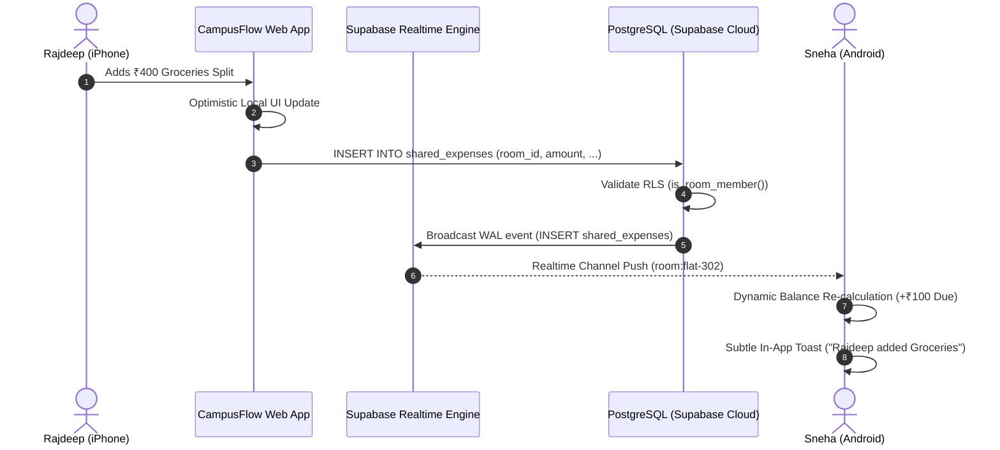

# Project Plan: Supabase Cloud Database & Multi-Device Realtime Sync

**File:** `docs/PLAN-supabase-cloud-sync.md`  
**Mode:** PLANNING ONLY (No code writing during planning phase)  
**Task Slug:** `supabase-cloud-sync`  
**Target:** Enable production-grade Supabase Cloud Database, PostgreSQL Row-Level Security (RLS), and Supabase Realtime synchronization for CampusFlow so multiple flatmates can track and settle shared expenses across devices simultaneously.

---

## 1. Context & Objectives

### The Problem
Currently, CampusFlow's state is stored in the browser's `localStorage` (`src/lib/storage/mockStorage.ts`). While snappy for single-device demonstrations, it has two critical limitations:
1. **No Cross-Device Visibility:** When Rajdeep adds an electricity bill on his phone, Sneha's phone does not update—she only sees her own local copy.
2. **Data Volatility:** Clearing browser cache, changing browsers, or opening incognito resets the room ledger.

### The Objective
Connect CampusFlow to live Supabase Cloud infrastructure with **Supabase Realtime** and **Offline-First Resilience**:
- **Automatic Multi-Device Synchronization:** As soon as any roommate logs an expense, split, or settlement, all other active roommates in that room receive an instant realtime push (`postgres_changes`) without refreshing.
- **Offline-First Resilience:** If a student has spotty campus Wi-Fi or cellular connectivity, operations queue locally and sync cleanly when connectivity restores.
- **Row-Level Security (RLS):** Roommate data is accessible only to verified room members; personal expense vault data is strictly private to the individual student.

---

## 2. Realtime Architecture & Data Flow



---

## 3. Dynamic Agent Assignments

| Agent Role | Skill / Focus | Responsibilities |
| :--- | :--- | :--- |
| **Cloud Database Architect** | `supabase-postgres-best-practices`, `database-design` | Verify migrations on Supabase Cloud, validate foreign key indexes, check constraints, and performance of RLS helper functions. |
| **Realtime Systems Engineer** | `api-patterns`, `supabase-realtime` | Implement Supabase Realtime channels (`postgres_changes`), room subscription multiplexing, and reconnection debouncing. |
| **Storage & Sync Specialist** | `offline-first`, `state-management` | Design `CloudStorageAdapter` implementing optimistic local writes, background queue flushing, and seamless fallback to `localStorage`. |
| **Frontend Mobile Engineer** | `react-patterns`, `mobile-design` | Integrate cloud sync status pill into `MobileLayout` header ("Cloud Live 🟢" vs "Offline 🟡"), trigger celebratory haptics on real-time settlement. |
| **Security & QA Auditor** | `security-auditor`, `clean-code` | Audit RLS isolation between different rooms, test concurrent split race conditions, and verify zero data leakage for personal vaults. |

---

## 4. Phase-by-Phase Task Breakdown

### Phase 1: Supabase Cloud Connectivity & Schema Verification
- [ ] Verify active Supabase project credentials in `.env` (`VITE_SUPABASE_URL`, `VITE_SUPABASE_ANON_KEY`).
- [ ] Run migration `20260909_init_student_expense_schema.sql` against cloud database:
  - `profiles`, `rooms`, `room_members`, `room_invitations`
  - `personal_expenses`, `shared_expenses`, `expense_splits`, `settlement_payments`
  - `user_subscriptions`, `audit_logs`
- [ ] Run stored procedure migration `20260909_room_debt_functions.sql` (`simplify_room_debts_v2`).
- [ ] Verify PostgreSQL publication includes tables for realtime broadcasts:
  ```sql
  ALTER PUBLICATION supabase_realtime ADD TABLE shared_expenses, expense_splits, settlement_payments, room_members;
  ```

### Phase 2: Hybrid Storage Adapter (`CloudStorageAdapter`)
- [ ] Create `src/lib/storage/cloudStorageAdapter.ts`:
  - Implement read-through / write-through caching pattern.
  - Expose unified asynchronous API (`getRoomExpenses`, `addSharedExpense`, `recordSettlement`).
  - Graceful fallback: If Supabase credentials are missing or network drops, seamlessly operate on `localStorage` with zero UI disruption.
- [ ] Hydrate initial app state from Supabase Cloud on mount.
- [ ] Implement seed synchronizer: Check if cloud room is empty; if so, offer 1-tap seed of demo roommate data ("Flat 302 - Emerald PG").

### Phase 3: Supabase Realtime Subscriptions Engine
- [ ] Create `src/lib/supabase/realtimeService.ts`:
  - Subscribe to changes on active `roomId`:
    - `shared_expenses` (INSERT, UPDATE, DELETE)
    - `expense_splits` (INSERT, UPDATE, DELETE)
    - `settlement_payments` (INSERT)
    - `room_members` (INSERT, UPDATE)
  - Debounce rapid multi-row batch inserts (e.g., adding an expense and 4 split rows).
- [ ] Wire Realtime listener to React state in `App.tsx` / `MobileLayout.tsx` so state updates reactively.
- [ ] Add sound / micro-banner toast when another flatmate logs a payment or expense.

### Phase 4: Auth Session Mapping & RLS Verification
- [ ] Map resident session tokens (`jwtService.ts`) with Supabase Auth or Anonymous RLS context.
- [ ] Ensure `is_room_member(room_id)` correctly gates unauthorized users from reading room transactions.
- [ ] Ensure personal expense vault queries enforce `auth.uid() = user_id` so roommate data cannot leak.

### Phase 5: UI Sync Status & Conflict-Free State Polish
- [ ] Update iOS simulated status bar in `MobileLayout.tsx` and `MobileDashboard.tsx`:
  - Add live connectivity indicator:
    - 🟢 `Cloud Synced` (WebSocket connected, latest WAL sequence)
    - 🟡 `Syncing...` (Pending queue flushing)
    - ⚪ `Offline Vault` (Working locally)
- [ ] Add a "Pull to Refresh" gesture on mobile list feed for manual reconciliation.
- [ ] Update `SupabaseSyncModal.tsx` to display real-time connection diagnostics, latency, and subscription channels.

---

## 5. Phase X: Verification & Acceptance Checklist

- [ ] **Dual-Browser Realtime Test:**
  - Open Browser Window 1 as Rajdeep (`http://localhost:5173`).
  - Open Browser Window 2 (Incognito) as Sneha (`http://localhost:5173`).
  - Add a ₹300 Wi-Fi split in Window 1.
  - Verify Window 2 updates balance and recent activity feed within < 500ms without page reload.
- [ ] **WhatsApp Nudge Studio Verification:**
  - In Window 2, record an instant settlement via UPI.
  - Verify Window 1 instantly displays the updated debt balance ("All Settled Up").
- [ ] **RLS Security Boundary Audit:**
  - Attempt querying room expenses from a user not registered in `room_members`.
  - Confirm Postgres returns empty dataset (0 rows leaked).
- [ ] **Offline Resilience Test:**
  - Toggle browser DevTools to "Offline".
  - Add personal and shared expense (verifying optimistic UI write).
  - Toggle back to "Online" and verify cloud database synchronization.
- [ ] **Zero TypeScript Errors & Clean Linter:**
  - `npx tsc --noEmit` exits with 0.
  - `npx oxlint src` reports 0 errors.
