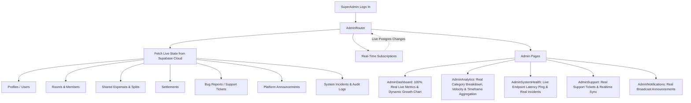

# PLAN: Clean All Dummy Data from SuperAdmin Portal & Real-World Testing Readiness

**Task Slug:** `superadmin-clean`  
**Goal:** Eliminate all hardcoded mock/dummy fallbacks, fake KPI multipliers, hardcoded charts, and simulated activity from the SuperAdmin portal, replacing them with dynamic, live calculations backed by Supabase Cloud so the platform is 100% ready for real-world staging and production testing.

---

## 1. Problem Statement & Root Cause Analysis

### Identified Dummy / Mock Data in SuperAdmin Portal

1. **`AdminDashboard.tsx`**:
   - **Hardcoded Metric Fallbacks**:
     - `totalUsers`: `allUsers.filter((u) => u.role === 'STUDENT').length || 12482;` (Fakes 12,482 users when empty)
     - `activeUsers`: `Math.round(totalUsers * 0.714);` (Fake 71.4% MAU rate)
     - `activeRooms`: `rooms.filter((r) => !r.isArchived && !r.isFrozen).length || 2843;` (Fakes 2,843 rooms)
     - `totalSharedVolume`: `sharedExpenses.length > 0 ? ... : 1842500;` (Fakes ₹18,42,500)
     - `totalSettledAmount`: `settlementPayments.length > 0 ? ... : 1420700;` (Fakes ₹14,20,700)
     - `outstandingSharedBalance`: `Math.max(totalSharedVolume - totalSettledAmount, 421800);` (Forces ₹4,21,800 minimum)
   - **Hardcoded KPI Trend Badges**:
     - `+8.4% vs previous period`, `+5.2% 71.4% MAU rate`, `+11.8% vs last month` are static text strings rather than calculated metrics.
   - **Fabricated Growth Charts**:
     - `chartData`: Hardcoded arrays for 7D, 30D, 3M, 6M, 1Y (e.g. 640 active users on Mon, 8,921 in Sep) instead of aggregating actual user registrations and activity.
   - **Hardcoded Room Activity Widgets**:
     - Static strings: `2,110 (74%)`, `512 (18%)`, `221 (8%)`, `3.8 residents` with static CSS widths (`74%`, `18%`, `8%`).
   - **Fake Recent Activity Stream**:
     - Hardcoded static records:
       - *"Pooja joined RoomMate with college email"* (2 mins ago)
       - *"New room created: PG Hostel Room 408 (4 members)"* (5 mins ago)
       - *"Shared expense added: ₹850 Groceries in Shared Room"* (8 mins ago)
       - *"Bug report submitted: Expense calculation delay reported"* (18 mins ago)
   - **Static System Status**:
     - Hardcoded static "Operational" badges with fake CSS pulses, not connected to live Supabase / edge connectivity.

2. **`AdminAnalytics.tsx`**:
   - Line 148: `filteredSettlements.length > 0 ? ... : 82; // benchmark default` (Fakes 82% UPI settlement rate if empty).
   - Line 431: Hardcoded static `+18.4% vs prev period` trend badge.
   - Line 647: Hardcoded static `"4.2 hours median time to resolve flatmate settlement after bill split"`.

3. **`AdminSystemHealth.tsx`**:
   - Lines 33–65: Default props contain 3 fabricated incidents (`inc-01`, `inc-02`, `inc-03`) referencing fake Android 11 dual-SIM errors, database pool query spikes, and biometric prompt dismissals.
   - Lines 143–150: Hardcoded static `latencyBuckets` array (`18:00 (22ms)`, `19:00 (25ms)`...).
   - Lines 78–135: Hardcoded static service latencies (`24ms`, `38ms`, `14ms`, `26ms`) and uptime (`99.98%`).

4. **`AdminUserDetailModal.tsx`**:
   - Lines 180–208: "Activity" tab displays hardcoded mock records (*"Recorded shared expense - 3 days ago"*).

5. **`AdminExpenseDetailModal.tsx`**:
   - Line 31: `const memberCount = expenseSplits.length > 0 ? expenseSplits.length : 4;` (Defaults to 4 members if splits array is empty).

6. **`AdminSettings.tsx`**:
   - Lines 365–381, 407–421: "Reset Staging Test Data - Restores default staging rooms, student profiles, and mock seed ledger" could re-pollute the database with mock records during real testing.

7. **`AdminRouter.tsx`**:
   - Reads `bugReports`, `featureSuggestions`, `announcements`, `contactRequests`, and `systemIncidents` solely from local `mockStorage` without fetching cloud tables or subscribing to Supabase realtime events.
   - Hardcodes `isCloudLive={true}` in `AdminLayout` instead of inspecting real network & Supabase client status.

8. **`SuperAdminPortal.tsx`**:
   - Unreferenced legacy 1,483-line monolithic component superseded by `AdminRouter.tsx`.

---

## 2. Target Architecture & Real-World Staging Flow

---

## 3. Detailed Implementation Plan

### Phase 1: `AdminDashboard.tsx` — Real Data Aggregation & Empty States
- **File:** [AdminDashboard.tsx](file:///c:/Users/ASUS/Downloads/student%20expense%20app/src/components/admin/pages/AdminDashboard.tsx)
- **Changes**:
  1. Remove all fallback numbers (`|| 12482`, `|| 2843`, `: 1842500`, `: 1420700`, `Math.max(..., 421800)`).
  2. Compute real metrics:
     - `totalUsers`: `allUsers.filter((u) => u.role === 'STUDENT').length`
     - `activeUsers`: `allUsers.filter((u) => !u.isSuspended && roomMembers.some(m => m.userId === u.id)).length` (or active within 30 days)
     - `activeRooms`: `rooms.filter((r) => !r.isArchived && !r.isFrozen).length`
     - `totalSharedVolume`: `sharedExpenses.reduce((sum, e) => sum + e.totalAmount, 0)`
     - `totalSettledAmount`: `settlementPayments.reduce((sum, s) => sum + s.amount, 0)`
     - `outstandingSharedBalance`: `Math.max(totalSharedVolume - totalSettledAmount, 0)`
  3. Replace static MetricCard trend strings with real calculated indicators:
     - Total Users: show `activeUsers` ratio or registration count in current timeframe.
     - Active Rooms: show `% of all rooms created`.
     - Shared Expenses: show count of shared transactions.
     - Outstanding: show `% of volume settled`.
  4. Replace static `chartData` with a dynamic time-bucket builder:
     - Group real user registrations (`createdAt`) and shared expense activity over the selected time range ('7D', '30D', '3M', '6M', '1Y').
     - If counts are 0, display clean baseline 0 values with a friendly "Awaiting student activity" prompt, rather than fake 8,921 active users.
  5. Dynamically calculate Room Activity breakdown:
     - Active Rooms %: `rooms.length > 0 ? Math.round((activeRooms / rooms.length) * 100) : 0`
     - Newly Created (30D) %: count rooms where `createdAt >= 30 days ago` / `rooms.length`
     - Dormant / Frozen %: count frozen/archived rooms / `rooms.length`
     - Average Flatmate Density: `rooms.length > 0 ? (roomMembers.length / rooms.length).toFixed(1) : '0'`
  6. Dynamic Recent Activity Feed:
     - Combine real events from `auditLogs`, latest `allUsers`, latest `rooms`, latest `sharedExpenses`, latest `settlementPayments`, and latest `bugReports`.
     - Sort by timestamp descending; take top 4-5.
     - Provide a clean empty state card (*"No platform activity recorded yet"*) when empty.
  7. Real-Time System Status widget:
     - Test actual live Supabase database connection and edge connectivity rather than static green checkmarks.

### Phase 2: `AdminAnalytics.tsx` — Real Metrics & Benchmark Removal
- **File:** [AdminAnalytics.tsx](file:///c:/Users/ASUS/Downloads/student%20expense%20app/src/components/admin/pages/AdminAnalytics.tsx)
- **Changes**:
  1. Remove fallback `82%`: compute `upiPercent` from `filteredSettlements.length > 0 ? Math.round((upiSettlements.length / filteredSettlements.length) * 100) : 0`.
  2. Remove static `+18.4% vs prev period`. Calculate actual period-over-period spend delta or display "Current Timeframe Volume".
  3. Remove static `4.2 hours median settlement time`. Calculate median duration from `sharedExpenses` timestamp to corresponding `settlementPayments` timestamp, or display `"N/A"` if no settlements recorded yet.

### Phase 3: `AdminSystemHealth.tsx` — Real Incident Tracking & Live Ping
- **File:** [AdminSystemHealth.tsx](file:///c:/Users/ASUS/Downloads/student%20expense%20app/src/components/admin/pages/AdminSystemHealth.tsx)
- **Changes**:
  1. Set default incidents to empty array `incidents = []` (no fake dummy incident objects).
  2. Implement a real ping mechanism:
     - On load and when clicking "Ping All Endpoints", execute a live round-trip query to Supabase (`supabase.from('profiles').select('id', { head: true, count: 'exact' })`).
     - Measure real response time in milliseconds (e.g. `42ms (Live)`).
     - Check `navigator.onLine` for Edge Network status.
  3. Remove hardcoded `latencyBuckets` or populate with actual measured pings.
  4. Display an empty state card for System Incidents when no incidents exist (*"All systems operational — zero active incidents"*).

### Phase 4: Modal Detail Views Polish (`AdminUserDetailModal.tsx` & `AdminExpenseDetailModal.tsx`)
- **Files:**
  - [AdminUserDetailModal.tsx](file:///c:/Users/ASUS/Downloads/student%20expense%20app/src/components/admin/pages/AdminUserDetailModal.tsx)
  - [AdminExpenseDetailModal.tsx](file:///c:/Users/ASUS/Downloads/student%20expense%20app/src/components/admin/pages/AdminExpenseDetailModal.tsx)
- **Changes**:
  1. In `AdminUserDetailModal`:
     - Pass `sharedExpenses` and display the user's actual expense history and room join activity.
     - If no expenses recorded by this user, show `"No shared bills logged yet"`.
  2. In `AdminExpenseDetailModal`:
     - Replace fallback `: 4;` with the actual member count of the target room (`roomMembers.filter(m => m.roomId === expense.roomId).length || 1`).

### Phase 5: `AdminRouter.tsx` & Cloud Storage Integration
- **Files:**
  - [AdminRouter.tsx](file:///c:/Users/ASUS/Downloads/student%20expense%20app/src/components/admin/AdminRouter.tsx)
  - [cloudStorageAdapter.ts](file:///c:/Users/ASUS/Downloads/student%20expense%20app/src/lib/storage/cloudStorageAdapter.ts)
- **Changes**:
  1. In `cloudStorageAdapter.ts`:
     - Implement `fetchPlatformAnnouncementsCloud()` and `createPlatformAnnouncementCloud()` targeting the existing `platform_announcements` table.
     - Implement `fetchSystemIncidentsCloud()` and `subscribeToSystemIncidentsRealtime()`.
     - Include announcements and system incidents in `fetchCloudDatabaseState()`.
  2. In `AdminRouter.tsx`:
     - On mount, call `fetchBugReportsCloud()`, `fetchPlatformAnnouncementsCloud()`, and `fetchSystemIncidentsCloud()`.
     - Subscribe to real-time changes so any report submitted from an Android phone or web client appears instantly in SuperAdmin.
     - Pass `isCloudLive={isSupabaseConfigured && IS_LIVE_SYNC_ENABLED}` to `AdminLayout`.

### Phase 6: `AdminSettings.tsx` & Local Cache Sanitization
- **File:** [AdminSettings.tsx](file:///c:/Users/ASUS/Downloads/student%20expense%20app/src/components/admin/pages/AdminSettings.tsx)
- **Changes**:
  1. Replace "Reset Staging Seeds" with:
     - "Clear Local Storage Demo Cache" (purges legacy mock database keys and re-hydrates strictly from Supabase Cloud).
     - "Force Cloud Sync" (triggers immediate re-fetch of all Supabase tables).
  2. Prevent any button from injecting mock student profiles or fake rooms into the database.

### Phase 7: Deprecation / Removal of Legacy `SuperAdminPortal.tsx`
- **File:** `src/components/SuperAdminPortal.tsx`
- Delete or mark deprecated this unused 1,483-line monolithic file to eliminate dead code and prevent any accidental imports.

---

## 4. Verification & Testing Checklist

| Test Item | Verification Method | Expected Outcome |
|-----------|--------------------|------------------|
| **Zero-State Dashboard** | Empty database / new Supabase project | Dashboard shows `0 Users`, `0 Rooms`, `₹0 Shared Volume`, clean empty chart with 0 values, and "No recent platform activity". No `12482` or `₹1842500` anywhere. |
| **Real Staging Data Flow** | Create a room & log an expense on mobile | SuperAdmin immediately reflects +1 User, +1 Room, exact expense title/amount in Shared Expenses, Analytics, and Recent Activity feed. |
| **System Health Live Ping** | Click "Ping All Endpoints" in System Health | Displays real round-trip latency in ms (e.g. `38ms (Live)`) against Supabase. Zero fake incidents. |
| **Support & Bug Realtime** | Submit bug report via shake/feedback on phone | Appears live in `AdminSupport` table via Supabase Realtime without page refresh. |
| **Announcements Broadcast** | Create announcement in SuperAdmin | Saved to Supabase `platform_announcements` and received by client notifications. |
| **TypeScript & Test Suite** | `npm test` & `npx tsc --noEmit` | All 244 unit tests pass with 0 regressions, 0 TypeScript compile errors. |

---

## 5. Next Steps

- Review the plan details.
- Approve to begin implementation of Phase 1 through Phase 7.
